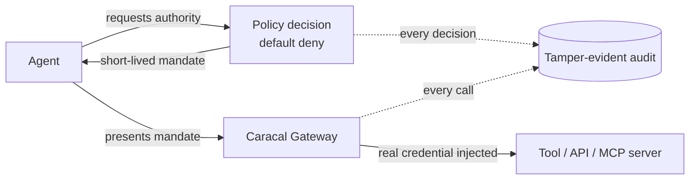

<div align="center">
<picture>
<source media="(prefers-color-scheme: dark)" srcset="public/caracal_nobg_dark_mode.png">
<source media="(prefers-color-scheme: light)" srcset="public/caracal_nobg.png">

</picture>
</div>

<div align="center">

**Authority, not credentials: the identity and authorization layer for AI agents**

_Agents never hold secrets. Every action is policy-approved before it runs, scoped to exactly what was delegated, revocable in one call, and recorded as tamper-evident evidence._
</div>

<div align="center">

[](LICENSE)
[](https://github.com/Garudex-Labs/caracal/releases)
[](https://caracal.run)

[](https://www.bestpractices.dev/projects/12350)
[](https://scorecard.dev/viewer/?uri=github.com/Garudex-Labs/caracal)
[](https://codecov.io/github/garudex-labs/caracal)
</div>

---

## Why Caracal

AI agents are entering production with **long-lived API keys in their environment**, **broader access than any task needs**, and **no answer to "which agent did this, under whose authority?"**

One prompt injection, leaked key, or runaway loop turns an assistant into an incident. Security reviews block launches. Auditors have nothing to inspect.

Existing tools weren't built for this: identity providers register agents but never see their actions, secrets managers hand the credential to the workload, and API gateways route traffic without deciding anything. Caracal is the missing control plane. It decides **what an agent may do** before every action, proves **what it actually did**, and **shuts it down instantly** when something goes wrong.

---

## How It Works

Agents never receive upstream credentials. They carry **mandates**: short-lived, signed grants of authority that can only shrink as work is delegated. Caracal's gateway injects the real credential at call time, so there is nothing for an agent to leak.



| Capability                           | Outcome for your team                                                                                                            |
| ------------------------------------ | -------------------------------------------------------------------------------------------------------------------------------- |
| **No standing secrets**              | Credentials are injected at the edge, at call time. Nothing to steal from prompts, code, or env files.                           |
| **Delegation that only narrows**     | Agents hand work to sub-agents, never with more access than they hold. Least privilege is enforced, not requested.               |
| **Decisions before actions**         | Default-deny policy evaluates every request _before_ it reaches a resource, not flagged in a log afterwards.                     |
| **One-call kill switch**             | Revoke an agent and everything it spawned loses access at once. No waiting for tokens to expire.                                 |
| **Human approval for risky actions** | Step-up gates hold high-risk operations for an authenticated approver before they execute.                                       |
| **Evidence, not just logs**          | An append-only, tamper-evident trail of every decision, exportable for SOC 2, EU AI Act, NIST AI RMF, and OWASP Agentic reviews. |

---

## Why Not Something Else?

| Alternative              | What's missing                                                                                                                                                      |
| ------------------------ | ------------------------------------------------------------------------------------------------------------------------------------------------------------------- |
| **Identity providers**   | Register agents; never see their actions. No per-call decisions, no delegation limits, no evidence.                                                                 |
| **Secrets managers**     | Hand the credential to the workload. A compromised agent is a leaked secret.                                                                                        |
| **API gateways**         | Route and rate-limit; carry no authority model and no delegation semantics.                                                                                         |
| **Building it yourself** | A proxy + vault + policy engine gets you plumbing, not narrowing delegation, revocation propagation, or a tamper-evident audit chain. Then you maintain it forever. |

Caracal is standards-native: OAuth 2.0 token exchange (RFC 8693), OPA policy, and MCP and A2A transports. It fits the stack you already run instead of replacing it.

---

## Works With Your Stack

TypeScript, Python, and Go SDKs. Drop-in verification for **MCP servers**, Express, FastAPI/ASGI, and Go net/http. Runs anywhere Docker runs: your infrastructure, your data.

Read the full documentation at [docs.caracal.run](https://docs.caracal.run).

---

## Get Started

### Prerequisites

- Docker Desktop 4.x or Docker Engine 24+ with Compose v2
- Git 2.x

### Install Released Version

> Check [GitHub Releases](https://github.com/Garudex-Labs/caracal/releases) for the latest available tag.

> Pin a version: `--version vYYYY.MM.DD` on Unix or `-Version vYYYY.MM.DD` in PowerShell.

<details>
<summary><strong>Linux</strong> (amd64 / arm64)</summary>

```bash
curl -fsSL https://raw.githubusercontent.com/Garudex-Labs/caracal/main/install.sh | \
  sh -s -- --version v2026.07.03-rc.1
```

</details>

<details>
<summary><strong>macOS</strong> (Intel / Apple Silicon)</summary>

```bash
curl -fsSL https://raw.githubusercontent.com/Garudex-Labs/caracal/main/install.sh | \
  sh -s -- --version v2026.07.03-rc.1
```

</details>

<details>
<summary><strong>Windows</strong> (amd64) PowerShell</summary>

```powershell
$installer = "$env:TEMP\install.ps1"
iwr -useb https://raw.githubusercontent.com/Garudex-Labs/caracal/main/install.ps1 -OutFile $installer
powershell -ExecutionPolicy Bypass -File $installer -Version v2026.07.03-rc.1
```

</details>

### Start the stack

```bash
caracal up                            # start all services, override with `CARACAL_VERSION=vYYYY.MM.DD caracal up`
caracal status [--ready]              # probe all services

caracal down                          # stop; add -v to remove volumes
caracal purge                         # interactive cleanup (containers, volumes, config, runtime, examples, caches)
```

Before the first sign-in, configure a sign-in method (Google/GitHub OAuth or email/password with SMTP) in `$CARACAL_HOME/caracal.env` - see [First Protected Call](https://docs.caracal.run/get-started/first-protected-call/#sign-in-and-create-your-first-zone).

```bash
caracal web                           # Console Interface http://localhost:3001
caracal run -- node worker.js         # workload execution
```

---

## Contributing

See [CONTRIBUTING.md](./CONTRIBUTING.md) for setup, workflow, tests, and pull request standards.

## Community & Partnerships

<div align="center">

|                                                                                                                                                                                                                                                                                                                Program                                                                                                                                                                                                                                                                                                                |      Timeline      |
| :-----------------------------------------------------------------------------------------------------------------------------------------------------------------------------------------------------------------------------------------------------------------------------------------------------------------------------------------------------------------------------------------------------------------------------------------------------------------------------------------------------------------------------------------------------------------------------------------------------------------------------------: | :----------------: |
|                                                                                                                                                                                                                   <a href="https://www.youtube.com/live/tZ4FdO-zjeE"></a>                                                                                                                                                                                                                   |      Feb 2026      |
|                                                                                                                                                                                                                        <a href="https://vercel.com/open-source-program"></a>                                                                                                                                                                                                                         |    Spring 2026     |
|                                                                                                                                                                                                                                                  <a href="#"></a>                                                                                                                                                                                                                                                  |   Apr – Jun 2026   |
| <a href="https://www.microsoft.com/startups"></a> | May 2026 – Present |
|                                                                                                                                                                                           <a href="https://mentorship.lfx.linuxfoundation.org/project/9cfe285b-7006-4610-84a8-1a52b0dff662"></a>                                                                                                                                                                                           | Jun 2026 – present |

</div>

---

## Editions

|                        |                                                                                                                                                                                                                                         |
| ---------------------- | --------------------------------------------------------------------------------------------------------------------------------------------------------------------------------------------------------------------------------------- |
| **Community Edition**  | Apache-2.0. The complete authority model (mandates, delegation, policy, revocation, audit), self-hosted, with no feature gates on security.                                                                                             |
| **Enterprise Edition** | Caracal run for you: managed multi-tenancy, hosted control plane, SSO/SCIM, and a fully managed data plane. [Compare editions](https://docs.caracal.run/enterprise/) or [book a call](https://cal.com/rawx18/caracal-enterprise-sales). |

---

## Maintainers

<table width="100%">
  <tr align="center">
    <td valign="top" width="33%">
      <a href="https://github.com/RAWx18" target="_blank">
        <br/>
        <strong>RAWx18</strong>
      </a>
      <p>
        <a href="https://github.com/RAWx18" target="_blank">
          
        </a>
        <a href="https://linkedin.com/in/ryanmadhuwala" target="_blank">
          
        </a>
      </p>
    </td>
    <td valign="top" width="33%">
      <a href="https://github.com/Slo-Pix" target="_blank">
        <br/>
        <strong>Slo-Pix</strong>
      </a>
      <p>
        <a href="https://github.com/Slo-Pix" target="_blank">
          
        </a>
        <a href="https://www.linkedin.com/in/shubh465" target="_blank">
          
        </a>
      </p>
    </td>
  </tr>
</table>

---

## Security & Trust

Caracal is built to be the enforcement point you can audit, not another black box: a published [threat model](governance/THREAT_MODEL.md), signed releases with verified assets, OpenSSF Best Practices and Scorecard tracking, and a tamper-evident audit chain at runtime. Start with the [Enterprise Security Readiness](https://docs.caracal.run/security/enterprise-readiness) review checklist.

Report vulnerabilities privately through [SECURITY.md](./.github/SECURITY.md).

---

## License

Caracal is open-source software licensed under the **Apache-2.0** License. See the [LICENSE](LICENSE) file for details.

**Developed by Garudex Labs.**
