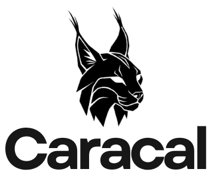

<!-- SPDX-FileCopyrightText: 2026 RAWx18 <rawx18.dev@gmail.com> -->
<!-- SPDX-License-Identifier: Apache-2.0 -->

<div align="center">
<picture>
<source media="(prefers-color-scheme: dark)" srcset="docs/assets/caracal_nobg_dark_mode.png">
<source media="(prefers-color-scheme: light)" srcset="docs/assets/caracal_nobg.png">

</picture>
</div>

<div align="center">

**Manage, secure, distribute, and trace the AI components your coding harnesses use.**

</div>

<div align="center">

[](LICENSE)
[](https://github.com/Garudex-Labs/caracal/releases)
[](https://caracal.run)

[](https://www.bestpractices.dev/projects/12350)
[](https://scorecard.dev/viewer/?uri=github.com/Garudex-Labs/caracal)
[](https://codecov.io/github/garudex-labs/caracal)
</div>

## What is Caracal?

Caracal is a self-hosted platform for organizations that need to understand and manage what developers' AI coding harnesses use. It provides a central registry for approved internal AI Resources, keeps versions and installations consistent across harnesses, and turns local coding sessions into project-scoped Traces for debugging and usage analysis.

Today, Caracal supports a practical workflow:

1. Publish and review reusable Resources and versioned Agents.
2. Pull an approved Agent into a supported harness and keep its installed versions in sync.
3. Capture sessions through managed harness hooks, plugins, or extensions, with reconciliation for missed records.
4. Inspect Traces, adoption, tool activity, costs when available, and Resource-level signals in the web UI or CLI.

Organizations and Projects provide the current access boundary. Review scopes, Resource visibility, audit and security events, trace privacy, retention, and separate deployment Operator authority provide the governance available today. Caracal does not currently proxy MCP traffic or enforce live tool access. Organization-wide policy, scoped service credentials, runtime enforcement, and governed autonomy are planned direction described in the [roadmap](ROADMAP.md).

## Current Support

Caracal currently provides:

- registry, review, versioning, ownership, and distribution for internal AI Resources;
- Agent bundles that resolve into native harness configuration and local version pins;
- capability-based integrations across ten registered coding harnesses;
- project-scoped session ingestion, normalized Traces, usage analytics, and Agent insight reports;
- Organization and Project membership, authenticated tenant access, and separate Operator functions for deployment administration.

Harness capabilities differ. See the [support matrix](docs/harnesses/index.mdx) for the exact install, scan, telemetry, and scope support available in each integration.

## Getting Started

Install the standalone CLI:

```bash
curl -fsSL https://raw.githubusercontent.com/Garudex-Labs/caracal/main/install.sh | bash
```

Start a local server with Docker Engine 24.0 or later and Compose v2:

```bash
git clone https://github.com/Garudex-Labs/caracal.git
cd caracal
cp .env.example .env
docker compose -f infra/docker/docker-compose.yml up --build -d
```

Log in, select an Organization/Project context, and instrument your harnesses:

```bash
caracal auth login
caracal use --list
caracal use <organization>/<project>
caracal doctor patch --all-harnesses
```

Run a coding session, then open **http://localhost/traces**. Follow the [quickstart](docs/quickstart.mdx) for the complete workflow or [installation guide](docs/installation.mdx) for other deployment paths.

## Documentation

The [`docs/`](docs/) directory covers [core concepts](docs/core-concepts/), [harness integrations](docs/harnesses/), the [CLI](docs/cli/), [self-hosting](docs/self-hosting/), and the [security model](docs/security/model.mdx).

## Security

Report vulnerabilities privately through [GitHub Security Advisories](https://github.com/Garudex-Labs/caracal/security/advisories) - never in public issues. The full policy, supported versions, and disclosure process are in [SECURITY.md](SECURITY.md). Before running downloaded release artifacts, see [release verification](docs/security/release-verification.md).

## Contributing

Contributions are welcome. See [CONTRIBUTING.md](CONTRIBUTING.md) for the complete contribution process, and note that the [Code of Conduct](CODE_OF_CONDUCT.md) applies to all project spaces.

## License

Caracal is licensed under [Apache-2.0](LICENSE.md).

## Supported by

<div align="center">

### Funding & Security

<a href="https://resources.github.com/github-secure-open-source-fund/"></a>

Funding and security lab support through the GitHub Secure Open Source Fund · [Read GitHub's report](https://github.blog/open-source/maintainers/what-50-open-source-projects-taught-us-about-security-in-the-ai-era)

### Cloud & AI Credits

<a href="https://www.microsoft.com/startups"></a>&nbsp;&nbsp;&nbsp;&nbsp;&nbsp;&nbsp;
<a href="https://vercel.com/blog/vercel-open-source-program-spring-2026-cohort#caracal"></a>

AI and cloud deployment credits from Microsoft · Vercel credits and community support from the Vercel

### Documentation

<a href="https://www.mintlify.com/oss-program"></a>

Documentation hosting through the Mintlify Open Source Program

### Community

<a href="https://f.inc/canopy"></a>&nbsp;&nbsp;&nbsp;&nbsp;&nbsp;&nbsp;
<a href="https://mentorship.lfx.linuxfoundation.org/project/9cfe285b-7006-4610-84a8-1a52b0dff662"></a>

Startup community at Founders, Inc. Canopy · Mentorship through LF Decentralized Trust's LFX Mentorship

</div>
