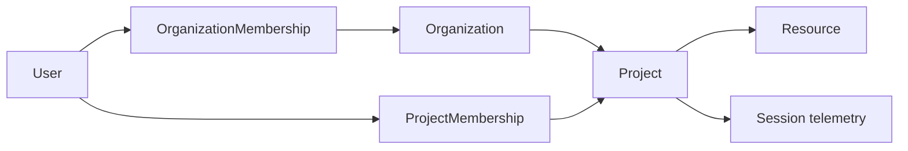

<!-- SPDX-FileCopyrightText: 2026 Ryan Madhuwala <rawx18.dev@gmail.com> -->
<!-- SPDX-License-Identifier: Apache-2.0 -->

# Organization -> Project Tenancy

Status: **implemented.** Organization -> Project is the current tenancy model. The legacy Teamspace layer was removed by `internal/dbinit/migrations/postgres/004_remove_teamspaces.sql`.

## Current Concepts

- **User:** a global identity row provisioned from the Better Auth identity service. Deployment role is one of `operator`, `reviewer`, or `user`.
- **Organization:** the tenant boundary. Members have Organization roles: `owner`, `admin`, or `member`.
- **Project:** the working scope inside an Organization. Members have Project roles: `lead` or `user`.
- **Resource:** an Agent, MCP server, Skill, Hook, Prompt, or Sandbox listing owned by a Project and addressed by `namespace/slug` or UUID.
- **Session:** telemetry is scoped by Project, User, Harness, and Session ID. Ingest and tenant reads resolve the authorized Project server-side.

## Role Boundaries

Deployment roles and tenant roles are deliberately separate.

| Layer | Roles | Authority |
| --- | --- | --- |
| Deployment | `operator`, `reviewer`, `user` | Instance operation, public registry review, settings, audit/security reads, diagnostics |
| Organization | `owner`, `admin`, `member` | Organization membership, projects, organization audit/security reads |
| Project | `lead`, `user` | Project membership, Project Resources, project-scoped review, Project Intelligence |

`operator` does not imply membership in every Organization and does not grant ownership over tenant Agents, component Resources, or insight reports. Organization owner/admin roles can administer projects inside their Organization; plain Organization membership does not grant Resource access without Project access.

## Routing and Scope Resolution

- Explicit tenant routes live under `/api/v1/orgs/{org}` and `/api/v1/orgs/{org}/projects/{project}`.
- Project-facing route groups that do not carry slugs in the path use the transport scope headers `X-Caracal-Org` and `X-Caracal-Project`.
- When `deployment.base_domain` is configured, the Organization can also be resolved from the request host. Host, header, and path scope must agree when more than one is present.
- Slugs are lookup keys only. `internal/orgs` resolves membership and Project access from PostgreSQL on every request; non-members receive 404 for scopes they cannot see.
- The CLI persists the selected Organization/Project context with `caracal use`; API calls still validate that context server-side.

## Resource Visibility

Registry Resources use three visibility values:

| Visibility | Stored behavior | Audience |
| --- | --- | --- |
| `public` | `ownership_scope='project'`, `is_private=false` | Everyone after review approval |
| `project` | `ownership_scope='project'`, `is_private=true` | Members of the owning Project and authorized reviewers |
| `private` | `ownership_scope='private'`, `is_private=true` | Creator-only; auto-approved |

Public submissions are reviewed by global reviewers (`reviewer` and `operator`). Project-scoped submissions are reviewed by Project leads. Private submissions do not enter the review queue because their audience is the creator.

## Data Model Invariants

- `organizations.slug` is globally unique.
- `organization_memberships` is unique by `(organization_id, user_id)` and enforces one `owner` per Organization.
- `projects` are unique by `(organization_id, slug)`.
- `project_memberships` is unique by `(project_id, user_id)` and tied to the Project's Organization.
- Agents and component listing tables carry `project_id`, `ownership_scope`, `is_private`, owner metadata, co-authors, timestamps, and latest-version pointers.
- Version tables preserve immutable release history and review status. New releases create new rows rather than mutating historic versions.
- Session ingest binds records to the authorized Project, User, Harness, and Session ID before writing ClickHouse rows.

## Implemented Route Surface

Organization and Project routes in `internal/orgs` cover Organization listing/detail, members, invitations, projects, project members, project Resources, resource retention policy, audit/security reads, and Project Intelligence.

Project-scoped product routes include registry Resources, Agents, session ingest, session reads, traces, layer snapshots, Inbox, alerts, insight reports, and live updates. Deployment operator routes are mounted separately under `/api/v1/operator/*` for users, settings, trace privacy, retention, diagnostics, logs, system status, tenant lifecycle, audit logs, security events, data migration, and AI engine configuration.

## Future Boundary

The current tenancy model supports scoped registry access, review, trace visibility, and Project Intelligence. It is not yet a full company policy engine. Team or employee policy, resource-level runtime authorization, MCP/tool execution enforcement, service-connection permissions, and scoped short-lived credentials require new policy objects, decision logs, credential issuance, and harness enforcement points before they should be documented as shipped behavior.
