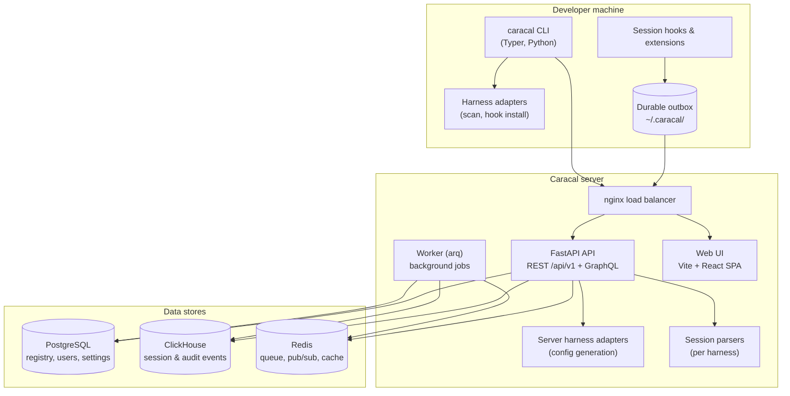
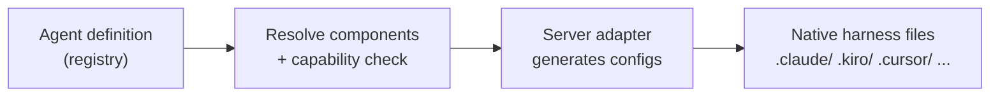
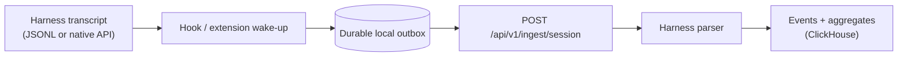

Caracal is a client–server system. The CLI and harness hooks run on developer machines; a single self-hosted server stores the registry and telemetry and serves the web UI and API.

## Components

| Component | Role |
| --- | --- |
| **CLI** | Authentication, scanning, agent installs, publishing, reconciliation, administration |
| **Harness adapters (CLI side)** | Per-harness scanning and hook installation - one adapter per harness, no shared conditionals |
| **Harness adapters (server side)** | Per-harness config file generation for agent installs |
| **Session parsers** | Convert each harness's raw transcript records into normalized events |
| **API** | REST at `/api/v1`, read-only GraphQL with subscriptions at `/api/v1/graphql` |
| **Worker** | Background jobs (catalog maintenance, migrations, scheduled tasks) via arq on Redis |
| **Web UI** | Single-page app for the registry, traces, dashboards, review, and administration |

## Data stores and what lives where

| Store | Holds | Notes |
| --- | --- | --- |
| **PostgreSQL** | Users, teams, agents, components, versions, review state, dynamic settings | Relational source of truth; Alembic migrations |
| **ClickHouse** | Session events, session aggregates, audit events, security events, webhook deliveries | Append-heavy telemetry; versioned SQL migrations; TTL-based retention |
| **Redis** | Job queue, GraphQL subscription pub/sub, settings cache, token revocation | Auth **fails closed** if Redis is down - no stale-token acceptance |

## The two main data flows

### Distribution: registry → harness

`caracal agent pull` resolves an agent's components, checks them against the target harness's capability set, and writes native config files. Unsupported components produce warnings; hard requirements the harness cannot satisfy fail the install. See [Agents and components](/concepts/agents).

### Observability: harness → dashboards

Delivery is at-least-once with idempotent, effectively-once storage keyed by session and source position. `caracal reconcile` reuses the same path to backfill anything hooks missed. See [Session telemetry](/concepts/telemetry).

## Design decisions worth knowing

- **One adapter per harness, on both sides.** Harness-specific logic lives only in adapters registered in a shared harness registry. Capabilities (`hooks`, `mcp_servers`, `skills`, `prompts`) gate which operations each harness supports.
- **No MCP interception.** MCP server commands and remote URLs are written into harness configs verbatim. Caracal observes sessions from transcripts; it adds no proxy, wrapper, or `OTEL_*` environment variables.
- **Bearer-only API auth.** All authenticated requests use `Authorization: Bearer <token>`. Tokens are ES256-signed JWTs with a JWKS endpoint for verification. There is no API-key header.
- **Server-side settings.** Runtime configuration beyond boot essentials lives in the database as dynamic settings, editable via the admin UI and API - not environment variables.
- **Outbound network guarded.** All server-initiated outbound requests (webhooks, git clone for submission analysis, MCP analysis) pass an SSRF guard that blocks private addresses unless explicitly allowed.

## Deployment shape

The server ships as a Docker Compose stack of ten services: init (migrations), API, worker, web, load balancer, PostgreSQL, ClickHouse, Redis, and optional Prometheus and Grafana. Kubernetes (Helm) and OpenTofu (AWS/GCP/Azure) deployments compose the same images. See [Self-Hosting](/self-hosting).
