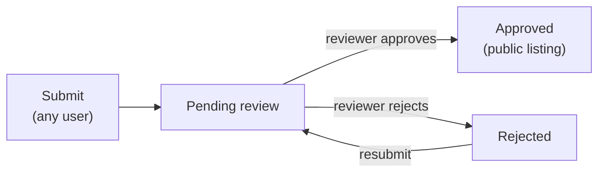

# SPDX-FileCopyrightText: 2026 Ryan Madhuwala <rawx18.dev@gmail.com>
# SPDX-License-Identifier: Apache-2.0

---
title: "Registry, identity, and review"
description: "How agents and components are named, published, reviewed, and shared"
---

The registry is the server-side catalog of agents and components. It lives in PostgreSQL, is browsable from the web UI and CLI, and enforces identity, versioning, review, and access rules.

## Canonical identity: `namespace/slug`

Every agent and component has one canonical identity:

```
<namespace>/<slug>        e.g.  richard/github-mcp,  dana/reviewer
```

- The **namespace** is the owner's username. Namespaces come from a single pool and cannot collide.
- The **slug** is stable within the namespace. Display names can change freely; the canonical identity does not.
- **UUIDs** remain the stable machine key - every command that accepts `namespace/slug` also accepts a UUID. Bare legacy names resolve only when unambiguous.

Use whichever is convenient; the CLI resolves slash-qualified references to UUIDs internally. For frequently used IDs, define aliases (`caracal config alias my-mcp <uuid>`, then `@my-mcp` anywhere a reference is accepted).

## Publish → review → listing



Two rules make this workable day-to-day:

1. **Anyone can publish.** Submission requires no privilege.
2. **Owner fallback.** You can always install your *own* items regardless of review state. Review gates the public listing, not your own access. Approved items are preferred at resolution time; pending or rejected items remain accessible to their submitter.

Reviewers (`reviewer` role and above) work the queue in the web UI. For MCP submissions, the server clones the referenced repository (SSRF-guarded) and analyzes tools, transports, and declared environment variables so reviewers see what the component actually does.

## Roles

Caracal has two role layers:

| Layer | Roles | Scope |
| --- | --- |
| Deployment | `user`, `reviewer`, `operator` | Instance operation, deployment-wide registry review, user administration, audit/security-event reads, settings, diagnostics |
| Organization | `owner`, `admin`, `member` | Tenant membership, organization settings, projects, organization audit/security reads |
| Project | `lead`, `user` | Project membership, project resources, project-scoped review, Project Intelligence |

Deployment `operator` authority does not make the operator an Organization member or owner of tenant content. Organization and Project access are resolved from membership rows on every request.

## Projects and visibility

Every published item carries a **visibility** that fixes its audience:

| Visibility | Who can see it |
| --- | --- |
| `project` | Members of the owning project |
| `private` | Only the submitter |

There is no public scope: every item is owned by a project. Project-scoped submissions enter the review queue - a project's **leads** review that project's shared items, and **global reviewers** (`reviewer` and `operator`) can review across the deployment. Private submissions skip review because their audience is the submitter alone. **Operators** can operate the deployment but do not automatically own tenant Resources. Organizations, their projects, members, and roles are managed in the web UI - see the [Organization → Project model](/architecture/org-project-model).

## Versions

Components and agents carry semver versions. Publishing a new version never mutates an existing one; installs pin the version they resolved into the local lockfile. `caracal sync --dry-run` reports pins with newer registry versions, and `caracal registry version` inspects and publishes component versions.
