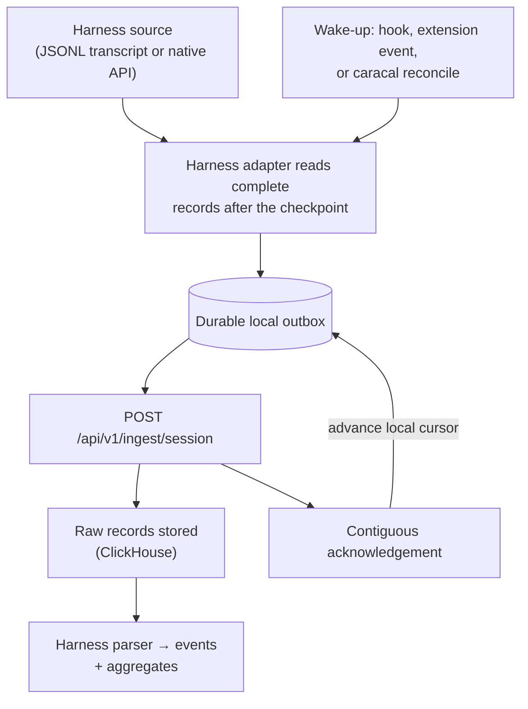

Caracal turns local harness conversations into indexed, queryable session events. This page defines the data model and walks the complete path from a transcript on a developer machine to aggregates in ClickHouse - including what happens when delivery is interrupted.

## Data model

| Term | Definition |
| --- | --- |
| **Session** | One harness conversation or task, identified by `session_id`, recorded with harness, authenticated user, project, agent attribution, and source position |
| **Source record** | One complete item emitted by the harness - for JSONL sources, one non-empty newline-terminated line; extension-based harnesses produce equivalent stable records |
| **Event** | The server-parsed classification of a source record: user prompt, assistant response, tool call, tool result, token update, lifecycle hook, error, or subagent event |
| **Aggregate** | Per-session rollup (`session_stats_agg`): event counts, prompts, tool calls, token totals, models, harness, agent attribution, timing - what dashboards and insights query |

Available event detail depends on the harness: Caracal indexes only what the harness's transcript or native API records. It never synthesizes latency, cost, or payload fields the harness didn't write.

## The pipeline



1. The harness writes its transcript (or exposes messages through an extension API).
2. A hook, extension event, or `caracal reconcile` wakes the exporter. A wake-up is only a request to resume work - delivery state lives in the outbox and checkpoints, so nothing depends on one hook process surviving.
3. The adapter reads only **complete** records past the current checkpoint. A JSONL line without its terminating newline stays local until the harness finishes it.
4. The batch is written to a **durable local outbox before** any network attempt.
5. The exporter posts the batch to the ingest API.
6. The server stores raw records, parses them with the harness's registered parser, and returns the highest **contiguous** acknowledged position.
7. The exporter deletes acknowledged batches and advances its cursor.

Hooks and reconciliation share the same adapters and acknowledgement protocol - reconciliation is a recovery path, not a second ingestion system.

## Durability guarantees

Delivery is **at-least-once**; storage is **effectively once**. The server keys each record by project, user, harness, session ID, and source index, so overlapping uploads converge on the same record.

| Exporter | Durable pending data | Cursor state |
| --- | --- | --- |
| Shared Python exporter | `~/.caracal/telemetry_buffer.db` (SQLite) | `~/.caracal/sync_state.json` |
| OpenCode extension | `~/.caracal/opencode_session_outbox/` | Per-session state in the same directory |
| Pi extension | `~/.caracal/pi_session_outbox/` | `~/.caracal/sync_state.json` |

- Outboxes are capped at **256 MiB**. Hitting the cap raises an explicit error; unacknowledged records are never silently evicted.
- Pending data is bound to its destination server and authenticated user. Switching logins never redirects queued records to a different account or registry.
- A timeout, crash, or server outage leaves the pending batch intact; the next wake-up retries it, draining older batches first.

## Checkpoints and conflict handling

An acknowledgement carries `acknowledged_line` (highest contiguous source index stored) and `acknowledged_offset` (corresponding byte offset). Only **contiguous** acknowledgement advances the cursor: if the server has indexes 0 and 2 but not 1, the checkpoint stays at 0, so a later record can never mask a missing earlier one.

If local cursor state is lost or stale, the exporter fetches the authenticated checkpoint from `GET /api/v1/ingest/session/checkpoint` and resumes from the server's position - no full replay after local state loss.

If different content arrives at an already-acknowledged index, the server **rejects the conflict** rather than overwriting the canonical record.

## Finalization and integrity repair

Incremental uploads hash only what each batch needs. At session finalization, the exporter makes one stable-file pass and sends the total record count, total byte offset, and a SHA-256 session hash. The server compares this against stored records; on any gap or mismatch it returns `repair_from_line`, and the exporter rewinds and replays that range through the same idempotent path.

Repair recovers from interrupted uploads and stale cursors. It cannot resurrect a record the harness deleted before any hook or extension observed and spooled it.

## Recovery: `caracal reconcile`

Run reconciliation when hooks were installed late, a machine was offline, or you want to verify recent history:

```bash
caracal reconcile --dry-run          # preview the default 7-day scan, sends nothing
caracal reconcile                    # push recent sessions from every installed harness
caracal reconcile --harness kiro --since 24
```

See [Backfill missed sessions](/guides/backfill-sessions) for the full workflow and [caracal reconcile](/cli/reconcile) for flags.

## Health and failure modes

```bash
caracal ops telemetry status    # pending batches, disk use, oldest pending, last ack
caracal doctor                  # detect and repair missing instrumentation
```

| Symptom | Meaning / action |
| --- | --- |
| Records stay pending | Server unreachable, or current login doesn't match the pending records' user/destination. Next wake-up or `reconcile` retries. |
| Checkpoint mismatch reported | The local transcript changed or was truncated after acknowledgement. The source is left untouched; investigate before deleting state. |
| Record permanently rejected | Quarantined in `~/.caracal/telemetry_buffer.rejected.jsonl` so one bad session never blocks others. Inspect the reason before retrying. |
| Sessions not discovered | Harness not installed, session source missing, or modified outside the `--since` window. |

<Note>
Caracal never proxies MCP transport traffic and never injects telemetry environment variables into MCP commands. All observability derives from session transcripts and native harness APIs.
</Note>
