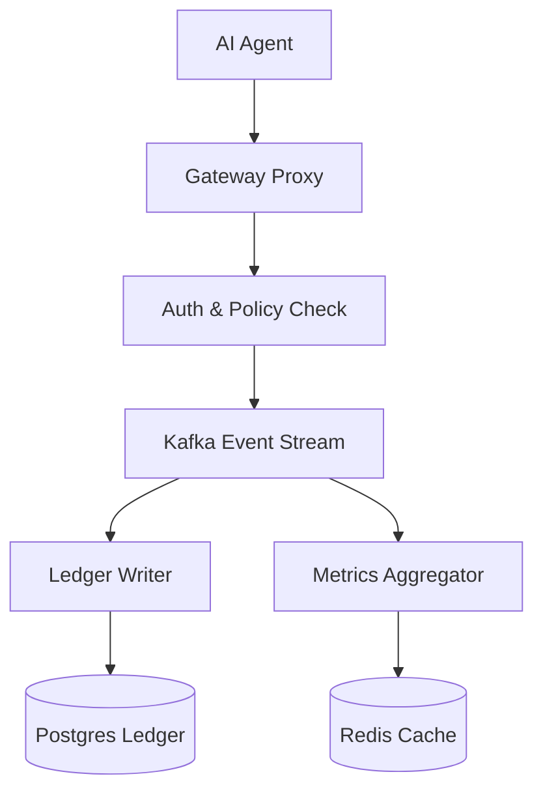

# Caracal Core Architecture

Caracal Core uses an event-driven architecture designed for high throughput and reliability.

## High-Level Overview

## Components

### Gateway Proxy
- Intercepts all agent HTTP/HTTPS traffic.
- Performs authentication (JWT, mTLS, API Key).
- Evaluates policies before forwarding requests.
- Emits metering events to Kafka.

### Policy Engine
- Evaluates spending limits and allowlists.
- Supports hierarchical delegation.
- Caches policies for low-latency evaluation.

### Ledger
- Append-only log of all metering events.
- Merkle tree integrity with ECDSA signatures.
- Supports snapshots and event replay.

### Kafka Consumers
- **LedgerWriter**: Persists events to PostgreSQL.
- **MetricsAggregator**: Updates real-time Redis cache.
- **AuditLogger**: Writes to audit log for compliance.

## Data Flow

1. Agent sends request to Gateway.
2. Gateway authenticates and evaluates policy.
3. If allowed, request is proxied and metering event is emitted.
4. Kafka consumers process the event asynchronously.
5. Ledger is updated with Merkle root.
