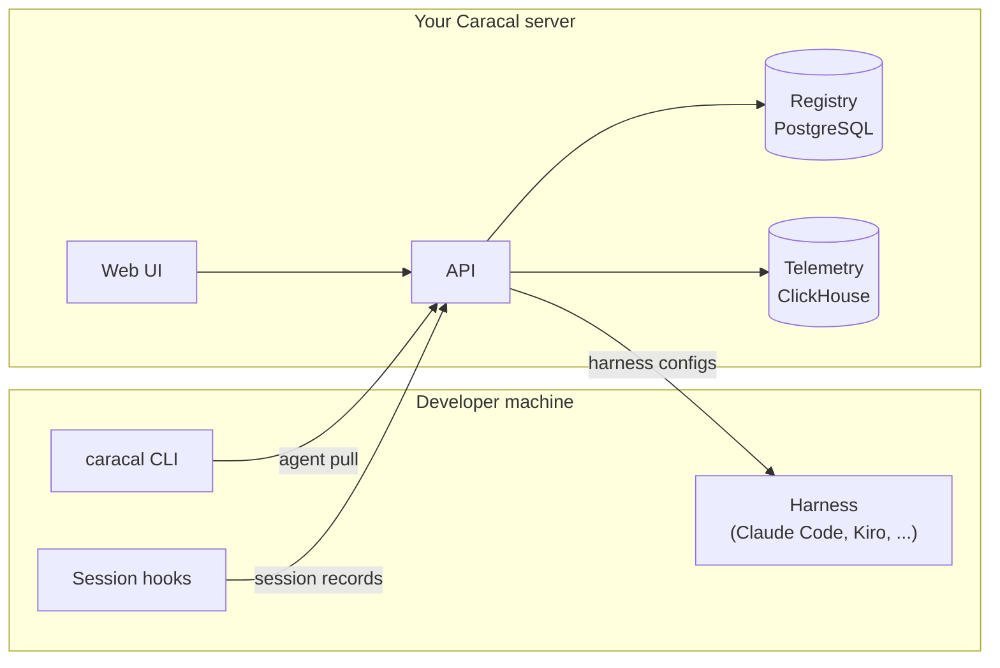

# SPDX-FileCopyrightText: 2026 RAWx18 <rawx18.dev@gmail.com>
# SPDX-License-Identifier: Apache-2.0

---
title: "What is Caracal"
description: "Cross-harness AI component management, distribution, and observability"
---

Caracal is a self-hosted platform for organizations standardizing how developers use AI coding harnesses with company tooling. It gives platform, security, and developer-experience teams one place to publish approved AI components, distribute them into different harnesses, and inspect the sessions those harnesses produce.

The current product solves two concrete problems:

1. **Distribution.** Agent configurations - MCP servers, skills, hooks, prompts, sandboxes - live in per-tool config files with incompatible formats. Sharing a working setup means copy-pasting JSON between `~/.claude/`, `.kiro/`, `.cursor/`, and half a dozen other directories.
2. **Visibility.** Coding agents leave their history in local transcript files. Nobody can answer "which agents does this Organization actually use," "what did that failed session do," or "which MCP server is called most" without collecting those transcripts somewhere.

Caracal addresses both with a server you run on your own infrastructure and a CLI installed on each developer machine. The long-term direction is policy-aware access, scoped credentials, runtime enforcement, and evaluation loops for safer AI-assisted development; those are documented as roadmap work until the implementation supports them.

## The mental model

Three ideas carry the whole system:

**Resources are the managed objects.** The registry stores Agents plus component Resources: MCP servers, Skills, Hooks, Prompts, and Sandboxes. Each Resource has `namespace/slug` identity, versions, visibility, review status, lifecycle activity, and ownership metadata.

**Agents are the unit of distribution.** An Agent is a versioned bundle of component references plus prompt/model metadata and generated harness configs. `caracal agent pull <agent>` resolves the bundle and writes native config files for whichever coding tool you use. One definition, capability-specific install targets.

**Harnesses are the install targets.** A *harness* is a supported AI coding tool: Claude Code, Kiro, Cursor, GitHub Copilot, Copilot CLI, Codex, OpenCode, Goose, Antigravity, or Pi. Caracal knows each registered harness's file layout, config format, declared capabilities, and event model, and adapts installs and telemetry per harness. See [Harnesses and capabilities](/concepts/harnesses).

**Sessions are the unit of observability.** Each harness conversation is a *session*. Lightweight hooks, plugins, extensions, and `caracal reconcile` deliver transcript records to your server, where they are parsed into events - prompts, tool calls, results, token counts, costs when supplied, and lifecycle events - and aggregated for dashboards and insights. Caracal reads transcripts; it does not currently proxy MCP traffic or enforce live tool access. See [Session telemetry](/concepts/telemetry).

## What you interact with

| Surface | What it does |
| --- | --- |
| **`caracal` CLI** | Log in, choose an Organization/Project context, scan installed components, pull Agents, publish Resources, sync local pins, query traces |
| **Web UI** | Browse Resources, view traces, review submissions, manage Organizations/Projects, operate deployment settings, and inspect Project Intelligence |
| **Bundled skill** | Installed into your harness on login, so the LLM in your coding tool can drive Caracal commands itself |
| **REST + GraphQL API** | Everything the CLI and UI do, available at `/api/v1` with Bearer authentication |

## What Caracal is not

- **Not an MCP proxy.** MCP commands and remote URLs stay exactly as configured. Observability comes from session transcripts, not intercepted traffic.
- **Not a hosted service.** You deploy the server (Docker Compose, Kubernetes, or OpenTofu on AWS/GCP/Azure) and own the data.
- **Not a complete policy engine yet.** Current controls cover auth, tenancy, review, visibility, trace privacy, retention, and operator settings. Company/team/employee policies, scoped credentials, and runtime access enforcement are roadmap work.
- **Not tied to one coding tool.** Every feature is defined per harness capability, so Agents degrade gracefully on tools that lack a capability.

## Where to go next

<CardGroup cols={2}>
  <Card title="Quickstart" icon="rocket" href="/quickstart">
    Server, login, instrumentation, and a first trace in about five minutes.
  </Card>
  <Card title="System architecture" icon="sitemap" href="/concepts/architecture">
    How the CLI, server, databases, and harness adapters fit together.
  </Card>
  <Card title="Install an agent" icon="download" href="/guides/install-agents">
    Pull a published agent into any supported harness.
  </Card>
  <Card title="Self-host the server" icon="server" href="/self-hosting">
    Deployment options from a single VM to a multi-AZ production stack.
  </Card>
</CardGroup>
