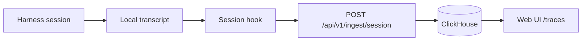

# SPDX-FileCopyrightText: 2026 RAWx18 <rawx18.dev@gmail.com>
# SPDX-License-Identifier: Apache-2.0

---
title: "Quickstart"
description: "Run a local server, log in, instrument a harness, and see your first trace"
---

This walkthrough goes from nothing to a live session trace in the Caracal web UI. You need Docker Engine ≥ 24.0 with Compose v2 (`docker compose`, not `docker-compose`) and a supported coding harness such as Claude Code, Kiro, or Cursor.

<Steps>
<Step title="Install the CLI">

```bash
curl -fsSL https://raw.githubusercontent.com/Garudex-Labs/caracal/main/install.sh | bash
```

This installs the standalone binary - no Python required. Verify:

```bash
caracal --version
```

Other install methods (uv, pipx, pip, from source) are covered in [Installation](/installation).

</Step>
<Step title="Start a local server">

```bash
git clone https://github.com/Garudex-Labs/caracal.git
cd caracal
cp .env.example .env
docker compose -f infra/docker/docker-compose.yml up --build -d
```

`.env.example` ships with working local defaults. The stack starts an nginx load balancer on `http://localhost`, the API, the web UI, a background worker, PostgreSQL, ClickHouse, and Redis. An init container runs database migrations and exits. Expect 15–30 seconds for health checks to pass:

```bash
curl http://localhost/health
# {"status": "ok"}
```

<Note>
Port already taken? Every host port is remappable through `.env` - see [Configuration](/self-hosting/configuration).
</Note>

</Step>
<Step title="Log in">

```bash
caracal auth login
```

Press Enter to accept `http://localhost` as the server URL. On a fresh server the CLI detects that no users exist and bootstraps the first deployment operator with the email, name, and password you choose. Credentials are stored in `~/.caracal/config.json` with mode `0600`. Confirm:

```bash
caracal auth whoami
# you@your-company.com (operator)
```

</Step>
<Step title="Instrument your harness">

See what Caracal can find on your machine - this is read-only:

```bash
caracal scan
```

The output lists detected harnesses and their MCP servers, skills, hooks, and agents. Then install session telemetry hooks:

```bash
caracal doctor patch --all-harnesses
```

`doctor patch` installs session hooks or extensions for every detected harness. It never rewrites MCP server commands or URLs. Restart your harness so the hooks take effect.

</Step>
<Step title="Produce and view a trace">

Run any coding session in your instrumented harness and let it finish. Then open **http://localhost/traces** in your browser, or list sessions from the CLI:

```bash
caracal ops traces --limit 5
```

Each session expands into its parsed events: prompts, assistant responses, tool calls and results, token totals, and lifecycle events.

If a session is missing (for example, the hook was installed mid-session), backfill it:

```bash
caracal reconcile
```

</Step>
<Step title="Optional: install a published agent">

```bash
caracal agent list
caracal agent show <namespace/slug>
caracal agent pull <namespace/slug> --harness claude-code
```

`pull` writes the agent's MCP servers, skills, hooks, and prompts into the correct native config files for the chosen harness. See [Install an agent](/guides/install-agents).

</Step>
</Steps>

## What you just built



The hook reads completed transcript records, spools them to a durable local outbox, and delivers them to the ingest API, which parses them into events and aggregates. Delivery is at-least-once with idempotent storage, so retries and reconciliation are always safe. Details in [Session telemetry](/concepts/telemetry).

## Next steps

<CardGroup cols={2}>
  <Card title="Core concepts" icon="lightbulb" href="/concepts/architecture">
    The architecture and vocabulary behind what you just did.
  </Card>
  <Card title="Build an agent" icon="hammer" href="/guides/build-agents">
    Package your own MCP servers, skills, and hooks into a shareable agent.
  </Card>
  <Card title="Production deployment" icon="server" href="/self-hosting">
    Move from the local stack to a hardened deployment.
  </Card>
  <Card title="CLI reference" icon="terminal" href="/cli">
    Every command, flag, and output contract.
  </Card>
</CardGroup>
