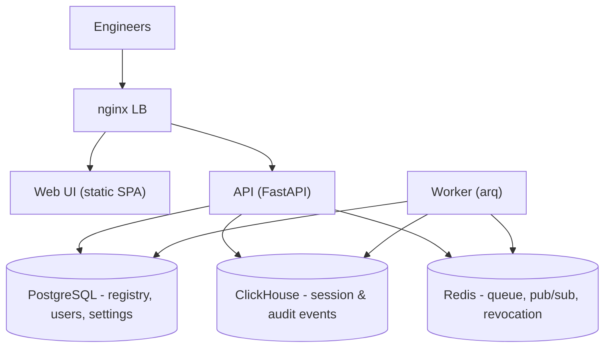

Caracal runs entirely on your infrastructure - no SaaS, no egress; all telemetry stays inside your network. The stack is the same everywhere: nginx load balancer, FastAPI API, background worker, static web UI, PostgreSQL, ClickHouse, Redis, plus optional Prometheus and Grafana.

## Choose a deployment

| | [Single-node](/self-hosting/single-node) | [Kubernetes](/self-hosting/kubernetes) | [OpenTofu (AWS/GCP/Azure)](/self-hosting/production) |
| --- | --- | --- | --- |
| How | `install-server.sh` or Docker Compose on one VM | Official Helm chart | ~100 managed cloud resources |
| Best for | ≤ 50 users, internal tools, evaluations | Teams with existing K8s infra | Enterprise, SLA-bound, 50+ users |
| Cost | $20–150/mo | variable | ~$255/mo AWS · ~$180/mo GCP · ~$160/mo Azure staging |
| HA | No | Pod resilience, horizontal scaling | Multi-AZ databases, autoscaling |
| Time to deploy | ~10 minutes | 10–15 minutes | 20–30 minutes |

For local development and evaluation, [run from source](/self-hosting/docker-compose) with Compose.

## The stack

An init container applies PostgreSQL (Alembic) and ClickHouse migrations before the API starts. All services share a private bridge network; named volumes (`pgdata`, `chdata`, `redisdata`, `grafanadata`, `apidata`) hold persistent data. The `apidata` volume contains the JWT signing keys.

## Production checklist

1. **Protect `SECRET_KEY`.** The server package generates it under `secrets/`; source deployments must set a strong value or `SECRET_KEY_FILE`.
2. **Replace default database passwords** (`POSTGRES_PASSWORD`, `CLICKHOUSE_PASSWORD`) - the server package generates restricted credential files.
3. **Scope `CORS_ALLOWED_ORIGINS`** to your real frontend origin, and set `FRONTEND_URL`.
4. **Terminate TLS** in front of the loopback nginx listener - see [Requirements](/self-hosting/requirements#tls).
5. **Configure [SSO](/self-hosting/sso)**, including `deployment.sso_only` if passwords should be disabled.
6. **Set `DATA_RETENTION_DAYS`** to your retention policy (default 90).
7. **Back up the JWT key volume** (`apidata`) - losing it invalidates every session. See [Backup and restore](/self-hosting/backup-restore).
8. **Never enable development login**: leave `AUTH_DEV_LOGIN` unset and keep the identity service on a production `NODE_ENV`.
9. **Tune rate limits** (`RATE_LIMIT_AUTH`, `RATE_LIMIT_AUTH_STRICT`).

## Operating pages

| Task | Page |
| --- | --- |
| Confirm hardware/software/network requirements | [Requirements](/self-hosting/requirements) |
| Every env var and dynamic setting | [Configuration](/self-hosting/configuration) |
| Auth model, JWT keys, token lifetimes | [Authentication](/self-hosting/authentication) |
| OIDC and SAML | [SSO](/self-hosting/sso) · [SCIM](/self-hosting/scim) |
| Databases and retention | [Databases](/self-hosting/databases) |
| Backups | [Backup and restore](/self-hosting/backup-restore) |
| Safe upgrades | [Upgrades](/self-hosting/upgrades) |
| Something's broken | [Troubleshooting](/self-hosting/troubleshooting) |
