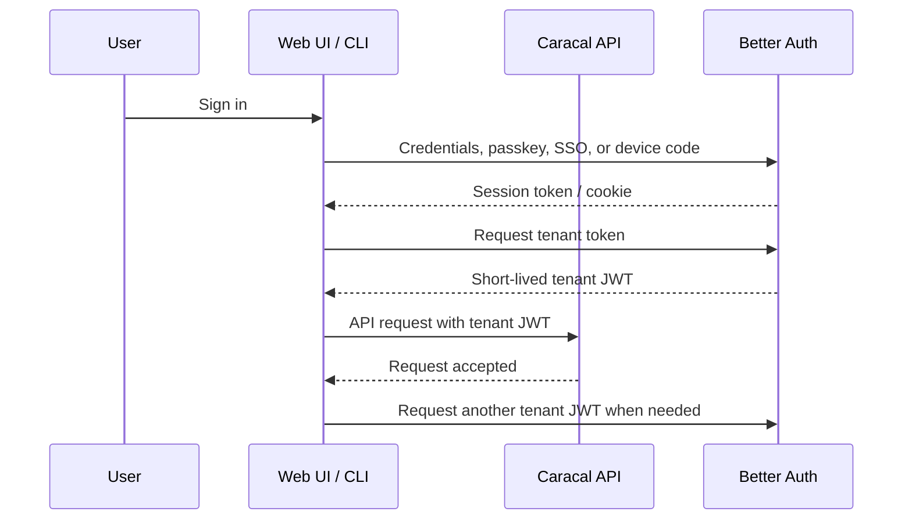

<!--
SPDX-FileCopyrightText: 2026 Ryan Madhuwala <rawx18.dev@gmail.com>
SPDX-License-Identifier: Apache-2.0
-->


# Token Expiry Settings

Most deployments don't need to change these. Caracal API requests use short-lived tenant JWTs minted by the Better Auth identity service. Browser and CLI devices hold Better Auth sessions and mint tenant JWTs as needed.

## Token Lifecycle



> **Tip:** Tenant JWTs are verified without a database lookup, so they expire quickly. Revoking a Better Auth session prevents that browser or CLI device from minting new JWTs.

## Recommended Configurations

Pick the row that matches your environment:

| Scenario | Tenant JWT | Session | Notes |
|----------|------------|---------|-------|
| **Development / local** | 15 min | Better Auth default session policy | Minimal setup friction; Development Login remains local-only. |
| **Production (standard)** | 15 min | Better Auth default session policy | Good balance of fast API verification and session revocation. |
| **High-security / SOC 2** | 15 min | Shorten Better Auth session policy in the identity service | Revocation blocks future JWT minting; already-issued JWTs expire naturally. |
| **Shared workstations** | 15 min | Use short Better Auth sessions and revoke other sessions after password changes | Sessions don't survive shift changes. |
| **CI/CD service accounts** | 15 min | Prefer a managed service identity/session workflow | Long-lived Caracal API keys are not supported. |

## How to Change

Tenant JWT expiry is configured in the identity service JWT plugin. It is not a runtime operator setting.

> **Warning:** Changing expiry does NOT retroactively affect existing tokens. Already-issued tokens keep their original TTL. To force a device to re-authenticate, revoke its Better Auth session from Security settings.

## Verify it works

Decode a freshly-issued access token to confirm the new expiry:

```bash
# Get a fresh token
caracal auth login --output json
jq -r .access_token ~/.caracal/config.json | cut -d. -f2 | base64 -d 2>/dev/null | python3 -m json.tool
```

Check the `exp` claim - it should be `iat` + your configured access token TTL (in seconds).


## General Guidance

- **Keep tenant JWTs short-lived.** Session revocation is enforced when a client mints its next tenant JWT; already-issued JWTs expire naturally.
- **Clock synchronization matters.** JWTs use `exp` / `iat` claims. If your server clock drifts >30 seconds from client clocks, tokens will be rejected prematurely or accepted past expiry. Use NTP.
