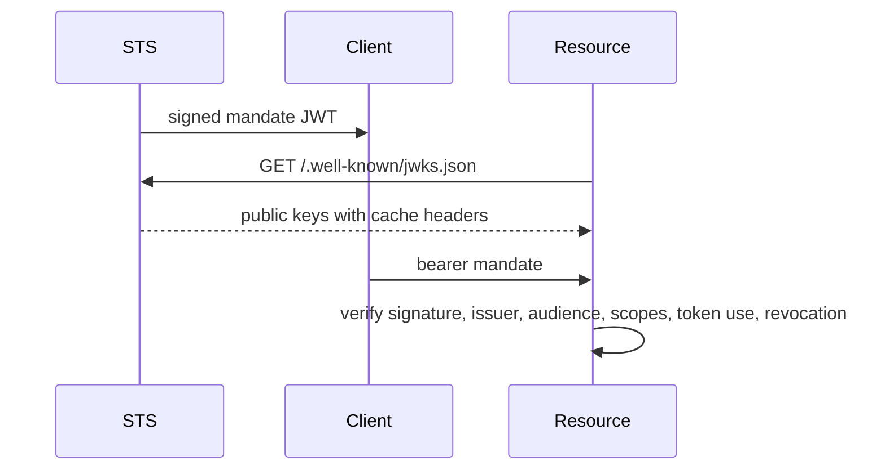

Caracal uses separate keys for encryption, mandate signing, audit integrity, stream integrity, and service-to-service exchange.

## Key Map

| Material                     | Used by                                         | Purpose                                                                                                                       |
| ---------------------------- | ----------------------------------------------- | ----------------------------------------------------------------------------------------------------------------------------- |
| Zone signing keys            | STS                                             | Sign mandate JWTs and publish public keys through JWKS.                                                                       |
| `SECRET_STORE_KEK`           | API and STS                                     | Root key that seals Secret Store envelopes: provider credentials, zone signing material, connection tokens, and sink secrets. |
| `AUDIT_HMAC_KEY`             | API, STS, Gateway, Audit, Control               | Protect audit event integrity.                                                                                                |
| `STREAMS_HMAC_KEY`           | API, STS, Gateway, Coordinator, Audit/consumers | Sign Redis stream messages in published modes.                                                                                |
| `GATEWAY_STS_HMAC_KEY`       | Gateway and STS                                 | Authenticate Gateway token-exchange requests to STS.                                                                          |
| Admin and Coordinator tokens | API, Coordinator, Console, Control              | Authenticate management and Session/Delegation operations.                                                                    |

## Secret Envelopes

Every stored secret is sealed into a self-describing envelope: a fresh data-encryption key encrypts the value with ChaCha20-Poly1305, and `SECRET_STORE_KEK` wraps that data key. Envelopes bind a key fingerprint and a purpose-specific associated-data string, so a value decrypts only under the correct key and in the context it was written for. The embedded fingerprint also routes each read to the right key while `SECRET_STORE_KEK_PREVIOUS` carries a retiring key through a rotation window. The KEK lives in the service environment, never beside the ciphertext, and startup rejects weak or short keys. [Configure Secret Backends](/operations/secret-backends/) covers where envelopes and user-entered credentials are stored and how the master key rotates.

## Mandate Verification

STS JWKS responses are cacheable; rotation plans must preserve overlap until verifier caches expire.

## Gateway Exchange Signature

Gateway signs STS exchange requests with timestamp, request ID, method, path, and form body. STS checks the signature, skew, request ID, and nonce before accepting the Gateway-authenticated path.

## Published-Mode Requirements

In `rc` and `stable`, HMAC keys used by services must be present and at least 32 bytes where validated. Missing keys cause startup or readiness failure rather than silent downgrade.

## Next Step

Use [Enforce Boundaries](/architecture/trust-boundaries/) to connect keys, services, commands, and data stores to trust boundaries.

## Related Pages

- [Rotate Keys and Secrets](/operations/key-management/)
- [Configure Secret Backends](/operations/secret-backends/)
- [Identity Package](/sdks/identity/)
- [Enforce Boundaries](/architecture/trust-boundaries/)
