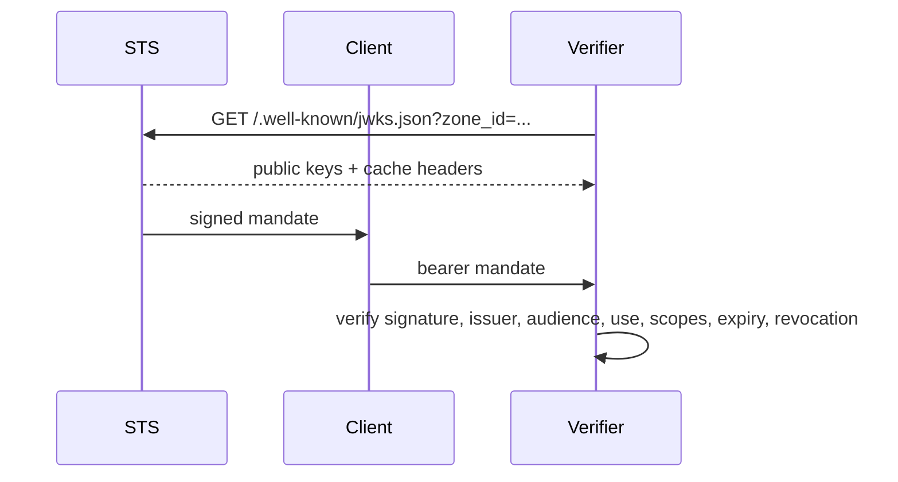

Caracal separates keys so compromise or rotation at one boundary does not silently authorize another.

## Key-to-Boundary Map

| Material                              | Boundary                                                                                  | Failure implication                                                                      |
| ------------------------------------- | ----------------------------------------------------------------------------------------- | ---------------------------------------------------------------------------------------- |
| Zone signing keys                     | STS mandate issuance to verifiers                                                         | Missing private material blocks issuance; stale JWKS caches can reject a rotated signer. |
| `SECRET_STORE_KEK`                    | Services to sealed provider, signing, connection, sink, application, and workload secrets | Wrong key fingerprint prevents decryption; restore ciphertext and keyring together.      |
| `AUDIT_HMAC_KEY`                      | Producers to Audit evidence                                                               | Mismatch creates HMAC failures and blocks trusted ingestion.                             |
| `STREAMS_HMAC_KEY`                    | Stream producers to consumers                                                             | Mismatch blocks trusted propagation in published modes.                                  |
| `GATEWAY_STS_HMAC_KEY`                | Gateway to STS exchange                                                                   | Mismatch denies every Gateway-authenticated exchange.                                    |
| Admin/Coordinator/Control credentials | Operator clients to management surfaces                                                   | Missing or insufficient scope yields `401` or `403`; do not distribute to workloads.     |

## Mandate Verification Flow

Keep old public keys available until verifier caches and outstanding token TTLs no longer need them. Never copy private signing material to a verifier.

## Secret Envelope Rotation

Secret Store uses a fresh data-encryption key per value and wraps it with the configured KEK. The envelope records a key fingerprint and purpose-specific associated data. During KEK rotation, `SECRET_STORE_KEK_PREVIOUS` allows reads under the retiring key while data is rewrapped. Removing it too early makes old envelopes unreadable.

Published `rc` and `stable` modes require validated HMAC material rather than silently disabling integrity checks. A missing or short required key fails startup or readiness.

Use [Rotate Keys and Secrets](/operations/key-management/) for the operational procedure and [Configure Secret Backends](/operations/secret-backends/) for custody options.

## Next Step

[Enforce Boundaries](/architecture/trust-boundaries/).
