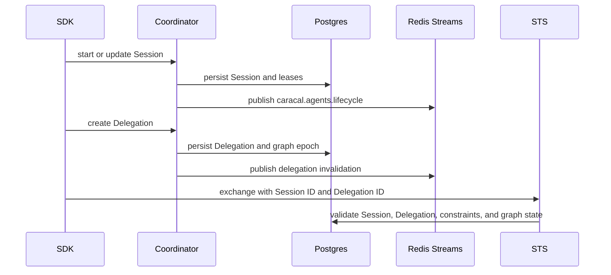

Coordinator owns governed execution state. It records Sessions, long-lived Session leases, invocation lifecycle, and Delegations that STS later uses to validate delegated exchanges.

## Flow

## Coordinator State

| State                     | Purpose                                                                                                           |
| ------------------------- | ----------------------------------------------------------------------------------------------------------------- |
| `sessions`                | Session tree, parent-child relationships, status, leases, and Subject authority record ID.                        |
| `agent_services`          | Retained internal table for long-lived Session heartbeat health.                                                  |
| `delegation_edges`        | Retained internal table for Delegation endpoints, resource and scope bounds, expiry, constraints, and status.     |
| `agent_invocations`       | Retained internal table for invocation lifecycle and deadline tracking.                                           |
| `delegation_graph_epochs` | Graph invalidation and traversal consistency.                                                                     |
| `caracal_outbox`          | Durable event publication for Coordinator-produced topics.                                                        |

## Event Topics

| Topic                            | Meaning                                                |
| -------------------------------- | ------------------------------------------------------ |
| `caracal.agents.lifecycle`       | Protocol topic for Session lifecycle.                  |
| `caracal.invocations.lifecycle`  | Invocation lifecycle.                                  |
| `caracal.delegations.invalidate` | Delegation graph invalidation.                         |
| `caracal.sessions.revoke`        | Authority record, Session, and Delegation revocation propagation. |

## Operator Boundaries

Human operators use the Console **Sessions** and **Delegation** views. Automation uses the Coordinator API or Admin SDK. Top-level `caracal` runtime commands do not manage Sessions or Delegations.

## Next Step

Use [Propagate Events](/architecture/event-streams/) to understand how lifecycle, invalidation, revocation, and audit messages move.

## Related Pages

- [Coordinate Session State](/services/coordinator/)
- [Session Delegation](/concepts/delegation/)
- [Manage Sessions and Delegation](/runtime-console/agents/)
