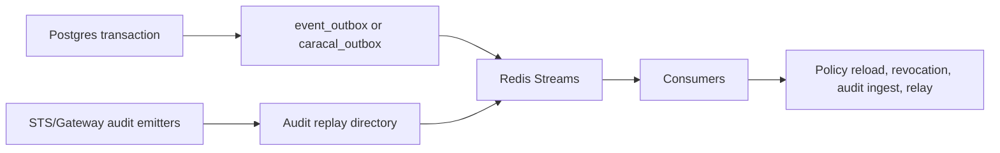

Caracal uses Postgres outboxes for durable enqueue and Redis Streams for asynchronous delivery. In rc and stable builds, producers sign stream messages with `STREAMS_HMAC_KEY` and consumers verify the signature before processing.

## Event Pipeline

## Streams

[Review Event Topics](/api/event-topics/) is the canonical list of stream topics, producers, and consumer groups. This page covers how events move: outbox enqueue, signed delivery, consumer groups, and replay.

## Outbox Behavior

| Outbox | Owner | Behavior |
| --- | --- | --- |
| `event_outbox` | API | Durable enqueue inside API transactions, cooperative dispatcher, signed Redis `XADD`, retry/backoff, dead-row metrics. |
| `caracal_outbox` | Coordinator | Dedupe by producer/topic/dedupe key and publishes Coordinator topics. |

## Audit Replay

STS and Gateway use replay directories under `/var/lib/caracal/audit-replay`. When Redis or Audit is unavailable, replay files preserve pending audit events so they can drain after recovery.

## Next Step

Use [Store State](/architecture/storage-model/) to understand which data is durable, transient, or recoverable.

## Related Pages

- [Operate Redis Streams](/operations/redis/)
- [Ingest Audit Evidence](/services/audit/)
- [Use Event Topics](/api/event-topics/)
