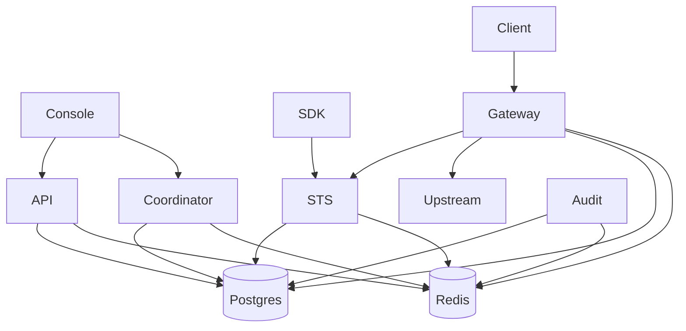

Use this map before exposing a service or diagnosing a cross-service failure.

## Caller Map

| Caller                        | Supported destination                                         | Avoid                                                              |
| ----------------------------- | ------------------------------------------------------------- | ------------------------------------------------------------------ |
| Human operator                | Web console on local `3001` or deployed console URL           | Direct database, Redis, or internal routes                         |
| Trusted management automation | Admin API/Admin SDK, or optional Control API on API `3000`    | Runtime CLI product-management commands                            |
| Workload needing mandates     | STS `POST /oauth/2/token` through an SDK or documented client | API admin credentials                                              |
| Protected HTTP client         | Gateway `8081` with a mandate and resource header             | Direct protected upstream when Gateway is the enforcement boundary |
| Session-aware application     | Coordinator `4000` through an SDK or documented API           | Coordinator operator tokens in workload source                     |
| Verifier                      | STS JWKS and revocation backend through verification packages | Private signing keys                                               |

Ports are local Compose defaults, bound to loopback. A production deployment normally places supported public surfaces behind TLS and keeps internal and operator-only routes private.

## Dependency Map

| Visible failure                               | Dependency to check                                                         |
| --------------------------------------------- | --------------------------------------------------------------------------- |
| Console cannot list or mutate product objects | API auth, API readiness, Postgres, then Redis/outbox                        |
| Exchange denies or cannot load policy         | STS, Postgres policy/product state, Redis invalidation, signing/secret keys |
| Gateway denies before reaching upstream       | Inbound mandate, resource binding, revocation, STS, or upstream safety      |
| Sessions or Delegations appear stale          | Coordinator, Postgres, Redis, outbox, leases/sweepers                       |
| Audit search lags behind requests             | Redis consumer state, Audit readiness, DLQ, replay volumes, Postgres        |

## Deployment Implications

- API, STS, Gateway, Audit, and Coordinator all need Postgres and Redis in the packaged topology; readiness captures more than process liveness.
- Gateway also depends synchronously on STS for per-request exchange.
- Console product views depend on API and Coordinator through the auth backend-for-frontend.
- Control is an optional API plugin, not a separate service or port.

Use [Choose a Deployment Profile](/operations/deployment-profiles/) for deployment choices and [Understand Services](/services/) for service-specific failure posture.

## Next Step

[Exchange Tokens](/architecture/token-exchange-flow/).
