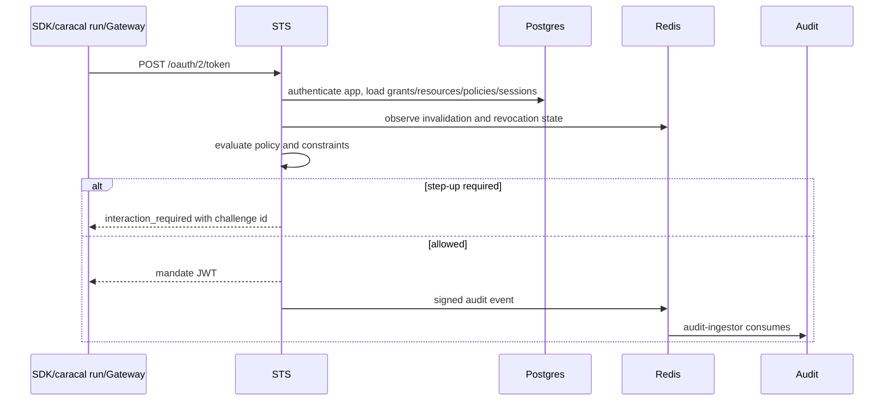

STS implements the token exchange boundary. Workloads, SDKs, `caracal run`, and Gateway submit existing authority plus requested resources and receive scoped mandates.

## Exchange Sequence

## Inputs

| Input                                                  | Purpose                                                                   |
| ------------------------------------------------------ | ------------------------------------------------------------------------- |
| `grant_type`                                           | OAuth token-exchange request type.                                        |
| `subject_token`                                        | An existing Caracal session mandate whose authority the exchange narrows. |
| `resource`                                             | Target resource identifiers.                                              |
| `scope`                                                | Requested resource scopes.                                                |
| `zone_id`                                              | Tenant boundary.                                                          |
| `application_id` and client credential                 | Authenticates the calling application.                                    |
| `session_id`, `agent_session_id`, `delegation_edge_id` | Protocol names for Authority record ID, Session ID, and Delegation ID.    |
| `challenge_id`                                         | Consumes an approved step-up hold during retry.                           |

RFC 8693 `actor_token` is not supported; the STS rejects requests that carry one. The calling application's authenticated identity is published to policy input as `input.context.actor_claims.caracal_client_id`.

## TTL Contracts

| Mandate type                | Contract                                                                   |
| --------------------------- | -------------------------------------------------------------------------- |
| Resource mandate            | Capped at 15 minutes.                                                      |
| Session mandate             | Capped at 60 minutes.                                                      |
| Runtime-injected credential | `caracal run` injects credentials capped at 15 minutes after STS exchange. |

Gateway performs a per-request exchange and rejects inbound tokens that are too close to expiry before proxying.

## Gateway-Authenticated Exchange

Gateway exchanges with STS using a request signature, timestamp, and nonce over the token exchange request. STS verifies the Gateway HMAC key and consumes the nonce before trusting the Gateway-authenticated path.

## Next Step

Use [Coordinate Sessions](/architecture/delegation-flow/) to see how Sessions and Delegations feed token exchange.

## Related Pages

- [Issue Mandates](/services/sts/)
- [Mandates](/concepts/mandate/)
- [Step-Up Challenges](/concepts/step-up/)
- [Use STS Endpoint](/api/sts/)
