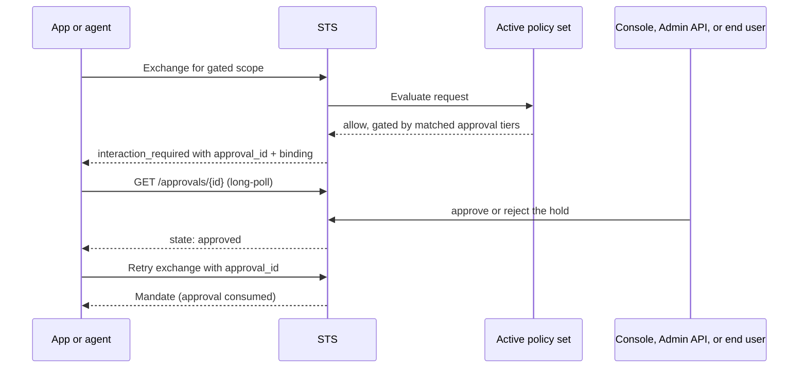

Read this page after [Policies and Policy Sets](/concepts/policy/). An Approval pauses a sensitive authority request until an eligible human decides it. Policy data maps scopes to risk tiers and identifies whether an operator, the federated Subject, or either may decide.

Approval is an optional security primitive. A zone that declares no `approval_tiers` data never creates a hold, and nothing in the platform requires one. One name carries through every surface: the SDKs call the decision's identifier `approvalId` and the wire calls it `approval_id` under `/approvals` paths; only the audit stream keeps the historical `step_up_` event-type prefix and `challenge_id` metadata key - see the [wire-name mapping](/reference/interoperability-contracts/#product-to-wire-mapping).

## Approval Flow

## Two Decision Planes

| Plane    | Approver                                                  | Surface                                                                                                 |
| -------- | --------------------------------------------------------- | ------------------------------------------------------------------------------------------------------- |
| Operator | A control-plane admin holding an `approve`-capable token. | Console Approvals page or `POST /v1/zones/{zone}/approvals/{id}/approve` / `/reject`.                  |
| Subject  | The requesting application's own authenticated end user.  | `POST /approvals/{id}/decision` on the STS, requiring a user-type session mandate and the hold's binding. |

The tier's `approver` declaration picks the plane: `operator`, `subject`, or `any`. On the operator plane, approval authority is a distinct admin capability - a `write` token cannot decide a hold. An `any` hold admits either plane, so operators can always decide it.

A Subject-only Approval requires the Application to federate its end user through a registered Subject issuer. Without that federation, the Approval can only expire. This is a decision mechanism, not per-Subject Resource authorization: the original Application, policy, scopes, and Delegation still bound the resulting Mandate.

## Components

| Component            | Responsibility                                                                                                                         |
| -------------------- | -------------------------------------------------------------------------------------------------------------------------------------- |
| Policy data          | Declares `risk` tiers per scope and `approval_tiers` gates; the platform fixes no tier taxonomy.                                       |
| STS                  | Creates the hold, serves its state to long-polling agents, records decisions, verifies the binding, and consumes the approval at mint. |
| Console or Admin API | Lists, inspects, and decides operator-plane holds.                                                                                     |
| Application          | Relays subject-plane holds to its own federated end user and posts the decision with the user's session mandate.                       |
| SDK or OAuth client  | Surfaces `interaction_required` and waits on the hold (`waitForApproval`); `caracal run` parks and retries automatically.              |

## Approval Lifecycle

| State      | Meaning                                                                                  |
| ---------- | ---------------------------------------------------------------------------------------- |
| `pending`  | The hold is live and awaiting a decision.                                                |
| `approved` | An approver granted the hold; the next matching exchange mints.                          |
| `rejected` | An approver refused the hold; terminal.                                                  |
| `expired`  | The approval window closed without a decision, or an approval lapsed before consumption. |
| `consumed` | The approval released its one mandate; terminal.                                         |

An Approval releases at most one Mandate. Its binding covers the Application, Authority record, Session, Delegation, Resource, scopes, and active policy version. A policy rollout or execution-context change therefore requires a fresh decision. Because the Authority record is minted per client-credentials exchange, a requester that restarts before its hold is decided returns with a new Authority record: persisting the approval id lets it observe the final state through `waitForApproval`, but consumption stays bound to the run that asked, so a restarted requester raises a fresh hold rather than consuming one approved for the prior process. Consumed and rejected are terminal.

## Privacy Modes

The tier's `privacy` declaration controls what the decision record retains of a Subject-plane approver: `identified` stores the Subject verbatim, `pseudonymous` a stable zone-scoped pseudonym, and `anonymous` a redaction marker. The approver's Authority record ID is always kept as the forensic and revocation anchor. Operator-plane decisions always record the deciding admin identity. Caracal stores authorization facts, never business context.

## Design Guidance

- Gate high-risk scopes, not everything: approval latency is a person, so reserve it for authority worth a pause.
- Keep the decision outside policy; policy declares that a decision is needed, never performs it.
- Use `subject` tiers when the risk belongs to the application's end user and the application federates its users through a zone subject issuer; use `operator` tiers when the risk belongs to the zone.
- Give automation credentials `write` without `approve`, so no pipeline can silently settle a hold.
- Cross-check the binding: the agent prints it beside the approval id, and the web console shows it on the hold.

## Next Step

Read [Session Delegation](/concepts/delegation/) to understand how approved authority can be narrowed for another Session.

## Related Pages

- [Human Approval](/guides/human-approval/)
- [Policies and Policy Sets](/concepts/policy/)
- [Audit and Request Traces](/concepts/audit-ledger/)
