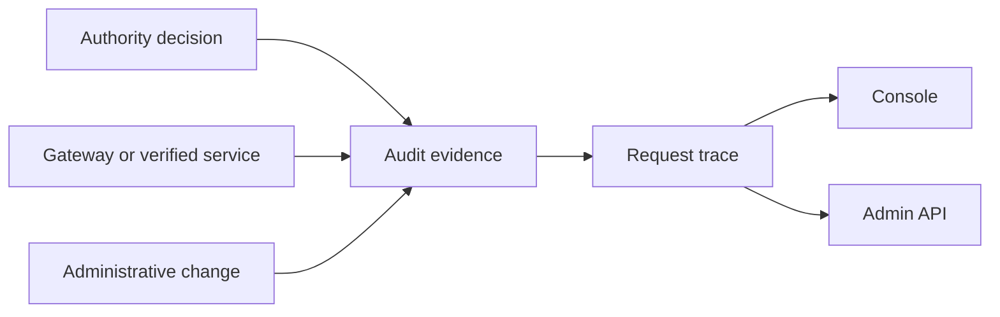

Use this page when you need to explain one decision or prove one action. Audit records what Caracal decided, the context used, and which request or Session produced the event.

## What Gets Audited

| Event area              | Examples                                                              |
| ----------------------- | --------------------------------------------------------------------- |
| Token exchange          | Allow, deny, Approval required, and policy diagnostics.               |
| Gateway and adapter use | Resource decision, mandate verification failure, request correlation. |
| Policy lifecycle        | Policy creation, validation, policy-set activation, simulation.       |
| Delegation              | Creation, traversal, impact, and revocation cascade.                  |
| Sessions                | Start, terminate, revoke, expire.                                     |
| Administration          | Zone, application, resource, provider, grant, and challenge changes.  |

## Evidence Flow

## How to Use Audit

| Question                                      | Where to look                                                        |
| --------------------------------------------- | -------------------------------------------------------------------- |
| Why was a request denied?                     | Console `request trace` or Admin API explain endpoint by request ID. |
| Which policy caused the decision?             | Determining policies and diagnostics.                                |
| Did revocation propagate?                     | Session, delegation, and resource decision events.                   |
| Which run made a request?                     | Request ID, Authority record ID, Session ID, and trace context.      |
| Was an Approval required, and who decided it? | Approval issuance, decision, and consumption events.                |

## Request IDs

Request IDs tie multiple events together. Keep the request ID from an SDK, Gateway, STS error, or Console trace whenever debugging. The explain view uses it to collect related decision events and diagnostics.

## Integrity and Retention

Tamper evidence is mechanical, not aspirational. Each ingested event is stored with a `content_sha256` of its payload, an HMAC computed under the deployment's `AUDIT_HMAC_KEY`, and the previous event's content hash - forming a per-zone hash chain. A background sweeper continuously recomputes hashes and HMACs and checks chain continuity; any mismatch or chain break surfaces as a tamper metric and readiness signal, and is treated as a security incident, never a retryable formatting issue. The database role that writes evidence cannot update or delete rows.

Retention defaults to 365 days (`AUDIT_RETENTION_DAYS`), and complete hourly partitions can be exported to S3-compatible storage - see [Export Audit Evidence](/operations/compliance-audit-integration/). Configure retention, export, and SIEM forwarding according to your deployment requirements, and do not rely on local process logs as the only authority trail.

## Outcome

For one request ID, you should be able to identify the Application, optional Subject attribution, Session, Resource, scopes, policy version, Approval or Delegation context, decision, and enforcement result.

## Next Step

Use [Guides](/guides/) when you are ready to apply the model.

## Related Pages

- [Tail and Query the Audit Stream](/guides/audit-stream/)
- [Trace One Protected Request](/tutorials/inspect-a-run/)
- [Operations](/operations/)
