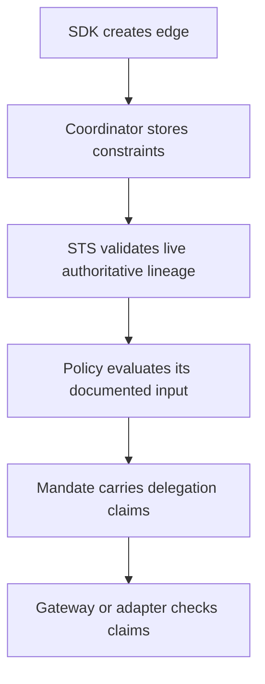

Typed constraints make delegated authority explicit. Coordinator validates them at edge creation and STS revalidates the current edge and its authoritative ancestry at token exchange.

## Constraint Types

| Constraint       | Use it to limit                                             |
| ---------------- | ----------------------------------------------------------- |
| Resource         | Which protected target can be reached.                      |
| Scopes           | Which actions can be requested.                             |
| TTL              | How long the delegated edge remains useful.                 |
| Hop count        | How deep the delegation chain may become.                   |
| Budget            | Maximum distinct requested scopes in one token exchange.    |
| Approval metadata | Audit/display annotation; it does not authorize the edge.    |
| Broad reason      | Audit/display note for an elevated resource-unbounded edge.  |

## Example Shape

```json
{
  "resource": "https://api.example.com/tickets",
  "scopes": ["tickets:read", "tickets:comment"],
  "max_hops": 2,
  "budget": 5,
  "expires_at": "2026-06-01T12:00:00Z",
  "policy_approved": true
}
```

`budget` stays between 1 and 1024. Repeated exchanges do not consume it, and duplicate scope tokens count once. It is not a call, work, cost, spend, quota, or cumulative-capacity ledger. `policy_approved` and `broad_reason` are metadata only.

Application-chain requirements are verifier options rather than edge constraints. Use `requireChainContains` at a resource boundary when a specific application must appear in the signed delegation chain.

## Where Constraints Are Enforced



## Design Guidance

- Put durable business rules in policy data documents.
- Put per-edge runtime limits in constraints.
- Prefer positive allowlists over open-ended deny lists.
- Keep constraints small enough to review in audit traces.
- Use consistent field names across agents so policies stay readable.

## Next Step

Read [Sessions and Revocation](/concepts/sessions-revocation/) to understand how active authority ends.

## Related Pages

- [Session Delegation](/concepts/delegation/)
- [Policies and Policy Sets](/concepts/policy/)
- [Implement Multi-Agent Delegation](/guides/delegation/)
