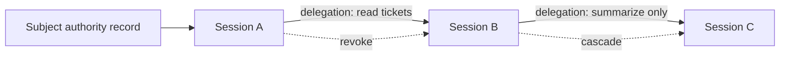

Read this page when one Session must give a child or peer less authority than the Application could otherwise request. A Delegation is a revocable, expiring authority relationship between Sessions.

Authority follows the **application**. Sessions started under the same application already act under that application's authority. Create a Delegation in exactly two cases:

- To **narrow** authority, so a child holds only a subset of what its parent can do (least privilege).
- To carry authority **across applications**, when a receiving Session belongs to a different application and explicitly presents the offered Delegation ID.

A Delegation is represented as a graph of directed edges. Each edge connects a source session to a target session, carries scopes and constraints, and can be revoked independently.

## Graph Model

## Delegation Fields

| Field                | Purpose                                                          |
| -------------------- | ---------------------------------------------------------------- |
| Source session       | The session that delegates authority.                            |
| Target session       | The child or receiving Session.                                  |
| Issuer application   | Application creating the delegation.                             |
| Receiver application | Application receiving authority.                                 |
| Resource             | Optional resource boundary for the edge.                         |
| Scopes               | Subset of authority being delegated.                             |
| Constraints          | Typed resource, scope, TTL, and hop limits plus audit metadata. |
| Status               | Active, expired, or revoked lifecycle state.                     |

## Rules

- Delegation should narrow authority, not expand it.
- Every Delegation must have a positive TTL; unbounded edges are rejected before creation.
- Delegation paths must not cycle.
- Hop count should be bounded.
- Revoking an upstream Delegation should invalidate downstream authority.
- Resource servers should verify delegation claims when they require delegated access.

Expiry removes the edge's authority without terminating either endpoint Session. STS rejects the expired edge and caps every mandate minted through it so the mandate cannot outlive the edge. The target Session remains active but cannot use that Delegation again; it must receive another live Delegation before it can mint delegated authority. Revocation is different: it is an explicit monotonic action that cascades through downstream Delegations and affected Session subtrees.

## What Delegation Bounds

A Delegation bounds every Mandate issued through it and every later Delegation chained from it. It never raises the Application's policy ceiling.

- A narrowed child receives no more scopes, Resources, lifetime, or hop budget than its parent.
- Inheriting from a narrowed parent preserves that narrowing for descendants.
- Inheriting from an Application-root Session does not manufacture delegated Resource authority.

Worked example: A starts B with `Authority.narrow([pipernet:read])`, then B starts C.

- If B starts C with **inherit**, Coordinator records a `B → C` edge mirroring B's `pipernet:read` slice, so C remains bounded by B's narrowing.
- If B starts C with narrower authority, Coordinator records a `B → C` edge and rejects it unless `C ⊆ B`.

The Application and active policy remain the hard ceiling. Use a separate Application when the receiver needs a separate credential or trust boundary. A cross-Application receiver must explicitly accept the offered Delegation before using it.

## SDK Relationship

The SDKs expose one primitive for creating children, one for granting a peer, and one for presenting a received grant:

| Language   | Start a child                            | Delegate to an existing peer | Present a received Delegation |
| ---------- | ---------------------------------------- | ---------------------------- | ----------------------------- |
| TypeScript | `session()` / `session({ authority })`   | `delegate()` / `revokeDelegation()` | `acceptDelegation()` |
| Python     | `session()` / `session(authority=…)`     | `delegate()` / `revoke_delegation()` | `accept_delegation()` |
| Go         | `Session()` / `Session` with `Authority` | `Delegate()` / `RevokeDelegation()` | `AcceptDelegation()` |

`session()` returns a child running under the **same application's** authority; it never moves the child into another application. Pass `Authority.narrow(...)` to bind a least-privilege Delegation or `Authority.none()` for no inherited authority. To hand authority across applications, use `delegate()` with an existing peer Session. The issuer's context is unchanged, and the receiver presents the Delegation with `acceptDelegation()`.

These helpers propagate session and delegation context so later token exchanges include the correct graph proof.

## Where You Interact With Delegation

Create Delegations at runtime through the SDK. The console is an inspection and revocation surface, not a Delegation authoring form. Audit records the Delegation ID, chain, scopes, and outcome.

## Next Step

Read [Delegation Constraints](/concepts/constraint/) to understand the limits carried by each edge.

## Related Pages

- [Implement Multi-Agent Delegation](/guides/delegation/)
- [Audit and Request Traces](/concepts/audit-ledger/)
