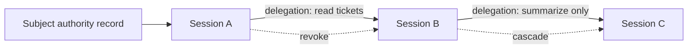

Delegation lets one Session pass a narrower, typed slice of authority to another Session.

Authority follows the **application**. Sessions started under the same application already act under that application's authority. Create a Delegation in exactly two cases:

- To **narrow** authority, so a child holds only a subset of what its parent can do (least privilege).
- To carry authority **across applications**, when a receiving Session belongs to a different application and explicitly presents the offered Delegation ID.

It is represented as a graph of directed edges. Each edge connects a source session to a target session, carries scopes and constraints, and can be revoked independently.

## Graph Model

## Delegation Fields

| Field                | Purpose                                                          |
| -------------------- | ---------------------------------------------------------------- |
| Source session       | The session that delegates authority.                            |
| Target session       | The child or receiving Session.                                  |
| Issuer application   | Application creating the delegation.                             |
| Receiver application | Application receiving authority.                                 |
| Resource             | Optional resource boundary for the edge.                         |
| Scopes               | Subset of authority being delegated.                             |
| Constraints          | Typed limits such as TTL, hop count, and distinct-scope budget, plus audit metadata. |
| Status               | Active, expired, or revoked lifecycle state.                     |

## Rules

- Delegation should narrow authority, not expand it.
- Every Delegation must have a positive TTL; unbounded edges are rejected before creation.
- Delegation paths must not cycle.
- Hop count should be bounded.
- Revoking an upstream Delegation should invalidate downstream authority.
- Resource servers should verify delegation claims when they require delegated access.

Expiry removes the edge's authority without terminating either endpoint Session. STS rejects the expired edge and caps every mandate minted through it so the mandate cannot outlive the edge. The target Session remains active but cannot use that Delegation again; it must receive another live Delegation before it can mint delegated authority. Revocation is different: it is an explicit monotonic action that cascades through downstream Delegations and affected Session subtrees.

## What a Delegation Bounds - and What It Does Not

A Delegation bounds **the token issued for that Delegation** and **any further Delegation chained from it**. It does **not** raise the application's authority ceiling. Internally and on the wire, Delegations are represented as graph edges.

- When a child is created with a **narrowing grant**, a `source → child` edge is recorded. A token exchange that presents this edge is bounded to the edge's scopes. Coordinator prevents widening when an edge is created, and STS independently rechecks every adjacent ancestor and child for scope, resource, expiry, TTL, hop, and budget attenuation before every delegated issuance.
- When a child is started with **inherit** under a narrowed parent, Coordinator mirrors the parent's Delegation onto the child in the same creation transaction. Least privilege is transitive by default.
- When a child is created with **inherit** under a **root parent** (one that holds the application's full authority with no inbound edge), no edge is recorded and the child runs under the application's policy-bounded authority. There is nothing narrower to carry forward - and because the decision contract mints resource mandates only over a Delegation, an edge-less session cannot present _delegated_ authority at all.

Worked example: A starts B with `Authority.narrow([tickets:read])`, then B starts C.

- If B starts C with **inherit**, Coordinator records a `B → C` edge mirroring B's `tickets:read` slice, so C remains bounded by B's narrowing.
- If B starts C with narrower authority, Coordinator records a `B → C` edge and rejects it unless `C ⊆ B`.

The consequence: the **application plus policy** is the hard, server-enforced boundary every session is contained by. Within one application, transitive inheritance keeps a narrowed subtree narrowed automatically. To place a subtree behind a real cross-application trust boundary, move it under a different application via `delegate()`. Creation records an offer and does not mutate the receiver's context. The receiver consents by possessing and presenting the opaque, target-Session-bound Delegation ID with `acceptDelegation()`; STS also verifies receiver application ownership and the live target Session before minting. All sessions of one application share a credential and a trust domain by design; transitive inheritance contains an _accidentally_ un-narrowed descendant, while a separate application contains a _mutually distrusting_ one.

## SDK Relationship

The SDKs expose one primitive for creating children, one for granting a peer, and one for presenting a received grant:

| Language   | Start a child                            | Delegate to an existing peer | Present a received Delegation |
| ---------- | ---------------------------------------- | ---------------------------- | ----------------------------- |
| TypeScript | `session()` / `session({ authority })`   | `delegate()` / `revokeDelegation()` | `acceptDelegation()` |
| Python     | `session()` / `session(authority=…)`     | `delegate()` / `revoke_delegation()` | `accept_delegation()` |
| Go         | `Session()` / `Session` with `Authority` | `Delegate()` / `RevokeDelegation()` | `AcceptDelegation()` |

`session()` returns a child running under the **same application's** authority; it never moves the child into another application. Pass `Authority.narrow(...)` to bind a least-privilege Delegation or `Authority.none()` for no inherited authority. To hand authority across applications, use `delegate()` with an existing peer Session. The issuer's context is unchanged, and the receiver presents the Delegation with `acceptDelegation()`.

These helpers propagate session and delegation context so later token exchanges include the correct graph proof.

## Where You Interact With Delegation

Delegation is authored **at runtime through the SDK**. There is intentionally no Console creation form; the Console remains an operator inspection and revocation surface. Call `session(authority=…)` or `delegate(to=…)`; Coordinator records and enforces the Delegation. Audit records the Delegation ID, hop chain, and scopes. See the [Coordinator protocol table](/api/coordinator/#delegation) for retained wire names.

## Next Step

Read [Delegation Constraints](/concepts/constraint/) to understand the limits carried by each edge.

## Related Pages

- [Implement Multi-Agent Delegation](/guides/delegation/)
- [Audit and Request Traces](/concepts/audit-ledger/)
