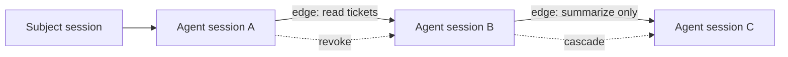

Delegation lets one agent session pass a narrower, typed slice of authority to another agent session.

Authority follows the **application**. Agents you spawn under the same application already act under that application's authority — no delegation edge is needed for ordinary fan-out. You create a delegation edge in exactly two cases:

- To **narrow** authority, so a child holds only a subset of what its parent can do (least privilege).
- To carry authority **across applications**, when the receiver is a different application that must consent.

It is represented as a graph of directed edges. Each edge connects a source session to a target session, carries scopes and constraints, and can be revoked independently.

## Graph Model

## Delegation Edge Fields

| Field | Purpose |
| --- | --- |
| Source session | The session that delegates authority. |
| Target session | The child or receiving agent session. |
| Issuer application | Application creating the delegation. |
| Receiver application | Application receiving authority. |
| Resource | Optional resource boundary for the edge. |
| Scopes | Subset of authority being delegated. |
| Constraints | Typed limits such as TTL, hop count, budget, and approval state. |
| Status | Active or revoked lifecycle state. |

## Rules

- Delegation should narrow authority, not expand it.
- Delegation paths must not cycle.
- Hop count should be bounded.
- Revoking an upstream edge should invalidate downstream authority.
- Resource servers should verify delegation claims when they require delegated access.

## SDK Relationship

The SDKs expose one primitive for creating children and one for granting a peer:

| Language | Spawn a child | Grant to an existing peer |
| --- | --- | --- |
| TypeScript | `spawn()` / `spawn({ grant })` | `delegate()` |
| Python | `spawn()` / `spawn(grant=…)` | `delegate()` |
| Go | `Spawn()` / `Spawn` with `Grant` | `Delegate()` |

`spawn()` returns a child running under the application's authority. Pass a **narrowing grant** (`Grant.narrow([...])`, `Grant.narrow(...)`, or `GrantNarrow(...)`) to bind a least-privilege delegation edge to the child, or `Grant.none()` for a child with no inherited authority. `delegate()` records an edge to an already-existing session — the path used to hand authority to a peer in another application.

These helpers propagate session and delegation context so later token exchanges include the correct graph proof.

## Next Step

Read [Delegation Constraints](/concepts/constraint/) to understand the limits carried by each edge.

## Related Pages

- [Implement Multi-Agent Delegation](/guides/delegation/)
- [Audit and Request Traces](/concepts/audit-ledger/)
