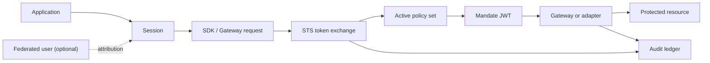

Read this section after Get Started when you need to design an integration or explain a decision. Get Started gave you the working vocabulary - application, resource, policy, mandate, Gateway, audit, zone. This section completes the model with the pieces behind them: how a **Session** bounds one run, how an optional **Subject** adds end-user attribution, how a **Delegation** narrows authority between Sessions, and how revocation and audit tie it all together. One sentence holds the whole picture: an Application acts in a Zone, a Session bounds execution, Delegation narrows authority, policy approves a Resource request, and a Mandate carries the result.

## Read This Section in Order

| Start here                                                | Use it to understand                                                          |
| --------------------------------------------------------- | ----------------------------------------------------------------------------- |
| [Caracal Mental Model](/concepts/model-overview/)         | The smallest useful picture of Caracal.                                       |
| [Authority and Enforcement](/concepts/authority-model/)   | Where decisions happen before requests reach a target.                        |
| [Zones](/concepts/zone/)                                  | The tenant boundary that owns keys, policies, resources, sessions, and audit. |
| [Identities and Applications](/concepts/principal/)       | Application credentials, Subjects and Federated users, Authority records, and Sessions. |
| [Resources and Grants](/concepts/resource-grant/)         | What can be accessed and which scopes are granted.                            |
| [Providers](/concepts/provider/)                          | The credential Caracal attaches to the upstream target.                       |
| [Policies and Policy Sets](/concepts/policy/)             | Rego rules evaluated by the STS during token exchange.                        |
| [Mandates](/concepts/mandate/)                            | The short-lived JWT that carries approved authority.                          |
| [Approvals](/concepts/approvals/)                        | How sensitive actions are held for a human decision.                        |
| [Session Delegation](/concepts/delegation/)               | How one agent passes bounded authority to another.                            |
| [Delegation Constraints](/concepts/constraint/)           | The limits attached to delegated authority.                                   |
| [Sessions and Revocation](/concepts/sessions-revocation/) | How active authority is ended and propagated.                                 |
| [Audit and Request Traces](/concepts/audit-ledger/)       | The event trail behind decisions and runs.                                    |
| [Caracal Operator](/concepts/operator/)                   | An optional governed assistant for reviewed console changes.                  |

## Core Flow

The same model appears across the product:

- Onboarding uses the web console guided setup to create the first zone, application, provider, resource, and policy, then makes the first protected call with the application's identity through an SDK transport.
- Guides use the SDKs, web console, Admin API, and adapters to build repeatable integrations.
- Operations pages use the same terms when explaining keys, revocation, audit, and runtime health.

## Term Map

| Term              | Short definition                                                                                         | Canonical page                                            |
| ----------------- | -------------------------------------------------------------------------------------------------------- | --------------------------------------------------------- |
| Zone              | Tenant boundary for authority data and signing keys.                                                     | [Zones](/concepts/zone/)                                  |
| Application       | Registered client or agent workload.                                                                     | [Identities and Applications](/concepts/principal/)       |
| Subject           | The identity work is done for: the Application itself by default, or a Federated user for attribution and supported approval flows. | [Identities and Applications](/concepts/principal/)       |
| Authority record  | Immutable record of identity and authority context created by an exchange.                             | [Identities and Applications](/concepts/principal/)       |
| Resource          | Protected API, MCP server, tool group, or upstream target.                                               | [Resources and Grants](/concepts/resource-grant/)         |
| Grant             | Policy data that describes which Application roles may request Resource scopes.                         | [Resources and Grants](/concepts/resource-grant/)         |
| Provider          | Credential mode Caracal uses toward the upstream target.                                                 | [Providers](/concepts/provider/)                          |
| Policy            | Versioned Rego logic evaluated at token exchange.                                                        | [Policies and Policy Sets](/concepts/policy/)             |
| Policy set        | Versioned bundle of policies activated for a zone.                                                       | [Policies and Policy Sets](/concepts/policy/)             |
| Mandate           | Short-lived JWT issued by the STS after policy approval.                                                 | [Mandates](/concepts/mandate/)                            |
| Delegation        | Bounded authority transfer between Sessions.                                                             | [Session Delegation](/concepts/delegation/)               |
| Revocation anchor | Authority record ID, Root authority record ID, Session ID, or Delegation ID checked by resource servers. | [Sessions and Revocation](/concepts/sessions-revocation/) |
| Caracal Operator  | Governed natural-language assistant that turns intent into reviewed control-plane changes.               | [Caracal Operator](/concepts/operator/)                   |
| System zone       | Reserved `caracal.sys/` zone for the infrastructure that runs Caracal.                                   | [Zones](/concepts/zone/#system-zone)                      |

## What to Read Next

After the concepts, use [Guides](/guides/) for task-focused procedures or [SDKs](/sdks/) for language-specific reference.
