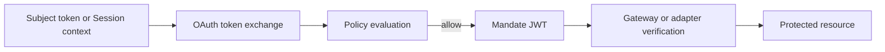

A mandate is the token Caracal issues after the STS approves an exchange. It is a short-lived JWT signed with the zone signing key and verified by the Gateway or resource adapters.

## What a Mandate Proves

A valid mandate proves:

- which zone issued it;
- which application and principal are acting;
- which session anchors are active;
- which resource targets and scopes were approved;
- which Authority record, Session, and Delegation supplied the authority;
- when the authority expires.

## Issuance Path

## Mandate Use

| Use                | Verification focus                                                             |
| ------------------ | ------------------------------------------------------------------------------ |
| Gateway request    | Issuer, audience, zone, resource, scopes, expiry, revocation.                  |
| MCP tool call      | Bearer token, required scopes, required targets, Session and Delegation constraints. |
| SDK outbound call  | Context propagation and mandate header injection.                              |
| Delegated exchange | Session, Delegation, scopes, hop count, and constraints.                       |

## Mandates Are Not API Keys

Mandates are intentionally short lived and context bound. They should not be stored as durable credentials, copied into configuration files, or reused across unrelated resources.

Resource servers should always verify a mandate at request time. Verification includes signature and claim checks plus revocation checks for the Authority record ID, Root authority record ID, Session ID, and Delegation ID when those claims are present. See the [parsed claim mapping](/sdks/identity/#parsed-claim-names) for language-level and raw JWT names.

## Failure Modes

| Failure                   | Meaning                                                                   |
| ------------------------- | ------------------------------------------------------------------------- |
| `invalid_token`           | Signature, issuer, audience, required claim, or expiry validation failed. |
| `scope_insufficient`      | The mandate does not contain a required scope.                            |
| `session_revoked`         | One of the mandate revocation anchors has been revoked.                   |
| `session_required`        | The resource requires authority from a governed Session.                  |
| `delegation_required`     | The resource requires delegated authority.                                |
| `chain_mismatch`          | The delegation chain does not include the required application.           |
| `hop_count_exceeded`      | The delegation path exceeds the configured hop limit.                     |

## Next Step

Read [Session Delegation](/concepts/delegation/) to understand how Sessions pass bounded authority.

## Related Pages

- [Sessions and Revocation](/concepts/sessions-revocation/)
- [Protect an MCP Server](/guides/protect-mcp/)
- [Run an Agent with caracal run](/guides/runtime-run/)
