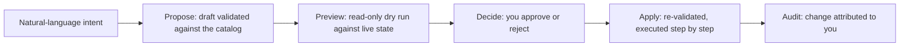

Caracal Operator lets you operate the control plane by describing what you want instead of navigating each console page by hand. It turns intent into a reviewed plan, then applies it through the same guarded APIs you use manually — within your operator scope and recorded in the audit log. Every change it makes is one you could have made yourself; it introduces no new authority.

## Why It Exists

Most control-plane work is a sequence of small, related changes: register an application, connect a provider, define a resource and its scopes, then activate the policy that ties them together. The Operator collapses that into a described outcome while keeping every safety property — validation, least privilege, approval, and audit — in the platform rather than the model.

The Operator works against a **capability catalog**: the set of control-plane actions it can take, grouped by the objects you operate — zones, applications, providers, resources, access, and policy. Each capability is classified as read-only or state-changing, so a request that only inspects state is always distinguishable from one that changes it.

## The Governed Lifecycle

A change never applies directly from natural language. Within a session the Operator follows a fixed lifecycle, and the language model only ever produces a draft that enters it:

1. **Propose.** Intent becomes a plan whose every step is validated against the capability catalog. A step that names an unknown action or invalid arguments is rejected before anything runs.
2. **Preview.** The plan is resolved against your live state as a read-only dry run, so each step is marked as a create, an update, a no-op, or blocked when a referenced object is missing. Nothing is written.
3. **Decide.** You approve or reject the plan. A plan is decided once, and only an approved plan is eligible to apply.
4. **Apply.** An approved plan is re-validated and re-previewed, then executed step by step. A plan applies only once, and any one-time secret it produces is surfaced in the apply response, never written to the conversation or the audit log.

## Authority and Isolation

The Operator runs under its own reserved identity, distinct from the human operator who approves a plan. When a plan applies, your approval is recorded in the admin audit log, while the execution record names the Operator's reserved principal as the authority that made the change — a delegated, attenuated form of your own authority.

That delegated authority is least-privilege: the Operator may execute only the capabilities explicitly granted to it. A plan that asks for a capability outside its grant is refused as forbidden, before execution. The Operator is also bounded by zone isolation — it will not open a session in, or execute against, a [system zone](/concepts/zone/#system-zone), keeping its authority away from the infrastructure that runs Caracal itself.

## Ask and Agent Modes

Every conversation runs in one of two modes, enforced by Caracal and never chosen by the model:

| Mode | What the Operator can do |
| --- | --- |
| Agent | Answer questions, read state, and propose plans that apply changes after your approval. |
| Ask | Strictly read-only: explain, investigate, and diagnose. It never produces a plan and cannot apply anything. |

Ask mode is enforced in two independent places — the planning skill is never selected, and the change endpoints refuse outright — so a read-only conversation is provably write-incapable.

## Autopilot

In agent mode you can engage **autopilot**, which lets Caracal auto-satisfy the approval step for changes it has pre-authorized as low-risk. It is off by default, and a deployment turns it on with a master switch and an explicit allowlist of low-risk capabilities. Even within the allowlist, Caracal forces a change to a human for any major change — such as granting access or rotating a credential — for plans that exceed the per-plan step limit, when the rolling auto-approval budget is spent, when a preview is anything other than a clean create or update, or when the advisory security review raises a warning. The master switch is a single kill switch that stops all auto-approval on the next turn.

## Authoring Policy

Policy is the densest control-plane object to write by hand: a decision rests on grant, binding, and confinement data that must parse as valid Rego and satisfy the platform decision contract. The Operator includes a dedicated policy author for exactly this. Describe the access you want — which application owns a resource, which roles hold which scopes, how to confine a label — and it drafts the matching [data documents](/concepts/policy/), explains each one, and reports the least-privilege posture, the risks it detected, ready-to-run simulations, and activation readiness.

Every draft is validated and previewed against the same contract the platform enforces, so a document the Operator emits is already contract-valid; if it cannot produce a valid document it fails closed rather than returning broken Rego. A draft is not a change. Turning one into a policy runs the ordinary [governed lifecycle](#the-governed-lifecycle) — you review the proposed create, approve it, and the create is re-validated on apply and attributed to you. Policies authored this way carry provenance marking them AI-assisted, and their later version, simulation, and activation steps stay under the same review and audit as any other policy work.

## Natural-Language Provider

Turning your words into a plan needs a language model, and that model is something you supply. The Operator is built on the [Vercel AI SDK](https://ai-sdk.dev) and talks to any OpenAI-compatible endpoint, so you can bring a hosted provider key, point at a local model server, or list several providers tried in order for resilience. The provider layer is **optional and off by default**: with nothing configured, the rest of the console is unaffected and the Operator simply runs without natural-language assistance.

Configure providers through the API service's `API_OPERATOR_AI_*` settings — see [Environment Variables](/operations/env-vars/#api-operator-and-control). Keys are read from the API service environment and never stored in or returned by the console.

## Where to Use It

The Operator is a console surface. For the full workspace behavior — the execution timeline, plan cards, composed requests, and long-session memory — see [Caracal Operator](/runtime-console/console/#caracal-operator) in the Web Console reference.

## Related Pages

- [Zones](/concepts/zone/) for the system zone the Operator self-governs.
- [Policies and Policy Sets](/concepts/policy/) for the data documents a plan can author.
- [Audit and Request Traces](/concepts/audit-ledger/) for the trail every applied change leaves.
