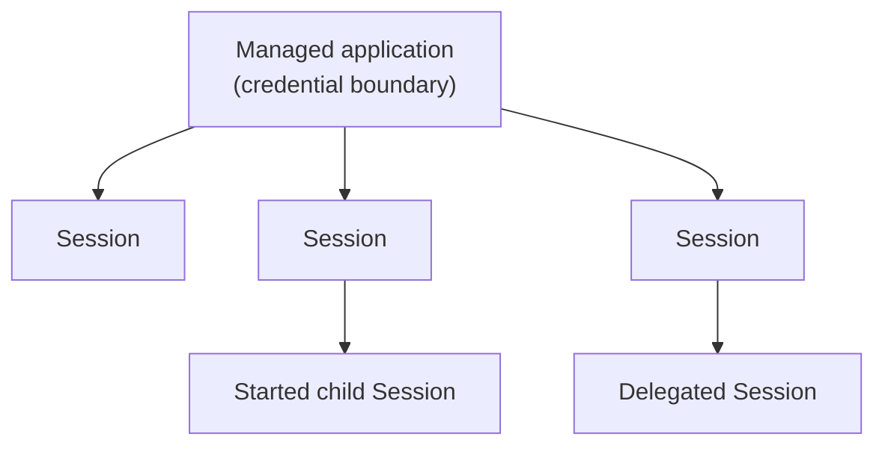
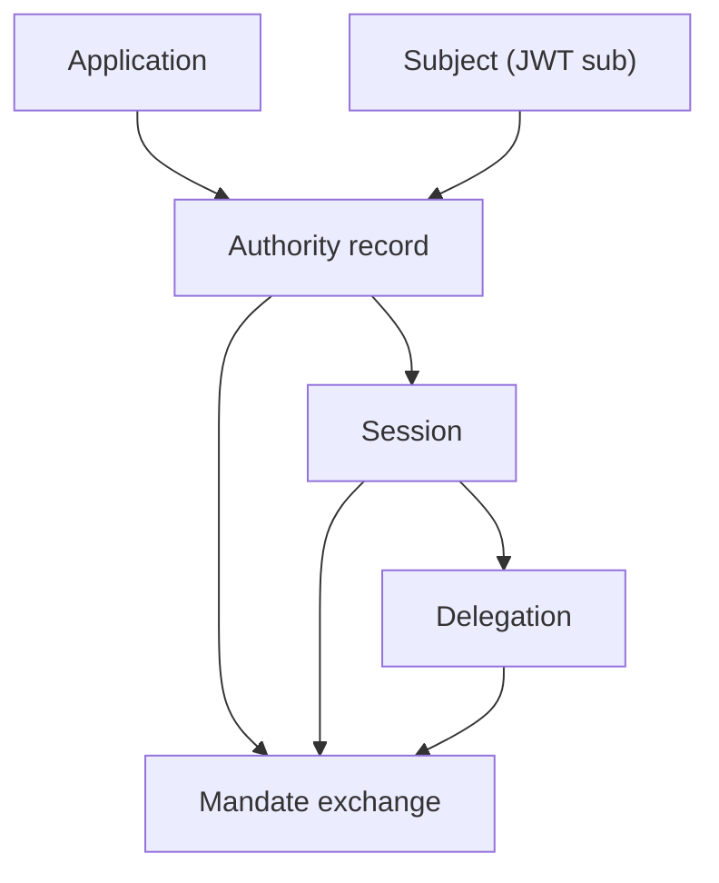

A principal is the acting identity. An application is the registered client or workload that authenticates and requests authority. A Subject is the JWT `sub` identity work is attributed to.

## Principal Types

| Principal | Typical source                                                 | How Caracal sees it                                                                                                                       |
| --------- | -------------------------------------------------------------- | ----------------------------------------------------------------------------------------------------------------------------------------- |
| User      | Your application's own authenticated end user.                 | Federated Subject (`sub`) recorded for attribution, provider connections, revocation, and audit - never an authorization input by itself. |
| Service   | Workload credential or client secret.                          | Application identity recorded on an Authority record and Session.                                                                         |
| AI agent  | Agent framework or autonomous software acting through the SDK. | One or more governed Sessions with labels, parentage, and delegation context.                                                             |

Principals are not enough on their own. A request also needs an application, Authority record, resource, scopes, and policy approval. Governed execution additionally has a Session.

## Application Roles

Applications represent software that can participate in Caracal flows:

- an agent runtime that starts Sessions for child agents;
- a backend service that requests mandates;
- a Gateway application that fronts protected upstreams;
- a adapter-protected resource server;
- a managed or dynamically registered client.

Applications have registration metadata, a server-owned token credential, and a registration method. Managed applications are operator-provisioned for known durable software, including runtimes that start Sessions for child agents. Dynamically registered applications are short-lived, isolated identities created through the zone DCR endpoint when a separate auto-expiring credential boundary is needed, such as a per-tenant or per-integration identity, rather than for ordinary Session fan-out.

## Applications Are the Credential Boundary; Sessions Are the Runtime Unit

An application is registered, holds a server-owned secret, and is the identity Caracal authenticates. A Session is started at runtime by the workload that already holds that secret; it carries parent, Subject authority record ID, labels, and delegation context. One application backs many Sessions, so a durable workload uses **one managed application** and starts, delegates, and fans out as many Sessions as it needs. You do not register an application per AI agent - see [Should I create one application per agent?](/reference/faq/#faq-006).

## Managed and DCR Applications

| Method  | Identity boundary                                                                                                | Operational rule                                                                                                                                                                                                                                     |
| ------- | ---------------------------------------------------------------------------------------------------------------- | ---------------------------------------------------------------------------------------------------------------------------------------------------------------------------------------------------------------------------------------------------- |
| Managed | One durable service, orchestrator, Gateway, or agent runtime - including a runtime that fans out AI-agent work.  | Created in the web console or Admin API and reused across many Sessions for the same workload.                                                                                                                                                       |
| DCR     | One short-lived, isolated application identity per tenant, integration, or externally issued ephemeral identity. | Created **programmatically only** through the Admin API or Admin SDK `applications.dcr()`, never in the web console; always expires, binds to exactly one Session, and cannot parent further Sessions. The Console lists DCR applications read-only. |

Coordinator records each Session's `lifecycle`: `task` for a block-scoped Session started by `session()`, or `service` for a long-lived, heartbeat-leased Session started by [`start_session()`](/sdks/python/). The value names lifecycle, not actor type. The credential boundary between managed and DCR identities is `registration_method`, not lifecycle; a DCR application's single Session is always `task`.

`lifecycle` carries one behavioral distinction: a `service` session holds a heartbeat lease and is swept when that lease lapses, while a `task` session is task-scoped - it is retired when its work completes (optionally bounded by a TTL). The two are governed by **different reapers**: a `task` is subject to the wall-clock TTL sweeper, and a `service` is **not** - its lifetime is governed solely by the heartbeat lease, so a service that keeps renewing its lease is never terminated on a timer. Service ownership is generation-fenced: creation starts at generation 1, attachment atomically increments it, and stale generations cannot heartbeat or terminate the Session. Task Sessions store generation 0 and retain their ordinary cleanup behavior. `lifecycle` does not change what an agent may do or which authority it carries.

The Session topology enforces two structural rules so a child can never outlast or out-scope what its position allows:

- A `task` parent cannot start a `service` child. The protocol reports `task_session_cannot_start_service`. A `service` parent may start either lifecycle.
- A DCR Session is a **leaf**: it cannot parent or be a child Session. The protocol reports `dcr_application_cannot_start_child` and `dcr_application_cannot_be_child`.

A **short-lived worker is not a separate lifecycle** - it is an ordinary `task` session created with a TTL. The mainstream tree of a long-lived orchestrator, mid-tier managers, and disposable task workers is modelled under **one managed application**:

- the orchestrator is the top-level Session, or a [`start_session()`](/sdks/python/) handle when it needs a heartbeat lease,
- each manager is a plain `session()` that inherits the application's authority,
- each task worker is `session(authority=Authority.narrow([...]), ttl_seconds=…)` - least-privilege and auto-terminated on block exit, with the TTL sweeper as a backstop.

Every node in that tree is a `task` Session under one managed application, distinguished by its Session ID, labels, and Delegation context. "Disposable worker" is expressed by TTL and narrowed authority, not a separate lifecycle.

DCR is therefore for credential isolation, not Session fan-out: it gives a unit of work an independently revocable, auto-expiring **application** identity.

A DCR application is reached by **authenticating as it**, not by starting it as a child. The Admin API registers the DCR application and returns a one-time secret and short expiry; the SDK never registers applications. An orchestrator injects those credentials into an independently launched workload, which authenticates with `client_credentials` and starts its single Session. The application then expires and is archived.

:::note[FAQ]
[What is the difference between an application, principal, and Session?](/reference/faq/#faq-005) and [when should I use a managed application versus DCR?](/reference/faq/#faq-007)
:::

Disabling DCR on a zone always stops future dynamic registration. If live DCR applications exist, operators choose whether those identities continue until expiry or are revoked immediately. Revocation archives the applications, revokes their Authority records and Delegations, and terminates their Sessions.

Policies receive registration method, Session ID, lifecycle, and labels through the documented [policy input contract](/concepts/policy/#policy-input-contract). Audit metadata records the application, registration method, Session ID, parent and Delegation context, requested scopes, and resource.

## Telling Sessions Apart

Every Session has one canonical Session ID. SDK context exposes it as `sessionId`, `session_id`, or `SessionID`. It is returned when `session()` or `startSession()` starts the Session and is stamped onto its token exchanges and audit events.

`labels` are descriptors, not identity. Many Sessions under one application can intentionally share labels. Use labels, metadata, or a trace ID for business correlation; use Session ID for exact attribution.

The Admin API audit endpoint filters by `session_id` for one Session or `label` for a role across many Sessions.

## Sessions Bind Identity to Time

Authority records, Sessions, and Delegations make authority revocable. Mandates carry their identifiers as revocation anchors.

## Naming Guidance

- Use **application** for registered software.
- Use **principal** for the acting identity.
- Use **Subject** for the JWT `sub` identity.
- Use **Authority record** for an STS exchange record.
- Use **Session** for a governed Coordinator execution.
- Avoid using "client" unless you are describing OAuth protocol fields.

## Next Step

Read [Resources and Grants](/concepts/resource-grant/) to understand what identities can request.

## Related Pages

- [Sessions and Revocation](/concepts/sessions-revocation/)
- [Session Delegation](/concepts/delegation/)
- [Integrate the TypeScript SDK](/guides/sdk-typescript/)
