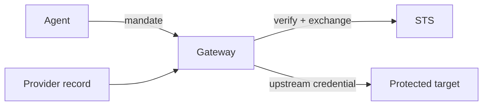

A credential Provider answers one question: after Caracal approves a call, what credential does the upstream target receive? Read [Resources and Grants](/concepts/resource-grant/) first. Every Gateway-routed Resource binds one Provider; one Provider can serve many Resources.

## Why Providers Exist

Callers never hold upstream credentials. The agent presents a Caracal mandate; Gateway verifies it, then attaches the upstream credential the provider describes. Provider secrets are sealed at creation and are not returned by list or detail APIs.

## Auth Modes

| Mode | Upstream receives | Use when |
| --- | --- | --- |
| None | No credential. | Gateway is the enforcement point and the upstream expects nothing. |
| Caracal mandate | The Caracal mandate as a bearer token. | The upstream verifies Caracal tokens itself with a verifier or adapter. |
| OAuth 2.0 authorization code | A consented upstream account's token. | The upstream needs delegated account consent. |
| OAuth 2.0 client credentials | A service-to-service token. | The upstream uses machine-to-machine OAuth, via the standard grant or an RFC 7523 signed-assertion grant such as a Google service account. |
| API key | A static key in a configured header. | The upstream uses vendor API keys. |
| Bearer token | A static pre-issued token. | The upstream expects a fixed bearer credential Caracal does not mint. |
| HTTP Basic | `Authorization: Basic` from a username and sealed password. | The upstream authenticates with a username/password or username/API-token pair. |

## How a Provider Is Used

Gateway strips the caller's authorization and forwards the provider credential instead. For OAuth modes, STS obtains and refreshes the upstream tokens; delegated consent is stored as a provider connection - one authenticated upstream account per subject and provider, distinct from Caracal grants, which express authorization.

## Common Mistakes

- A resource says what is protected; its provider says how the upstream is authenticated. Keep credential detail on the provider and target detail on the resource.
- Name providers with stable `provider://` identifiers, such as `provider://hooli-oidc`.
- OAuth providers support a real connectivity check before creation. The other modes are validated at creation and exercised when a resource first uses them.
- A Provider controls upstream authentication, not whether Caracal issues a Mandate.
- A Subject's Provider connection identifies its upstream account; it does not grant Caracal scopes.

:::note[FAQ]
[What is the difference between a resource and a provider?](/reference/faq/#faq-009) and [is an application secret the same as a provider credential?](/reference/faq/#faq-013)
:::

## Next Step

Read [Policies and Policy Sets](/concepts/policy/) to understand how requests against a Resource are allowed, denied, or held for Approval.

## Related Pages

- [Define Resources and Providers](/guides/resources-providers/)
- [Provider Recipes](/guides/provider-recipes/)
- [Resources and Grants](/concepts/resource-grant/)
