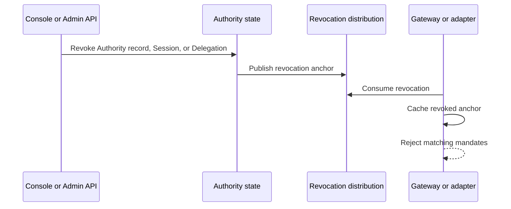

Read this page after [Delegation Constraints](/concepts/constraint/). Authority records, Sessions, and Delegations make authority temporary and revocable. A Mandate refers to these records so the Gateway or verified service can reject authority that has ended.

## Identity and Execution Records

| Record                | Role                                                                                                                                                            |
| --------------------- | --------------------------------------------------------------------------------------------------------------------------------------------------------------- |
| Subject               | Opaque JWT `sub` identity - the application itself by default, or a Federated user. The web console's **Subjects** page groups Authority records by this value.     |
| Authority record      | Immutable record created by an identity or authority exchange; an audit and revocation anchor.                                                                  |
| Root Authority record | First record in an authority ancestry; revoking it can end the descendant authority chain.                                                                      |
| Session               | Governed execution. A delegated Session is still a Session, with an inbound Delegation.                                                                          |

## A Subject Can Be a Federated User

**Subjects** is not a login surface, and a Subject is not only a federated identity. When an application exchanges as itself, the Subject is the application's own identity. When a zone registers an external identity system as a Federated user issuer and the application exchanges an end user's identity token, the Subject is that Federated user: the `sub` is recorded verbatim from the exchanged token, and the resulting Authority record carries no resource authority. Caracal never authenticates Federated users; it federates and records them.

A Session may attach the Federated user's Authority record only while presenting proof of control. That Federated user remains immutable attribution and a revocation anchor for the Session. It does not automatically replace the Application identity on later Resource Mandates and does not create per-Subject scopes.

## Revocation Anchors

Resource servers check every relevant anchor: Authority record ID, Root authority record ID, Session ID, and Delegation ID. The [parsed claim mapping](/sdks/identity/#parsed-claim-names) lists the canonical language-level names and raw JWT fields.

If any anchor is revoked, the mandate should be rejected as `session_revoked`.

## Revocation Flow

Suspension is reversible Session state, not permanent revocation. Gateway-routed requests perform a fresh STS exchange and reject a suspended Session immediately through authoritative Session validation. Already issued mandates checked directly by a resource verifier can remain usable until their mandate TTL expires; keep mandate TTLs within the documented 15-minute cap when suspension latency matters. Termination and Delegation revocation remain monotonic revocation events.

## Cascade Behavior

Revocation should follow authority:

- revoking an Authority record invalidates authority descended from it;
- revoking a Session invalidates its child Delegations;
- revoking a Delegation invalidates downstream delegated authority;
- revoking a grant prevents future exchange and can invalidate active Authority records and Sessions depending on workflow.

## Resource-Server Responsibility

The Gateway and adapters must be configured with a revocation store. For development, an in-memory store can be useful. For production, use a shared store and stream consumer so revocations propagate across resource-server instances.

## Next Step

Read [Audit and Request Traces](/concepts/audit-ledger/) to understand how decisions and requests are explained.

## Related Pages

- [Mandates](/concepts/mandate/)
- [Protect an MCP Server](/guides/protect-mcp/)
- [Tail and Query the Audit Stream](/guides/audit-stream/)
