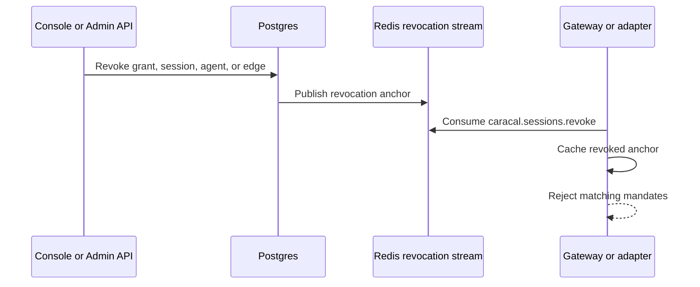

Sessions make Caracal authority temporary and revocable. A mandate includes session anchors, and resource servers check those anchors before accepting the mandate.

## Session Types

| Session | Role |
| --- | --- |
| Subject session | Original authenticated user or service context. Shown on the web console's *Subjects* page. |
| Agent session | Runtime context for a spawned agent. |
| Delegated session | An agent session that holds an inbound delegation edge - a *state* of an agent session, not a separate object. |

## Subject Identity Is Federated

Caracal does not generate subject identities, and the *Subjects* page is not a login surface. The `sub` on a subject session is taken verbatim from the subject token the application exchanged: the application's own identity system (Auth0, Keycloak, Better Auth, a custom JWT issuer) authenticates the user or service, and the exchange carries that identity into Caracal. Caracal treats the identifier as opaque - it does not need to know whether it names a user id, an employee id, or a customer id - and requires only that it is unique and stable for the same identity over time, so revocation and audit history stay attributable. Everything below the subject session is keyed by that `sub`: derived sessions, delegations, provider connections, approvals, and every audit event.

## Revocation Anchors

Resource servers check every relevant anchor:

- session ID;
- root session ID;
- agent session ID;
- delegation edge ID.

If any anchor is revoked, the mandate should be rejected as `session_revoked`.

## Revocation Flow

The Redis stream name is `caracal.sessions.revoke`. The Redis backend packages can consume the stream and populate local revocation stores.

## Cascade Behavior

Revocation should follow authority:

- revoking a subject session invalidates derived agent sessions;
- revoking an agent session invalidates its child edges;
- revoking a delegation edge invalidates downstream delegated authority;
- revoking a grant prevents future exchange and can invalidate active sessions depending on workflow.

## Resource-Server Responsibility

The Gateway and adapters must be configured with a revocation store. For development, an in-memory store can be useful. For production, use a shared store and stream consumer so revocations propagate across resource-server instances.

## Next Step

Read [Audit and Request Traces](/concepts/audit-ledger/) to understand how decisions and requests are explained.

## Related Pages

- [Mandates](/concepts/mandate/)
- [Protect an MCP Server](/guides/protect-mcp/)
- [Tail and Query the Audit Stream](/guides/audit-stream/)
