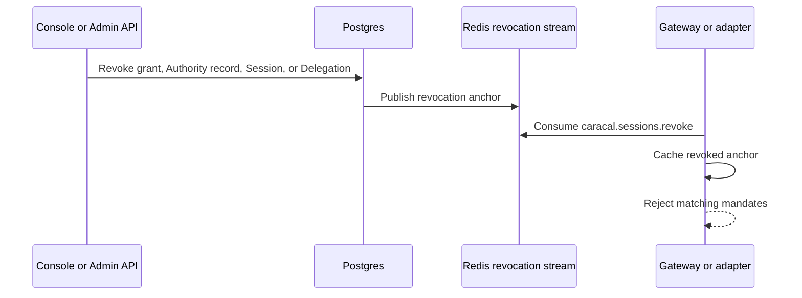

Authority records, Sessions, and Delegations make Caracal authority temporary and revocable. A mandate includes their revocation anchors, and resource servers check those anchors before accepting it.

## Identity and Execution Records

| Record                | Role                                                                                                                                                            |
| --------------------- | --------------------------------------------------------------------------------------------------------------------------------------------------------------- |
| Subject               | Opaque JWT `sub` identity. The Console's **Subjects** page groups Authority records by this value.                                                              |
| Authority record      | One STS exchange record, stored in `authority_records`. Its Authority record ID anchors revocation and audit.                                                    |
| Root authority record | Root of an STS exchange ancestry chain. Its ID anchors ancestry-wide revocation.                                                                                 |
| Session               | Governed Coordinator execution, stored in `sessions`. A delegated Session is a Session with an inbound Delegation, not a separate object type.                  |

## Subject Identity Is Federated

Caracal does not generate Subjects, and **Subjects** is not a login surface. The `sub` on an Authority record is taken verbatim from the token the application exchanges. To federate end users, a zone registers the identity system as a Subject issuer and the application exchanges each identity token for an Authority record with no resource authority.

A Session may attach that record through `subjectAuthorityRecordId`, `subject_authority_record_id`, or `SubjectAuthorityRecordID`. Session creation must also present the federated Subject mandate through `subjectAuthorityRecordToken`, `subject_authority_record_token`, or `SubjectAuthorityRecordToken`; a bare record ID is not proof of control. The verified user record remains the Session's immutable attribution and revocation anchor while application credentials rotate for lease maintenance. STS rejects Session-bound mints after that user record expires or is revoked, and Coordinator terminates a service Session when its next lease operation observes the inactive anchor. It does **not** by itself cause later resource mandates minted for the Session to carry the federated user's `sub`; callers that need the user's own mandate must present the federated mandate on the supported exchange or approval path.

## Revocation Anchors

Resource servers check every relevant anchor: Authority record ID, Root authority record ID, Session ID, and Delegation ID. The [parsed claim mapping](/sdks/identity/#parsed-claim-names) lists the canonical language-level names and raw JWT fields.

If any anchor is revoked, the mandate should be rejected as `session_revoked`.

## Revocation Flow

The Redis stream name is `caracal.sessions.revoke`. The Redis backend packages can consume the stream and populate local revocation stores.

Suspension is reversible Session state, not permanent revocation. Gateway-routed requests perform a fresh STS exchange and reject a suspended Session immediately through authoritative Session validation. Already issued mandates checked directly by a resource verifier can remain usable until their mandate TTL expires; keep mandate TTLs within the documented 15-minute cap when suspension latency matters. Termination and Delegation revocation remain monotonic revocation events.

## Cascade Behavior

Revocation should follow authority:

- revoking an Authority record invalidates authority descended from it;
- revoking a Session invalidates its child Delegations;
- revoking a Delegation invalidates downstream delegated authority;
- revoking a grant prevents future exchange and can invalidate active Authority records and Sessions depending on workflow.

## Resource-Server Responsibility

The Gateway and adapters must be configured with a revocation store. For development, an in-memory store can be useful. For production, use a shared store and stream consumer so revocations propagate across resource-server instances.

## Next Step

Read [Audit and Request Traces](/concepts/audit-ledger/) to understand how decisions and requests are explained.

## Related Pages

- [Mandates](/concepts/mandate/)
- [Protect an MCP Server](/guides/protect-mcp/)
- [Tail and Query the Audit Stream](/guides/audit-stream/)
