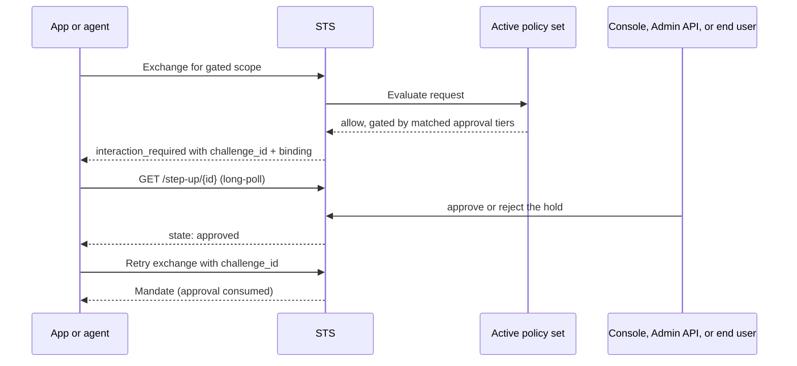

An approval is Caracal's way to pause a token exchange until a human decides it. Policy data classifies scopes into risk tiers; when a mint requests a gated scope, the STS creates a durable hold and returns `interaction_required` with a challenge id instead of a mandate. The mandate is released only after an authorized approver decides the hold.

Approval is an optional security primitive. A zone that declares no `approval_tiers` data never creates a hold, and nothing in the platform requires one.

## Approval Flow

## Two Decision Planes

| Plane | Approver | Surface |
| --- | --- | --- |
| Operator | A control-plane admin holding an `approve`-capable token. | Console Approvals page or `POST /v1/zones/{zone}/step-up-challenges/{id}/approve` / `/reject`. |
| Subject | The requesting application's own authenticated end user. | `POST /step-up/{id}/decision` on the STS, authenticated with a session mandate and echoing the hold's binding. |

The tier's `approver` declaration picks the plane: `operator`, `subject`, or `any`. A subject-only hold is the application's promise that only its own end user decides; no zone credential overrides it. On the operator plane, approval authority is a distinct admin capability - a `write` token cannot decide a hold.

## Components

| Component | Responsibility |
| --- | --- |
| Policy data | Declares `risk` tiers per scope and `approval_tiers` gates; the platform fixes no tier taxonomy. |
| STS | Creates the hold, serves its state to long-polling agents, records decisions, verifies the binding, and consumes the approval at mint. |
| Console or Admin API | Lists, inspects, and decides operator-plane holds. |
| Application | Relays subject-plane holds to its own end user and posts the decision with the user's session mandate. |
| SDK or OAuth client | Surfaces `interaction_required` and waits on the hold (`waitForApproval`); `caracal run` parks and retries automatically. |

## Challenge Lifecycle

| State | Meaning |
| --- | --- |
| `pending` | The hold is live and awaiting a decision. |
| `approved` | An approver granted the hold; the next matching exchange mints. |
| `rejected` | An approver refused the hold; terminal. |
| `expired` | The approval window closed without a decision, or an approval lapsed before consumption. |
| `consumed` | The approval released its one mandate; terminal. |

An approval releases exactly one token for exactly the held resource and scope set. Consumed and rejected are terminal and outrank expiry, so both planes always report the same state for the same hold.

## Privacy Modes

The tier's `privacy` declaration controls what the decision record retains of a subject-plane approver: `identified` stores the subject verbatim, `pseudonymous` a stable zone-scoped pseudonym, `anonymous` a redaction marker. The approver's session id is always kept as the forensic and revocation anchor. Caracal stores authorization facts, never business context - what was approved, by which authority, under which binding, and nothing else.

## Design Guidance

- Gate high-risk scopes, not everything: approval latency is a person, so reserve it for authority worth a pause.
- Keep the decision outside policy; policy declares that a decision is needed, never performs it.
- Use `subject` tiers when the risk belongs to the application's end user, `operator` tiers when it belongs to the zone.
- Give automation credentials `write` without `approve`, so no pipeline can silently settle a hold.
- Cross-check the binding: the agent prints it beside the challenge id, and the Console shows it on the hold.

## Next Step

Read [Mandates](/concepts/mandate/) to understand what the STS issues once an exchange is allowed or approved.

## Related Pages

- [Human Approval](/guides/step-up/)
- [Policies and Policy Sets](/concepts/policy/)
- [Audit and Request Traces](/concepts/audit-ledger/)
