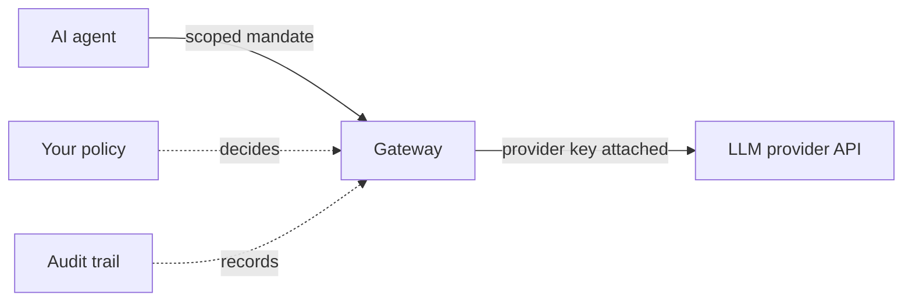

import { Tabs, TabItem } from '@astrojs/starlight/components'

In this walkthrough an AI agent makes its first protected call. The agent asks Caracal for authority, receives a short-lived scoped mandate, and calls an LLM provider through the Gateway - which checks policy, attaches the provider's real API key on the way through, and records everything. The agent never sees that key.



This is the workflow Caracal is built for, and it inverts traditional service authentication. A conventional service holds a long-lived API key and uses it whenever it likes; you find out what it did afterward, if at all. An agent under Caracal starts with nothing: authority is requested per run, granted by policy in exactly the scope you allowed, expires on its own, and leaves evidence. That difference matters most for agents because agents decide at runtime what to call.

Concretely, you will create four objects in the browser, then make the call with a small script:

- an **Application** - the identity your agent acts as;
- a **Provider** - Caracal's sealed custody of the LLM API key, so the key lives in Caracal, not in the agent;
- a **Resource** - Caracal's record of the LLM API and where to forward verified requests;
- a **Policy** - one rule allowing that application to list the provider's models.

## Prerequisites

- Complete [Install Caracal](/get-started/install-caracal/), including the sign-in setup at the end of that page.
- An API key for an OpenAI-compatible LLM provider. The walkthrough's only upstream call is `GET /v1/models`, which is free and consumes no tokens.
- One script runtime: Node.js 22+, Python 3.12+, or Go 1.26+.
- Keep a terminal open.

:::note[No provider key handy?]
Any OpenAI-compatible endpoint works: point the resource's upstream URL at a local model runner instead and create the provider with kind **None** (the Gateway then enforces policy and records audit without attaching a credential). Every other step is identical. One rule to respect: the upstream URL is resolved from inside the Gateway's container, where `localhost` means the Gateway itself - use a hostname the Gateway can reach.
:::

## Start Caracal

The same commands work in every shell:

```sh
caracal up
caracal status --ready
```

If readiness fails, run `caracal status --ready --json`; the output names the service that is not ready. Create nothing until readiness succeeds.

## Sign In and Create Your First Zone

Open the web console at [http://localhost:3001](http://localhost:3001) and sign in with the method you configured during [installation](/get-started/install-caracal/#enable-console-sign-in). A first sign-in walks through a short onboarding flow:

1. **Profile** - your name and avatar.
2. **Zone** - create your first zone. As introduced in the Overview, a zone is an isolated workspace: everything you create next lives inside it.
3. **Review** - confirm and finish.

Onboarding drops you into the console for that zone. The browser address follows an `account → org → zone` hierarchy (an org groups zones; onboarding creates a default one for you). If you later create more zones, the zone selector switches between them.

## Create the Agent's Access Chain

The console now shows **Guided setup**, a checklist that explains each building block and opens its real create form. Work through it in order:

| Step | What you do | Why |
| --- | --- | --- |
| Application | Create **Anton** as a *confidential* application - confidential means it runs server-side and can keep a secret, as opposed to code running in a browser. Copy the application ID and the client secret it shows you. | This is the identity your agent acts as. |
| Provider | Create a provider named **OpenAI** with kind **Bearer** and paste your provider API key. The key is sealed server-side on save. | This moves the LLM key out of your agent and into Caracal's custody. The Gateway will attach it to verified requests; the agent never receives it. |
| Resource | Create **OpenAI** with identifier `resource://openai`, scope `openai:models`, upstream URL `https://api.openai.com`, and the provider you just created. | This tells Caracal what it is protecting and where the Gateway should forward verified requests. A *scope* is a named permission - `openai:models` is the one permission this walkthrough grants: listing the provider's models. |
| Policy | Create and activate the starter policy allowing Anton to request `openai:models`. | Caracal denies everything not explicitly allowed. Without an active policy, every request in the zone is refused. |

Guided setup ticks each step off from live zone data; you can also reach the same forms from the **Applications**, **Providers**, **Resources**, and **Policies** pages in the navigation.

:::tip[Lost the secret?]
The application client secret stays recoverable: reveal it again from the application's detail panel in the console. Every reveal is recorded in audit, so recovery never bypasses the evidence trail. The provider API key is different - it is sealed for the Gateway's use and is never returned to anyone.
:::

## Give the Agent Its Identity

Your rules exist; now the agent needs the identity you just registered. It takes exactly three values from guided setup - the zone ID (shown in zone settings and in the console URL), the application ID, and the client secret:

<Tabs syncKey="os">
<TabItem label="Linux / macOS">

```sh
export CARACAL_ZONE_ID=<zone ID>
export CARACAL_APPLICATION_ID=<Anton's application ID>
export CARACAL_APP_CLIENT_SECRET=<Anton's client secret>
```

</TabItem>
<TabItem label="Windows">

```powershell
$env:CARACAL_ZONE_ID = "<zone ID>"
$env:CARACAL_APPLICATION_ID = "<Anton's application ID>"
$env:CARACAL_APP_CLIENT_SECRET = "<Anton's client secret>"
```

</TabItem>
</Tabs>

On the local stack the SDK's built-in defaults already point at the right service URLs, so these three variables are the whole configuration. Notice what is *not* here: the OpenAI key. The agent's environment never contains it.

## The Agent's First Protected Call

Install the SDK for one language and run the smallest possible agent - a script that asks Caracal for authority to list the provider's models, then sends that one request through the Gateway. On the local stack the Gateway listens at `http://localhost:8081`; the SDK builds the request and attaches the mandate for you.

<Tabs syncKey="lang">
<TabItem label="TypeScript">

```sh
npm install @caracalai/sdk
```

```typescript
// agent.mjs - run with: node agent.mjs
import { Caracal } from '@caracalai/sdk'

const caracal = new Caracal()
const governedFetch = caracal.applicationTransport('resource://openai', {
  scopes: ['openai:models'],
})
const target = caracal.gatewayRequest('resource://openai', '/v1/models')

try {
  const response = await governedFetch(target.url, { method: 'GET' })
  if (!response.ok) throw new Error(`protected call failed: ${response.status}`)
  console.log(await response.text())
} finally {
  await caracal.close()
}
```

</TabItem>
<TabItem label="Python">

```sh
pip install caracalai-sdk
```

```python
# agent.py - run with: python agent.py
import asyncio

from caracalai import Caracal


async def main():
    caracal = Caracal()
    target = caracal.gateway_request("resource://openai", "/v1/models")
    try:
        async with caracal.application_transport(
            "resource://openai",
            scopes=["openai:models"],
        ) as governed:
            response = await governed.get(target.url)
            response.raise_for_status()
            print(response.text)
    finally:
        await caracal.aclose()


asyncio.run(main())
```

</TabItem>
<TabItem label="Go">

```sh
go mod init agent && go get github.com/garudex-labs/caracal/packages/sdk/go
```

```go
// agent.go - run with: go run agent.go
package main

import (
	"fmt"
	"io"

	caracal "github.com/garudex-labs/caracal/packages/sdk/go"
)

func main() {
	client, err := caracal.New()
	if err != nil {
		panic(err)
	}
	defer client.Close()

	// nil base: the SDK constructs its own HTTP client.
	governed, err := client.ApplicationTransport(nil, "resource://openai", caracal.ApplicationTransportOptions{
		Scopes: []string{"openai:models"},
	})
	if err != nil {
		panic(err)
	}
	target, err := client.GatewayRequest("resource://openai", "/v1/models")
	if err != nil {
		panic(err)
	}

	resp, err := governed.Get(target.URL)
	if err != nil {
		panic(err)
	}
	defer resp.Body.Close()
	if resp.StatusCode < 200 || resp.StatusCode >= 300 {
		panic(fmt.Sprintf("protected call failed: %s", resp.Status))
	}
	body, _ := io.ReadAll(resp.Body)
	fmt.Println(string(body))
}
```

</TabItem>
</Tabs>

A JSON list of models means <mark>every link in the chain worked</mark>: the agent authenticated as Anton, policy allowed `openai:models`, a short-lived mandate was issued, and the Gateway verified it, swapped the mandate for the sealed provider key, forwarded the request, and returned the provider's answer. The agent authenticated to the provider without ever possessing its credential.

Here is what happened in that moment. `applicationTransport()` asked Caracal for exactly the authority you listed - the `openai:models` scope on `resource://openai` - and attached a fresh, short-lived, single-use mandate to the request. `gatewayRequest()` built the Gateway URL and the routing header that names the resource. The Gateway did the rest. A real agent does exactly this on every protected action - request scoped authority, present it to the Gateway - whether the operation is listing models, a chat completion under an `openai:chat` scope you add later, or any other API you protect.

:::caution[Failure point: the mandate is not a proxy pass]
The Gateway is not an open relay with extra steps. Let the mandate expire, replay one, or request a scope policy does not allow, and the request is rejected before the provider is contacted - and the rejection is recorded.
:::

## Read the Audit Trail

Every step you just triggered was recorded. In the web console:

1. Open **Audit**.
2. Find the request you just made.
3. Open the event detail to follow its full decision trace.

The explanation shows which application asked, which resource and scopes were requested, which policy version decided, what the Gateway did, and the final result. If a request fails, this same view tells you whether to fix configuration, policy, resource routing, or the upstream provider - diagnose from here rather than guessing.

## Common Mistakes

- The agent presents a Caracal mandate to the Gateway, never a provider key. If your agent's code asks for `OPENAI_API_KEY`, point it at the governed transport instead - the [next page](/get-started/add-sdk-to-your-app/) and [Provider Recipes](/guides/provider-recipes/) show how existing provider clients adopt it.
- Resource identifiers and scopes must match the active policy exactly - `openai:models` and `openai-models` are different strings.
- The one secret in the agent's environment is Anton's client secret - its identity, not the provider key. That key is sealed in Caracal and never leaves it.
- Signing in to the console does not connect your identity to the agent's calls. The call you made was made by the application identity. (Federating user identities in for attribution is possible later; nothing in Get Started needs it.)

## Clean Up

```sh
caracal down
```

`caracal down` stops the stack and keeps your data. Use `caracal purge` only when you intentionally want to erase local containers, volumes, config, runtime state, and caches.

## Next Step

Your agent made one protected call from a throwaway script. Next, wire the same call into a real application with a configuration profile: [Add SDK to Your App](/get-started/add-sdk-to-your-app/).
