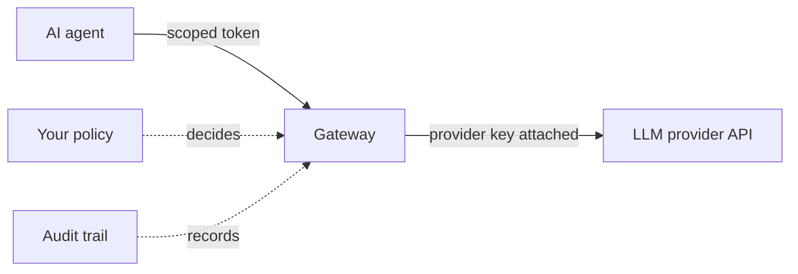

import { Tabs, TabItem } from '@astrojs/starlight/components'

In this walkthrough an AI agent makes its first protected call. The agent asks Caracal for authority, receives a short-lived scoped token, and calls an LLM provider through the Gateway - which checks policy, attaches the provider's real API key on the way through, and records everything. The agent never sees that key.



This is the workflow Caracal is built for, and it inverts traditional service authentication. A conventional service holds a long-lived API key and uses it whenever it likes; you find out what it did afterward, if at all. An agent under Caracal starts with nothing: authority is requested per run, granted by policy in exactly the scope you allowed, expires on its own, and leaves evidence. That difference matters most for agents because agents decide at runtime what to call.

Concretely, you will create:

- an **application** - the identity your agent acts as;
- a **provider** - Caracal's sealed custody of the LLM API key, so the key lives in Caracal, not in the agent;
- a **resource** - Caracal's record of the LLM API and where to forward verified requests;
- a **policy** - one rule allowing that application to list the provider's models;
- a **workload** - a launch identity so `caracal run` can start the agent with a fresh, scoped token instead of a stored key.

Everything is created in the browser. No config files are written on your machine.

## Prerequisites

- Complete [Install Caracal](/get-started/install-caracal/).
- An API key for an OpenAI-compatible LLM provider. The walkthrough's only upstream call is `GET /v1/models`, which is free and consumes no tokens.
- Choose an email address you can use to sign in.
- Keep a terminal open.

:::note[No provider key handy?]
Any OpenAI-compatible endpoint works: point the resource's upstream URL at a local model runner instead and create the provider with kind **None** (the Gateway then enforces policy and records audit without attaching a credential). Every other step is identical. One rule to respect: the upstream URL is resolved from inside the Gateway's container, where `localhost` means the Gateway itself - use a hostname the Gateway can reach.
:::

## Start Caracal

The same commands work in every shell:

```sh
caracal up
caracal status --ready
```

If readiness fails, run `caracal status --ready --json`; the output names the service that is not ready. Create nothing until readiness succeeds.

## Sign In and Create Your First Zone

Open the web console at [http://localhost:3001](http://localhost:3001).

The console ships locked down: nobody can register until you, from the machine that runs the stack, allow their email. Allow yours:

```sh
caracal allowlist add <your email>
```

The change applies immediately; no restart is needed. The same command family later manages suspension, restoration, and removal - see [Control Console Access](/runtime-console/console-access/) for the full lifecycle.

An allowlisted email still needs a way to sign in. Pick one, add its settings to the environment file the stack reads (`$CARACAL_HOME/caracal.env` - Linux default `~/.local/share/caracal/caracal.env`, macOS `~/Library/Application Support/caracal/caracal.env`, Windows `%LOCALAPPDATA%\caracal\caracal.env`), then rerun `caracal up`:

| Sign-in method | Required variables |
| --- | --- |
| Google or GitHub | `GOOGLE_CLIENT_ID` + `GOOGLE_CLIENT_SECRET` or `GITHUB_CLIENT_ID` + `GITHUB_CLIENT_SECRET`. OAuth callback URL: `http://localhost:3001/api/auth/callback/google` or `.../github`. |
| Email and password | `CARACAL_PASSWORD_SIGNUP=true`, plus `CARACAL_SMTP_URL` and `CARACAL_SMTP_FROM` so the required verification email can be delivered; the console fails closed without a mail transport. |

For OAuth, create an OAuth app in the [Google Cloud console](https://console.cloud.google.com/apis/credentials) or [GitHub developer settings](https://github.com/settings/developers), set its callback URL to the value above, and paste the client ID and secret into `caracal.env`. With email/password sign-up, registration sends a verification link over SMTP and the account signs in after the link is confirmed. The full sign-in reference lives in [Environment Variables](/operations/env-vars/#web-console-bff).

Sign in and complete the short onboarding flow:

1. **Profile** - your name and avatar.
2. **Zone** - create your first zone. As introduced in the Overview, a zone is an isolated workspace: everything you create next lives inside it.
3. **Review** - confirm and finish.

Onboarding drops you into the console for that zone. The browser address follows an `account → org → zone` hierarchy (`/<accountId>/<orgId>/<zoneId>/app/...`); if you later create more zones, the zone selector switches between them.

## Create the Agent's Access Chain

The console now shows **Guided setup**, a checklist that explains each building block and opens its real create form. Work through it in order:

| Step | What you do | Why |
| --- | --- | --- |
| Application | Create **Anton** as a *confidential* application - confidential means it runs server-side and can keep a secret, as opposed to code running in a browser. Copy the client secret it shows you. | This is the identity your agent acts as. |
| Provider | Create a provider named **OpenAI** with kind **Bearer** and paste your provider API key. The key is sealed server-side on save. | This moves the LLM key out of your agent and into Caracal's custody. The Gateway will attach it to verified requests; the agent never receives it. |
| Resource | Create **OpenAI** with identifier `resource://openai`, scope `openai:models`, upstream URL `https://api.openai.com`, and the provider you just created. | This tells Caracal what it is protecting and where the Gateway should forward verified requests. A *scope* is a named permission - `openai:models` is the one permission this walkthrough grants: listing the provider's models. |
| Policy | Create and activate the starter policy allowing Anton to request `openai:models`. | Caracal denies everything not explicitly allowed. Without an active policy, every request in the zone is refused. |

Guided setup ticks each step off from live zone data; you can also reach the same forms from the Applications, Providers, Resources, and Policies pages in the navigation.

:::tip[Lost a secret?]
Both the application client secret and the workload secret stay recoverable: reveal them again from the matching detail panel in the console. Every reveal is recorded in audit, so recovery never bypasses the evidence trail. The provider API key is different - it is sealed for the Gateway's use and is never returned to anyone.
:::

## Register a Workload

Your rules exist; now the agent needs a way to run under them. That is what a **workload** is: a launch identity you register once, so the `caracal run` command can start any agent process with fresh, scoped tokens already in its environment - instead of you pasting long-lived keys into shell profiles or `.env` files.

1. Open the **Launcher** page and create a workload. Copy its ID and secret.
2. Add a **launch binding** named `CARACAL_RESOURCE_OPENAI_TOKEN`, bound to `resource://openai` with scope `openai:models`. A launch binding is a simple instruction to the launcher: "before my agent starts, obtain a token for this resource and this scope, and place it in an environment variable with this name." The page shows the exact launch commands once the binding exists.
3. In your terminal, give the launcher the workload identity:

<Tabs syncKey="os">
<TabItem label="Linux / macOS">

```sh
export CARACAL_WORKLOAD_ID=<workload ID>
export CARACAL_WORKLOAD_SECRET=<workload secret>
```

</TabItem>
<TabItem label="Windows">

```powershell
$env:CARACAL_WORKLOAD_ID = "<workload ID>"
$env:CARACAL_WORKLOAD_SECRET = "<workload secret>"
```

</TabItem>
</Tabs>

These two variables configure the launcher itself; they are scrubbed from the agent's environment and never reach it. Instead of the inline secret, local dev and stable launches can read the owner-only file at `<Caracal config dir>/runtime/<workload_id>/secret`, and cloud deployments can point `CARACAL_WORKLOAD_SECRET_FILE` at a mounted secret; see [Configure Workloads](/runtime-console/config-file/).

## Run the Agent Under Caracal

With the identity variables exported, launch any agent process through `caracal run`:

<Tabs syncKey="os">
<TabItem label="Linux / macOS">

```sh
caracal run -- ./start-agent.sh
```

</TabItem>
<TabItem label="Windows">

```powershell
caracal run -- .\start-agent.ps1
```

</TabItem>
</Tabs>

Here is what happens in that moment: `caracal run` authenticates as the workload to Caracal's token service (called the **STS**, the component that evaluates policy and issues mandates), fetches the workload's launch bindings, obtains a short-lived scoped token for each one, and starts your agent with those tokens injected into the environment variables the bindings name. Everything else is scrubbed: `CARACAL_*` launcher variables do not leak into the agent. The full launcher contract, including renewal limits and approval holds, lives in [Run an Agent with caracal run](/guides/runtime-run/).

Notice what the agent's environment contains: a short-lived Caracal token - and no OpenAI key. You can see that with any agent process; the walkthrough uses plain shell commands so nothing is hidden:

<Tabs syncKey="os">
<TabItem label="Linux / macOS">

```sh
caracal run -- sh -c 'printenv | grep -i "openai\|api_key"'
```

</TabItem>
<TabItem label="Windows">

```powershell
caracal run -- powershell -Command "Get-ChildItem env: | Where-Object Name -match 'openai|api_key'"
```

</TabItem>
</Tabs>

The only match is `CARACAL_RESOURCE_OPENAI_TOKEN` - the scoped, expiring token from your binding. A prompt injection or dependency compromise inside this agent has no provider key to steal.

## The Agent's First Protected Call

The agent performs its protected operation by sending the request to the Gateway, not to the provider directly. On the local stack the Gateway listens at `http://localhost:8081`. Each request carries two headers:

| Header | Value | Purpose |
| --- | --- | --- |
| `Authorization` | `Bearer <the injected token>` | Proves policy allowed this exact access. |
| `X-Caracal-Resource` | `resource://openai` | Tells the Gateway which resource, and therefore which upstream, this request targets. |

Make the call - list the provider's models through the Gateway:

<Tabs syncKey="os">
<TabItem label="Linux / macOS">

```sh
caracal run -- sh -c 'curl -sS http://localhost:8081/v1/models \
  -H "Authorization: Bearer $CARACAL_RESOURCE_OPENAI_TOKEN" \
  -H "X-Caracal-Resource: resource://openai"'
```

</TabItem>
<TabItem label="Windows">

```powershell
caracal run -- powershell -Command "curl.exe -sS http://localhost:8081/v1/models -H ('Authorization: Bearer ' + `$env:CARACAL_RESOURCE_OPENAI_TOKEN) -H 'X-Caracal-Resource: resource://openai'"
```

</TabItem>
</Tabs>

A JSON list of models means <mark>every link in the chain worked</mark>: the workload authenticated, policy allowed `openai:models`, a mandate was issued, and the Gateway verified it, swapped the mandate for the sealed provider key, forwarded the request, and returned the provider's answer. The agent authenticated to the provider without ever possessing its credential.

A real agent does exactly this on every protected action - request scoped authority, present it to the Gateway - whether the operation is listing models, a chat completion under an `openai:chat` scope you add later, or any other API you protect. The [next page](/get-started/add-sdk-to-your-app/) moves this same flow into SDK code.

:::caution[Failure point: the token is not a proxy pass]
The Gateway is not an open relay with extra steps. Drop either header, let the token expire, or request a scope policy does not allow, and the request is rejected before the provider is contacted - and the rejection is recorded.
:::

## Read the Audit Trail

Every step you just triggered was recorded. In the web console:

1. Open **Audit**.
2. Find the request you just made.
3. Open the event detail to follow its full decision trace.

The explanation shows which application asked, which resource and scopes were requested, which policy version decided, what the Gateway did, and the final result. If a request fails, this same view tells you whether to fix runtime configuration, policy, resource routing, or the upstream provider - diagnose from here rather than guessing.

## Common Mistakes

- The agent presents the injected Caracal token, never a provider key. If your agent's code asks for `OPENAI_API_KEY`, point it at the Gateway URL and the injected token instead - that is exactly how the [research agent example](/examples/research-agent/) and the [SDK path](/get-started/add-sdk-to-your-app/) work.
- Resource identifiers and scopes must match the active policy exactly - `openai:models` and `openai-models` are different strings.
- You now hold two secrets: the application client secret and the workload secret. Neither is the provider API key - that one is sealed in Caracal and never leaves it.
- Signing in to the console does not connect your identity to the agent's calls. The call you made was made by the application identity. (Federating user identities in for attribution is possible later; nothing in Get Started needs it.)

## Clean Up

```sh
caracal down
```

`caracal down` stops the stack and keeps your data. Use `caracal purge` only when you intentionally want to erase local containers, volumes, config, runtime state, and caches.

## Next Step

Your agent made a protected call from a shell. Next, make the same call from agent code: [Add SDK to Your App](/get-started/add-sdk-to-your-app/).
