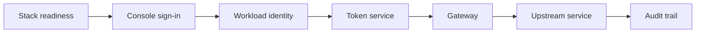

Use this page when a Get Started step fails. Every request you make crosses the same boundaries in the same order, so <mark>diagnose in that order and stop at the first boundary that fails</mark> - do not change policy, credentials, and routing at the same time:



Run the failing step once and keep its request ID or exact error, then start at the matching section below. For production incidents and deeper operational diagnosis, use [Troubleshoot by Symptom](/operations/troubleshooting/).

## Readiness Failures

The same command works in every shell:

```sh
caracal status --ready --json
```

| Symptom                  | Check                                                                                                              |
| ------------------------ | ------------------------------------------------------------------------------------------------------------------ |
| Docker command fails     | Confirm Docker Desktop or Docker Engine is running and `docker compose version` succeeds.                          |
| A service is not ready   | Wait for the dependency named in the JSON output, then rerun readiness.                                            |
| Ports are already in use | Stop the conflicting local process or change the runtime port configuration before starting Caracal.               |
| Stack state looks stale  | Run `caracal down`, then `caracal up`. Use `caracal purge` only when you intentionally want to remove local state. |

## Console Sign-In

| Symptom                                               | Check                                                                                                                                                                                                                                                                                                                                                                                                                                                                                                                    |
| ----------------------------------------------------- | ------------------------------------------------------------------------------------------------------------------------------------------------------------------------------------------------------------------------------------------------------------------------------------------------------------------------------------------------------------------------------------------------------------------------------------------------------------------------------------------------------------------------ |
| Sign-up is rejected or the access-denied page appears | The packaged console closes registration by default and shows one uniform page for every allowlist denial. On the runtime host, run `caracal allowlist list` to inspect entries, then `caracal allowlist add <email>` or `caracal allowlist unlock <email>` - see [Control Console Access](/runtime-console/console-access/). Make sure a sign-in method is configured in `$CARACAL_HOME/caracal.env` - see [Sign In and Create Your First Zone](/get-started/first-protected-call/#sign-in-and-create-your-first-zone). |
| Google or GitHub buttons are missing                  | Set both the client ID and client secret for the provider, then rerun `caracal up`.                                                                                                                                                                                                                                                                                                                                                                                                                                      |
| Password sign-in is blocked pending verification      | The packaged console requires a verified email. Confirm `CARACAL_SMTP_URL` and `CARACAL_SMTP_FROM` are set and the verification message was delivered.                                                                                                                                                                                                                                                                                                                                                                   |

## Workload Identity Issues

| Symptom                             | Check                                                                                                                       |
| ----------------------------------- | --------------------------------------------------------------------------------------------------------------------------- |
| `workload identity not found`       | Export `CARACAL_WORKLOAD_ID` and provide a workload secret source, exactly as in [Register a Workload](/get-started/first-protected-call/#register-a-workload). |
| `no credential bindings configured` | Define launch bindings for the workload on the **Launcher** page in the web console.                                        |
| Secret file is rejected             | Ensure the secret file exists and is readable only by the current user.                                                     |
| SDK cannot load configuration       | Set `CARACAL_CONFIG` to your `caracal.toml` path, or pass the profile path using the SDK-supported configuration mechanism. |

## Lost Workload Secret

The workload secret is held sealed server-side. If you lose your local copy, reveal it again from the web console **Launcher** page - each reveal is recorded in the zone audit timeline - or rotate the secret and update your secret file or environment with the new value.

## Token Service Denials (STS 403)

The STS is Caracal's token service: it checks policy and issues mandates. A 403 from it means your program authenticated successfully but policy did not allow what it asked for.

| Check             | Fix                                                                                         |
| ----------------- | ------------------------------------------------------------------------------------------- |
| Active policy set | Activate the starter policy set created by guided setup.                                    |
| Resource ID       | Use the resource ID you created in guided setup.                                            |
| Scopes            | Request only scopes covered by the starter policy.                                          |
| Workload secret   | Rotate the workload secret if the configured secret file no longer matches the workload.    |
| Audit request ID  | Open web console **Audit** with the request ID to see the policy diagnostic.                |

## Gateway 403

A Gateway 403 means policy already said yes and a token was issued, but the Gateway rejected the request before forwarding it upstream.

| Check                | Fix                                                                       |
| -------------------- | ------------------------------------------------------------------------- |
| Authorization header | Send `Authorization: Bearer <the injected token>`.                        |
| Resource header      | Send `X-Caracal-Resource` with the resource ID from guided setup.         |
| Token freshness      | Mandates are short-lived by design; rerun the workload to obtain a fresh one. |
| Revocation           | Confirm the session, application, or delegation was not revoked.          |
| Route binding        | Confirm the resource has the Gateway route and upstream URL you intended. |

## Upstream Unreachable

| Symptom               | Check                                                                                              |
| --------------------- | -------------------------------------------------------------------------------------------------- |
| Connection refused    | The upstream service is not listening, or the Gateway cannot reach that host and port.             |
| DNS failure           | Use a hostname visible from the Gateway container, not only from the host shell.                   |
| Demo upstream missing | Confirm the resource's upstream URL is reachable from the Gateway container and the provider key sealed on the provider is current. |
| Wrong path            | Use a known-good path on the upstream before trying custom paths.                                  |

## Missing Audit Events

| Check                                | Fix                                                                               |
| ------------------------------------ | --------------------------------------------------------------------------------- |
| Wrong request ID                     | Copy the request ID from the STS, Gateway, SDK, or web console output.            |
| Wrong zone                           | Select the zone used by guided setup.                                             |
| Request never reached STS or Gateway | Confirm the workload used your runtime configuration and the Gateway URL it sets. |
| Audit ingestion lag                  | Wait briefly and refresh the web console audit view.                              |

## Expected Outcome

Repeat only the failed step. Success means readiness passes, the protected call returns the upstream response, and Audit contains both the authorization decision and the Gateway result under the same request trace.

## Next Step

After the first run succeeds, continue with [Tutorials](/tutorials/) or the language-specific [SDK guides](/guides/).
