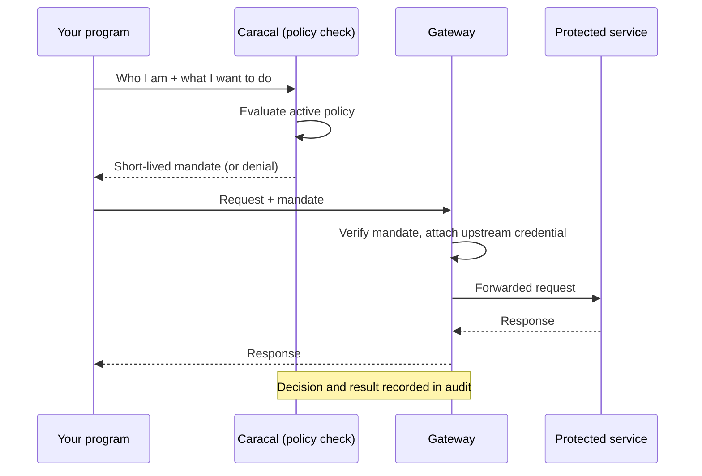
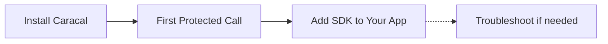

Caracal is a self-hosted, open-source system that controls what AI agents and automated programs are allowed to do, without giving them your API keys. This page explains the problem it solves and how it works before you install anything. By the end you will know every term the rest of Get Started uses.

## The Problem

If you run agents or automation today, each program that calls an external API usually holds a credential for it, an API key or token in an environment variable or config file. That works until you look closely at what the program can now do:

- The key usually grants far more than the program needs. An agent that should only read reports can often also write, delete, or administer.
- The key lives inside the program's process. A prompt injection, dependency compromise, or leaked log exposes it, and whoever has it has everything it grants.
- Turning access off means rotating the key and redeploying every workload that shares it. There is no central off switch.
- When something goes wrong, there is no reliable record of which program did what, with which permission, and why it was allowed.

These problems get worse with agents, because agents decide at runtime what to call. A static, all-powerful key in the hands of software that improvises is a standing risk.

## The Solution

Caracal puts a decision point between your program and the things it calls. Your program never holds the upstream API key. Instead, each time it wants to act:

1. The program proves its identity to Caracal.
2. It asks for a narrow, specific permission, such as "read from the reports service".
3. Caracal checks the rules you wrote. This happens before the action runs, not after.
4. If the rules allow it, Caracal issues a short-lived signed pass for exactly that permission.
5. The request travels through a checkpoint that verifies the pass, attaches the real upstream credential if one is needed, and forwards the request.
6. The decision and the result are written to a tamper-evident log.

If you revoke access, the pass stops working at the checkpoint. There is no key to rotate and no redeploy, because the program never had the key.

:::note[Key takeaway]
Your program never holds the upstream credential. It holds a short-lived, narrowly scoped pass that Caracal can refuse to renew or revoke centrally, and every use of it is recorded.
:::

## The Building Blocks

Caracal gives each part of that flow a name. Seven terms cover the rest of Get Started, and each one maps to something you already know:

| Term | Plain meaning | Familiar comparison |
| --- | --- | --- |
| Application | The registered identity your program acts as when it talks to Caracal. | An OAuth client with an ID and secret. |
| Resource | A thing you protect: an API, tool, model provider, or data service. | An upstream service behind a proxy. |
| Provider | Caracal's sealed custody of a resource's real upstream credential, attached only after a request is approved. | A vault entry only the proxy can use. |
| Policy | The rules that decide which application may use which resource, with which permissions. | An allow/deny ruleset evaluated before execution. |
| Mandate | The short-lived signed pass Caracal issues when policy allows a request. | A scoped access token with a tight expiry. |
| Gateway | The HTTP checkpoint in front of your resources. It verifies each mandate, attaches the upstream credential when one is needed, forwards the request, and records the result. | A reverse proxy that authenticates every request. |
| Audit | The append-only record of every decision and result. | A structured, tamper-evident event log. |

One more term appears when you first sign in: a **Zone** is an isolated workspace, like a project or tenant. Applications, resources, policies, and audit records all live inside one zone and never leak across zones.

## What Happens on a Request

Read it once as a story: <mark>your program asks, policy decides, a mandate is issued, the Gateway verifies and forwards, and audit records both the decision and the outcome</mark>. Every page that follows walks a real request through exactly this path.

## When to Use Caracal

Caracal fits when programs, not humans, need controlled access:

| Question | Use Caracal when |
| --- | --- |
| Do programs hold credentials? | Agents, services, or jobs call APIs, tools, providers, or data systems, and you do not want raw keys inside them. |
| Must access be decided up front? | An action should be allowed or denied before it runs, based on rules you control centrally. |
| Do you need a fast off switch? | Access must end centrally, without rotating keys or restarting every workload. |
| Do you need evidence? | You must be able to show which program did what, with which permission, under which rule, and what happened. |

Caracal is not an LLM framework, agent scheduler, or general-purpose API gateway. If you already use adjacent tools, here is where it differs:

| You already use | How Caracal differs |
| --- | --- |
| A secrets manager | It stores and rotates keys, but your program still holds the key at call time. Caracal keeps the key out of the program entirely and decides each request against policy. |
| An API gateway | It routes and rate-limits, but it does not decide per-request permission from your rules or issue short-lived passes per action. |
| An identity provider | It authenticates people. Caracal governs what programs do. Keep your IdP for logins; you can federate it into Caracal later for attribution. If your only need is human users behind a normal login, an identity provider alone is the right tool. |

## What You Will Do in This Section

1. [Install Caracal](./install-caracal/) - install one `caracal` executable, start the local stack with Docker, and enable console sign-in.
2. [First Protected Call](./first-protected-call/) - give an AI agent scoped authority to call an LLM provider from the browser console, then send one request through the full path and read its audit trail.
3. [Add SDK to Your App](./add-sdk-to-your-app/) - turn the first call into an application integration with a configuration profile.
4. [First-Run Troubleshooting](./first-run-troubleshooting/) - a boundary-by-boundary checklist if any step fails.

You are done when `caracal status --ready` succeeds, an agent's request reaches the protected provider through the Gateway, and the audit view shows the matching allow decision and result. A successful local run proves the enforcement path; it does not make the local stack production-ready.

## Prerequisites

You need a supported Linux, macOS, or Windows machine, Docker 25 or later with Compose v2, and permission to run containers. No Caracal source checkout is required.

## Where to Go Deeper

Get Started needs only the terms on this page. When you want the full model, including delegation between agents, revocation mechanics, and the audit chain, read [Concepts](/concepts/) after your first successful call. Contributors who want to build Caracal from source should use [Set Up Locally](/contributing/setup/) instead of this path.

## Next Step

Continue with [Install Caracal](./install-caracal/).
