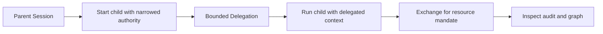

Use Delegation when one Session needs to hand a narrower slice of authority to another Session. The SDK creates the Delegation and carries the context; the web console shows the graph and impact.

`session()` always starts the child under the **same application** as the parent. Narrow the child's authority only when it should hold less than the parent. To hand authority across applications, use `delegate()` with a peer Session under the other application; it returns the Delegation, and the receiver presents it with `acceptDelegation()`.

## Implementation flow



## TypeScript example

```ts
import { Caracal, Authority } from '@caracalai/sdk'

const caracal = new Caracal()

await caracal.session(async () => {
  await caracal.session(
    async () => {
      const headers = await caracal.headersAsync()
      await fetch('https://api.example.com/tickets', { headers })
    },
    {
      authority: Authority.narrow(['tickets:read'], {
        resourceId: 'https://api.example.com/tickets',
        constraints: { maxHops: 1, budget: 5 },
        ttlSeconds: 600,
      }),
    },
  )
})
```

## Review the graph

1. Open `caracal web`.
2. Select **Delegation**.
3. Inspect active edges, inbound edges, outbound edges, and traversal.
4. Use impact before revoking an edge.
5. Check **Audit** for the delegated exchange and resource decision.

## Hand Over the Delegation ID Safely

The issuer and receiver share the opaque Delegation ID over their authenticated work channel, such as a queue message, RPC field, or task payload. Creation is only an offer and does not mutate receiver context. Possessing and presenting this target-Session-bound ID through `acceptDelegation()` is receiver consent; STS also checks the receiving application and live target Session. Use `acceptDelegation(delegationId, fn, { validate: true })` to confirm that exact ID with Coordinator before work runs under it. Every presentation emits a `delegation.accept` event.

## Safe constraints

| Constraint | Good default                              |
| ---------- | ----------------------------------------- |
| Scopes     | Small subset of parent authority.         |
| TTL        | Minutes, not days.                        |
| Hop count  | `1` unless a deeper graph is intentional. |
| Budget     | Maximum distinct scopes in each exchange. |
| Resource   | Single resource whenever possible.        |

## Troubleshooting

| Symptom                               | Check                                                                |
| ------------------------------------- | -------------------------------------------------------------------- |
| `Delegate requires an active Session` | Call delegation inside `session()` or a bound Caracal context.       |
| Resource denies delegated request     | Confirm the edge, ancestry, policy grant, and required scopes remain live. |
| Chain validation fails                | Confirm authoritative parent links are continuous; configure `requireChainContains` separately at verifiers when needed. |
| Revocation did not affect child       | Confirm cascade revocation and resource-server revocation consumers. |

Related pages: [Session Delegation](/concepts/delegation/) and [Delegation Constraints](/concepts/constraint/).
