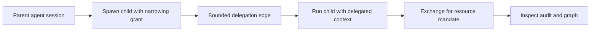

Use delegation when one agent needs to hand a narrower slice of authority to another agent. The SDK creates the edge and carries the context; the Console shows the graph and impact.

Both the parent and the child run under the **same application**. A plain `spawn()` already runs the child under that application's authority — reach for a narrowing grant only when the child should hold *less* than the parent, or when authority must cross into another application.

## Implementation flow



## TypeScript example

```ts
import { Caracal, Grant } from "@caracalai/sdk";

const caracal = Caracal.connect();

await caracal.spawn(async () => {
  await caracal.spawn(async () => {
    const headers = await caracal.headersAsync();
    await fetch("https://api.example.com/tickets", { headers });
  }, {
    grant: Grant.narrow(["tickets:read"], {
      resourceId: "https://api.example.com/tickets",
      constraints: { maxHops: 1, budget: 5 },
      ttlSeconds: 600,
    }),
  });
});
```

## Review the graph

1. Open `caracal console`.
2. Select `delegation`.
3. Inspect active edges, inbound edges, outbound edges, and traversal.
4. Use impact before revoking an edge.
5. Check `audit` for the delegated exchange and resource decision.

## Safe constraints

| Constraint | Good default |
| --- | --- |
| Scopes | Small subset of parent authority. |
| TTL | Minutes, not days. |
| Hop count | `1` unless a deeper graph is intentional. |
| Budget | Explicit request or work limit. |
| Resource | Single resource whenever possible. |

## Troubleshooting

| Symptom | Check |
| --- | --- |
| `Delegate requires an active agent session` | Call delegation inside `spawn()` or a bound Caracal context. |
| Resource denies delegated request | Confirm policy accepts the edge constraints and required scopes. |
| Chain validation fails | Confirm the expected application appears in the delegation path. |
| Revocation did not affect child | Confirm cascade revocation and resource-server revocation consumers. |

Related pages: [Agent Delegation](/concepts/delegation/) and [Delegation Constraints](/concepts/constraint/).
