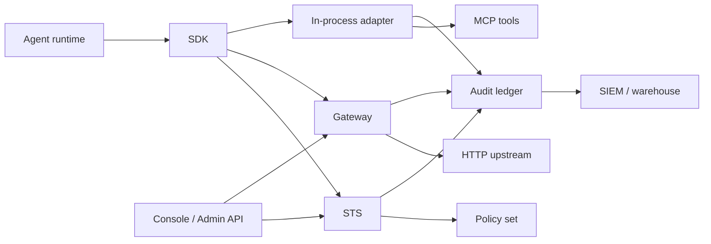

Production deployments usually combine the Gateway, adapters, SDKs, revocation consumers, audit export, and policy automation. Keep the same authority model, then place enforcement where it best fits the system.

## Pick an Enforcement Pattern

| Pattern | Use when | Primary guide |
| --- | --- | --- |
| Gateway-routed HTTP | You can route traffic through Caracal before it reaches the upstream. | [Protect a Gateway-Routed HTTP API](/guides/protect-gateway-http/) |
| In-process adapter | The resource server owns verification inside its framework. | [Protect an Express App](/guides/protect-express/), [Protect a FastMCP App](/guides/protect-fastmcp/), [Protect a Go net/http Service](/guides/protect-nethttp/) |
| Verify engine | You need framework-neutral bearer verification. | [Protect an MCP Server](/guides/protect-mcp/) |
| SDK transport injection | Provider SDK accepts custom fetch, transport, or HTTP client hooks. | [SDK guides](/guides/) |
| Batch or queue worker | Work runs outside request/response but still needs scoped mandates. | [Run an Agent with caracal run](/guides/runtime-run/) |

## Reference Architecture



## Production Checklist

| Area | Requirement |
| --- | --- |
| Zones | Separate production, staging, and customer trust boundaries. |
| Keys | Rotate zone signing keys and verify JWKS refresh behavior. |
| Workload launch | Author launch bindings on the console's Launcher page; keep workload-secret files locked down. |
| Revocation | Use shared revocation stores and stream consumers, not process-local memory. |
| Policy | Validate, simulate, version, activate, and audit policy-set changes. |
| Audit | Export decisions and diagnostics to operational monitoring or SIEM. |
| Step-up | Route gated mints to the zone's approvers through the Console Approvals queue or the Admin API decision routes. |

## Run Many Applications on One Host

Each service keeps its own application identity, even when several share a VM, node, or compose stack. Give every process its own `caracal.toml` and point `CARACAL_CONFIG` at it; the SDKs load that file before any other credential source.

```toml
# /etc/caracal/reporting.toml
zone_id = "zone_prod"
application_id = "app_reporting"
app_client_secret_file = "/etc/caracal/reporting.secret"
zone_url = "https://sts.example.com"
gateway_url = "https://gateway.example.com"

[[credentials]]
env = "OPENAI_API_KEY"
resource = "resource://openai"
credential_type = "provider_token"
upstream_prefix = "https://api.openai.com/v1"
```

```ini
# /etc/systemd/system/reporting.service
[Service]
Environment=CARACAL_CONFIG=/etc/caracal/reporting.toml
```

Repeat per service with a distinct `application_id` and secret file. Do not share one application identity across services: policy decisions and audit attribution both key on the application, and a shared identity collapses them into one indistinguishable actor. The [config file reference](/runtime-console/config-file/) documents the full schema.

When identity must be resolved at runtime instead of from a file - a vault-issued secret, per-tenant identities, or rotation without restarts - construct the client with a credentials resolver. All three SDKs export `CredentialsResolver`, and the resolver runs on each token exchange, so a rotated secret takes effect on the next mint:

```python
from caracalai import Caracal, ClientCredentials


def resolve() -> ClientCredentials:
    identity = vault.read("caracal/reporting")
    return ClientCredentials(
        zone_id=identity["zone_id"],
        application_id=identity["application_id"],
        client_secret=identity["client_secret"],
    )


caracal = Caracal.from_client_secret(
    coordinator_url="https://coordinator.example.com",
    sts_url="https://sts.example.com",
    credentials=resolve,
)
```

## Coexist with OpenTelemetry

Caracal needs no bridge configuration to run alongside an OpenTelemetry deployment. The SDK transport merges its envelope with headers already on the request: a valid `traceparent` written by your instrumentation is preserved rather than overwritten, `tracestate` passes through unchanged, and Caracal appends its `baggage` entries without dropping the ones your services set. The Gateway validates the W3C trace context on every request and records the trace id in each audit event's metadata.

```python
from opentelemetry.instrumentation.httpx import HTTPXClientInstrumentor

HTTPXClientInstrumentor().instrument()

client = caracal.transport()
response = await client.get("https://api.openai.com/v1/models")
```

The span your APM shows for that call and the audit ledger entry the Gateway wrote carry the same trace id, so an APM alert pivots directly to the governance record: filter the [audit stream](/guides/audit-stream/) on the trace id from the span. The same merge behavior applies to the TypeScript `transport()` fetch wrapper and the Go `Transport()` HTTP client.

## Carry Mandates over gRPC

The Caracal envelope is plain metadata, so gRPC needs no dedicated package: project the SDK's header helpers into call metadata with a client interceptor, and verify at the service edge with the verify engine, as in [Protect an MCP Server](/guides/protect-mcp/).

```ts
import * as grpc from "@grpc/grpc-js";
import { Caracal } from "@caracalai/sdk";

const caracal = new Caracal();

const caracalCreds = grpc.credentials.createFromMetadataGenerator((_params, callback) => {
  caracal.headersAsync().then((headers) => {
    const metadata = new grpc.Metadata();
    for (const [key, value] of Object.entries(headers)) metadata.set(key.toLowerCase(), value);
    callback(null, metadata);
  }, callback);
});

const channelCreds = grpc.credentials.combineChannelCredentials(
  grpc.credentials.createSsl(),
  caracalCreds,
);
const client = new OrdersClient("orders.example.com:443", channelCreds);
```

Metadata generators run per call on the caller's async context, so each RPC carries the spawning session's mandate. They require a secure channel.

```python
import grpc
from caracalai import Caracal

caracal = Caracal()


class CaracalInterceptor(grpc.aio.UnaryUnaryClientInterceptor):
    async def intercept_unary_unary(self, continuation, client_call_details, request):
        metadata = grpc.aio.Metadata(*(client_call_details.metadata or ()))
        for key, value in (await caracal.aheaders()).items():
            metadata[key.lower()] = value
        details = client_call_details._replace(metadata=metadata)
        return await continuation(details, request)


channel = grpc.aio.secure_channel(
    "orders.example.com:443",
    grpc.ssl_channel_credentials(),
    interceptors=[CaracalInterceptor()],
)
```

```go
func caracalUnary(client *caracal.Client) grpc.UnaryClientInterceptor {
	return func(ctx context.Context, method string, req, reply any, cc *grpc.ClientConn, invoker grpc.UnaryInvoker, opts ...grpc.CallOption) error {
		headers, err := client.Headers(ctx)
		if err != nil {
			return err
		}
		pairs := make([]string, 0, len(headers)*2)
		for key, values := range headers {
			for _, value := range values {
				pairs = append(pairs, key, value)
			}
		}
		ctx = metadata.AppendToOutgoingContext(ctx, pairs...)
		return invoker(ctx, method, req, reply, cc, opts...)
	}
}

conn, err := grpc.NewClient("orders.example.com:443",
	grpc.WithTransportCredentials(creds),
	grpc.WithUnaryInterceptor(caracalUnary(client)),
)
```

Streaming calls use the same projection through the stream interceptor variants. On the server, read the `authorization` and Caracal metadata keys into a header map and pass them to the verify engine exactly as an HTTP middleware would.

## Integration Notes

- For FastAPI or ASGI services, use the Python SDK context middleware for propagation and the verify engine for mandate verification.
- For gRPC, inject envelope metadata with the client interceptors above and verify mandates at the service edge.
- For service mesh deployments, keep Caracal authority at the application layer; mesh identity does not replace resource scopes or policy decisions.
- For provider SDKs, use the SDK `transport()` or language equivalent when the provider accepts a custom HTTP transport.

## Validate After Rollout

Run a successful request, a denied request, a revoked-session request, and a step-up request. Confirm each one has an audit trail and that operators can explain the final decision from the web console.
