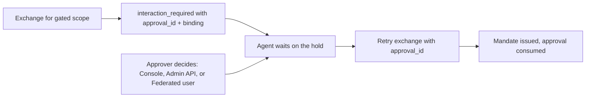

Human approval pauses a token exchange until a person decides it. A policy data document classifies scopes into risk tiers and declares which tiers need a human decision; when an agent requests a gated scope, the STS parks the exchange on a durable hold and returns `interaction_required` instead of a mandate. The gate is optional: a zone that declares no approval tiers never sees a hold.

:::note[One object, one name]
An Approval is called an Approval on every surface: SDKs expose it as `approvalId`, the wire carries `approval_id`, and the STS and Admin API serve it under `/approvals` paths. This page says *Approval* for the object and *hold* for its undecided state. Only the audit stream retains the historical `step_up_` event-type prefix and `challenge_id` metadata key, so SIEM pipelines and saved queries stay stable; the [wire-name mapping](/reference/interoperability-contracts/#product-to-wire-mapping) records that exception.
:::

## When to use approval

Use it for infrequent high-impact authority where waiting is safer than automatic issuance. Do not use approval as user authentication, a substitute for least privilege, or a repair for an overbroad provider credential.

## Prerequisites

- Valid grant data for the underlying scope; approval can gate authority but cannot create it.
- An operator approval path, or a registered Federated user issuer plus implemented federation for decisions reserved to the Federated user.
- A durable place to persist `approvalId` and operation identity across worker restarts.

## Flow



## Declare the gate in policy data

Approval is declared as data, like every other policy input. `risk` names a tier for each sensitive scope; `approval_tiers` declares which tiers hold a mint for a decision:

```rego
# caracal:data-document
package caracal.authz

import rego.v1

risk := [
  {"scope": "pipernet:refund", "tier": "high"},
]

approval_tiers := [
  {"tier": "high", "approver": "operator", "ttl_seconds": 1800, "privacy": "identified"},
]
```

| Field         | Meaning                                                                                                                                                            |
| ------------- | ------------------------------------------------------------------------------------------------------------------------------------------------------------------ |
| `tier`        | Your tier name; the platform fixes no taxonomy. Required - a declaration without a tier fails the mint closed.                                                     |
| `approver`    | Who may decide: `operator` (approve-capable admin credential), `subject` (the application's own Federated user - see below), or `any`. Defaults to `operator`. |
| `ttl_seconds` | How long the hold stays decidable. Federated-user-decidable holds (`subject` or `any`) default to 15 minutes and cap at 24 hours; operator-only holds default to 4 hours and cap at 7 days. The floor is 60 seconds everywhere. |
| `privacy`     | How much approver identity the decision record retains: `identified`, `pseudonymous`, or `anonymous`. Defaults to `identified`.                                    |

When one mint matches several compatible tiers, the shortest window and most protective privacy mode win, and a specific `operator` or `subject` requirement wins over `any`. A request that combines an operator-only tier with a Federated-user-only tier is denied and must be split into separate mints: one decision cannot satisfy two independent approver roles. Invalid approver, privacy, or TTL declarations fail the mint closed.

An approval's lifetime is its own: it never inherits or extends a session's lifetime. A Federated user decision is an interactive consent moment, so its window is short by default; an operator decision is an administrative review and gets hours. Tune `ttl_seconds` to the tier's real decision window: it bounds how long an approved-but-unconsumed hold stays spendable, so a shorter TTL shrinks the window in which a leaked approval could be consumed, while a TTL shorter than your approvers' actual response time just converts legitimate requests into expiries. Expiry is cheap by design - an expired hold never resumes anything, the requester simply raises a fresh one, and terminal rows age out of the store automatically.

## Handle the hold in the agent

The `interaction_required` error carries the approval id, tier, expiry, and an opaque `binding`. The binding covers the principal, Authority record, governed Session, Delegation, application, canonical resource and scope sets, active policy-set manifest, and platform decision contract. A retry after policy or execution context changes cannot spend an earlier decision. The SDK runs the whole flow - catch the hold, wait for the decision, retry with the approval id so the retried mint consumes it - in one call:

```ts
import { Caracal } from '@caracalai/sdk'

const caracal = new Caracal()

const mandate = await caracal.withApproval((approvalId) => caracal.mintMandate('resource://pipernet', ['pipernet:refund'], { approvalId }))
```

When the wait outcome is anything but `approved` - rejected, expired, already consumed, or the wait timed out - `withApproval` rethrows the original `ApprovalRequiredError`. Its `approvalId` is durable: persist it and resume later with `waitForApproval`, which long-polls and returns the typed final state without re-raising the hold:

```ts
const state = await caracal.waitForApproval(persistedApprovalId, { timeoutMs: 600_000 })
// 'approved'  -> retry the mint with { approvalId } to consume the decision
// 'pending'   -> nobody has decided; waiting again is safe
// 'rejected' | 'expired' | 'consumed' -> terminal; re-request the operation
```

An approval is **single-use**: it releases exactly one authority. The first mint that presents the approval id under its bound Authority record spends it, and the consumption records the authority it created. When two in-flight attempts from the same run race one approval - a retried queue message picked up while the first mint is still outstanding - one wins and the loser receives the typed `approval_consumed` error. This is not a new `ApprovalRequired` hold and is not an error to wait out: check whether the intended effect already happened before requesting another approval.

A lost success response never costs a second decision. When the network drops a successful mint's response, the retry - same approval id, same complete binding, same credentials - arriving within a two-minute window receives a fresh bearer for the very authority the consumption created: nothing new is minted into existence, nothing needs revoking, and the human is not asked again. Outside that window the retry receives `approval_consumed` and the requester raises a fresh hold. A worker that has since restarted returns with a new Authority record and cannot spend a decision approved for the prior run; it re-requests the operation and raises a fresh hold - expiry and re-request are the expected shape of long gaps, not a failure.

A rejection is final. The rejected hold stays authoritative for its remaining window, during which identical re-asks are refused rather than re-raised, so a declined agent cannot nag its approver into fatigue. After the window closes, requesting the operation again raises an entirely fresh hold with a fresh decision - rejection never permanently revokes the underlying grant, and no API can flip, cancel, or reopen a decided hold.

The Python and Go clients expose the same surface as `with_approval`/`wait_for_approval` and `WithApproval`/`WaitForApproval`. The lower-level `@caracalai/oauth` client offers `waitForApproval` directly for integrations that drive the exchange themselves. Under `caracal run` none of this is hand-written: the engine prints an `approval_required` notice with the approval id and binding, waits on the hold, and retries the exchange itself.

## Decide as an operator

Open the zone's **Approvals** page in the web console to review pending holds - each shows the requesting principal, the tier, the binding to cross-check against the agent's notice, and the approval window - and approve or reject with an optional reason. For automation, the Admin API exposes the same decision:

```bash
curl -X POST \
  "$CARACAL_API_URL/v1/zones/$CARACAL_ZONE_ID/approvals/$APPROVAL_ID/approve" \
  -H "Authorization: Bearer $CARACAL_ADMIN_TOKEN" \
  -H "Content-Type: application/json" \
  -d '{"reason": "PiperNet refund reviewed against baseline v3"}'
```

Use `/reject` to settle the hold terminally. Deciding requires an admin token minted with the `approve` capability - `write` alone cannot decide a hold, so day-to-day automation credentials never carry approval authority. The approver is recorded from the authenticated actor, never from the request body. To hear about new holds without watching the web console, add a [notification sink](/guides/approval-notifications/) that pushes approval events to your team's own systems.

## Decide as the application's Federated user

A hold declared `"approver": "subject"` reserves the decision for the application's own Federated user and refuses every operator decision with `subject_approval_required`. Deciding it takes a user session mandate minted through federation: register the application's identity system as a Federated user issuer in the zone, exchange the user's identity token (`subject_token_type=urn:ietf:params:oauth:token-type:id_token`) for that user's session mandate, then post the decision to the STS:

```bash
curl -X POST "$CARACAL_STS_URL/approvals/$APPROVAL_ID/decision" \
  -H "Authorization: Bearer $USER_SESSION_MANDATE" \
  -H "Content-Type: application/json" \
  -d '{"decision": "approved", "binding": "'$BINDING'", "reason": "refund confirmed"}'
```

The SDKs wrap both steps: `caracal.federateSubject(idToken)` creates the Federated user's Authority record and returns its `subjectAuthorityRecordId` plus mandate; Python and Go expose `subject_authority_record_id` and `SubjectAuthorityRecordID`. The OAuth client's `decideApproval({...})` posts the decision. The decision must echo the hold's binding exactly. The Session that raised the hold cannot approve itself, and the deciding Federated user must have federated through the application that raised it. Without a registered Federated user issuer, a hold reserved for the Federated user can only expire.

When the gated execution acts for a known Federated user - the exchange carried that user's token, or the requesting Session was started with the Federated user's authority record - the hold anchors to that exact person and the decision is reserved for them. A session mandate for any other user is refused, so one user of an application can never approve authority requested on behalf of another. Because the requester's own token lineage still cannot decide the hold, approving means the same human authenticating freshly through the application's identity system. Holds raised by executions whose Subject is the application itself - a workload credential, an application-only Session - carry no anchor and stay decidable by any of the application's Federated users; attribute Sessions to their Federated users at start when the tier's decision must be personal.

## Retry the exchange

Retry with `approval_id` once the hold is approved. STS verifies the complete binding against the current execution and policy context, then consumes it: an approval releases at most one mandate for the held capability and cannot be replayed. STS emits issuance, decision, and consumption lifecycle events to the zone audit pipeline.

## Troubleshooting

| Symptom                                | Check                                                                                                                                                                             |
| -------------------------------------- | --------------------------------------------------------------------------------------------------------------------------------------------------------------------------------- |
| Deny without an `approval_id`          | The deny was not an approval gate. Confirm the scope appears in `risk` and its tier in `approval_tiers`.                                                                          |
| `subject_approval_required` on approve | The tier declares `"approver": "subject"`: only the application's own Federated user can decide it. Relay the hold to that user, or redeclare the tier as `operator` or `any`. |
| Reserved decision refused               | The hold anchors to the Federated user the requesting agent acts for, and the presented session mandate belongs to someone else. Relay the approval to that user; no one else can decide it.        |
| `approval_not_decidable`               | The hold was already decided, consumed, or expired; the response names its current state.                                                                                         |
| `approve_capability_required`          | The admin token carries `write`, not `approve`. Mint a token with the `approve` capability.                                                                                       |
| Retry still denied                     | The approval may have expired, or the retry changed its principal, Authority record, Session, Delegation, application, resource, scopes, policy set, or decision contract. Request a fresh approval for the current context. |

## Validate the flow

Test approve, reject, expiry, concurrent consumption, changed binding, a second user deciding a hold anchored to another Federated user, and a missing issuer for a Federated-user-only tier. Expected result: exactly one matching retry consumes an approval; no decision widens resource, scopes, Session, Delegation, application, or policy binding; an anchored hold is decidable only by its own Federated user.

:::caution[Failure point: Federated user authority]
A Federated user approval works only when the application registers a trusted Federated user issuer, federates the user's token, and presents the resulting user session mandate. A caller-supplied Subject identifier or Session label cannot approve a hold.
:::

## Next Step

Add [Approval Notifications](/guides/approval-notifications/) if operators need push delivery, then add all terminal states to [Test Caracal Integrations](/guides/testing/).
