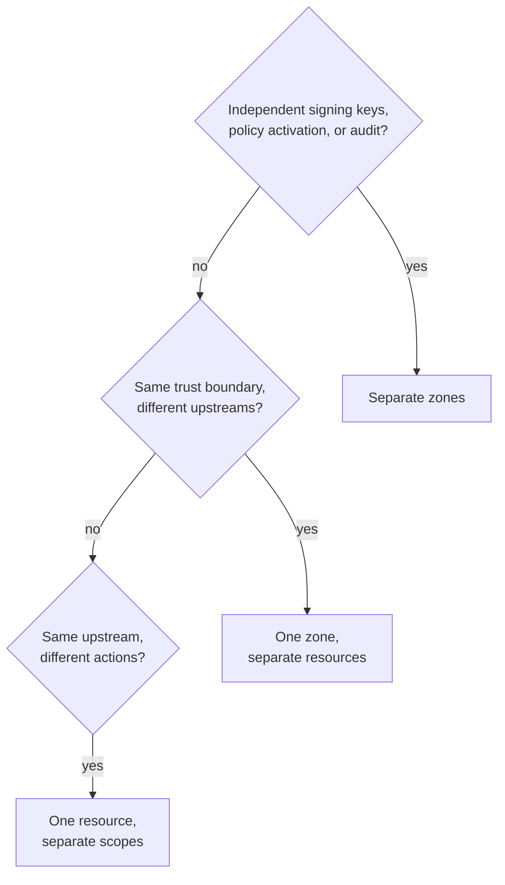

Use this guide before creating production objects or when an existing zone has become hard to reason about. It turns deployment boundaries into a reviewed model; the [concept pages](/concepts/) remain the canonical definitions.

## Prerequisites

- A list of workloads, protected upstreams, deployment environments, and policy owners.
- A decision about which systems require separate signing keys and audit trails.
- The stable actions each upstream exposes; do not start from hostnames or current credentials.

The deliverable is a short model table naming each zone, application, resource, provider, and scope. Review it with application and resource-server owners before provisioning.

Every recipe states the modeling decision, what maps to each noun, and the trade-off. Use the [Caracal Mental Model](/concepts/model-overview/) as the vocabulary reference while you read. Three terms appear here before their own guides: a **grant** is policy data mapping application roles to resource scopes ([Resources and Grants](/concepts/resource-grant/)); the **platform decision contract** is the fixed decision logic your policy data feeds ([Author Policy Data](/guides/author-policy/)); a **DCR application** is a short-lived programmatically registered identity ([managed and DCR applications](/concepts/principal/#managed-and-dcr-applications)).

## Choose the Zone Boundary

The most common question is "what is a zone - an environment, a customer, a team, or a product area?" A zone is none of those by default. It is the isolation boundary that owns signing keys, policy sets, sessions, audit, and authority data. You decide what trust boundary it represents.

:::note[FAQ]
[What should a zone represent?](/reference/faq/#faq-003) and [does this repository implement managed multi-tenancy?](/reference/faq/#faq-004)
:::

| Question                                                                    | If yes, lean toward           |
| --------------------------------------------------------------------------- | ----------------------------- |
| Must these workloads have independent signing keys and JWKS?                | Separate zones                |
| Must a policy change for one never affect the other?                        | Separate zones                |
| Must audit and explain traces never mix?                                    | Separate zones                |
| Do they share keys, policy owners, and audit, but call different upstreams? | One zone, separate resources  |
| Do they share an upstream but need different actions?                       | One resource, separate scopes |

Keep [resource identifiers](/concepts/resource-grant/) stable across zones so policy, grants, and audit refer to the same target even when upstream URLs differ.

## Single Application, Single Environment

The simplest deployment: one team, one runtime, a handful of upstreams.

| Noun        | Mapping                                                                                                                                         |
| ----------- | ----------------------------------------------------------------------------------------------------------------------------------------------- |
| Zone        | One zone for the whole deployment.                                                                                                              |
| Application | One managed application per durable service; one DCR application (a short-lived identity created through [Dynamic Client Registration](/sdks/admin/#dynamic-client-registration-dcr)) per isolated, externally-launched identity (per tenant, job, or integration). |
| Resource    | One resource per protected upstream, with action-oriented scopes.                                                                               |
| Grant       | One grant per application and subject that may request a resource's scopes.                                                                     |

Trade-off: lowest operational overhead. Add zones only when you need key, policy, or audit isolation.

## Per-Environment Zones

Separate production, staging, and development so a policy or key change in one cannot affect another.

| Noun       | Mapping                                                                                                              |
| ---------- | -------------------------------------------------------------------------------------------------------------------- |
| Zone       | One zone per environment: `prod`, `staging`, `dev`.                                                                  |
| Resource   | The same stable identifier in each zone, such as `resource://pipernet`, pointing at that environment's upstream URL. |
| Policy set | Authored and activated independently per zone.                                                                       |
| Keys       | Each zone has its own signing key and JWKS.                                                                          |

Trade-off: clean blast-radius isolation and independent key rotation, at the cost of registering resources and activating policy in each zone. Automate this with the Admin API so environments stay consistent.

In application code, one SDK client represents exactly one `(zone, application)` identity. A workload that acts as several applications, or talks to several zones, constructs one client per identity and routes work to the matching client - never swap the identity behind a live client, because its tokens, mandates, sessions, and shutdown state belong to that one identity. The mechanics live in the [SDK guides](/guides/sdk-typescript/).

## Multiple Customers or Workspaces

A platform with many customer workspaces and one shared agent service must choose how customer isolation maps onto Zones. This open-source product gives you the **Zone** as the isolation primitive; you provision and automate customer onboarding yourself through the Admin API. Managed tenant, team, and SSO lifecycle are not implemented in this repository.

| Model                                 | When to use                                                                                                                | Trade-off                                                                                                                                       |
| ------------------------------------- | -------------------------------------------------------------------------------------------------------------------------- | ----------------------------------------------------------------------------------------------------------------------------------------------- |
| Zone per customer                     | Customers require isolated signing keys, isolated audit, and policy that one customer's change can never affect another's. | Strongest isolation; you automate per-zone provisioning and key rotation, and one shared agent service authenticates separately into each zone. |
| Shared zone, resource per customer    | Customers share a trust boundary and policy owner but target distinct upstreams or data sets.                              | Lower overhead; isolation is enforced by policy and grants, not by keys or audit separation.                                                    |
| Shared zone, customer in policy input | Customer is a runtime attribute of the same resource, carried in the request and checked by policy.                        | Lowest overhead; relies entirely on policy correctness, so audit and keys are shared.                                                           |

Decide on the strongest isolation a customer actually requires, then pick the least complex model that satisfies it. Do not encode customer identity into [scope names](/concepts/resource-grant/); keep it in the zone, principal, or policy input. For the end-to-end pattern of serving many customers from one shared zone, see [Serve Your Own Customers](/guides/serve-customers/).

## High-Sensitivity Resources

For resources whose compromise is unacceptable - payouts, key material, production data deletion.

| Option         | Mapping                                                                                                        |
| -------------- | -------------------------------------------------------------------------------------------------------------- |
| Dedicated zone | Put the sensitive resource in its own zone with distinct signing keys and a separate audit trail.              |
| Tight scopes   | Split actions into the smallest scopes, such as `pipernet:read` and `pipernet:refund`, so grants stay minimal. |
| Approval       | Hold the sensitive action for a human decision through [Human Approval](/guides/step-up/).                    |

Trade-off: a dedicated zone gives the cleanest audit and key separation; in-zone tight scopes plus approval are lighter and often enough. Combine them for the highest-risk targets.

## App-Only Agents and Delegated Upstream Accounts

The principal is always your application; Sessions carry its labels and delegation context. The real fork is where the upstream credential lives.

| Dimension           | Shared broker credential                                                                           | Connected upstream account                                                                                                |
| ------------------- | -------------------------------------------------------------------------------------------------- | ------------------------------------------------------------------------------------------------------------------------- |
| Upstream credential | Shared credential the agent never sees: `oauth2_client_credentials`, `api_key`, or `bearer_token`. | A consented upstream account stored as a provider connection, shared across the Zone by default or bound to the exchange subject: `oauth2_authorization_code`. |
| Consent             | None - the zone operator configures the credential once.                                           | A human completes the provider's consent screen once for the shared account, or once per subject when bound to a customer. |
| Audit attribution   | Application, Session, and delegation chain.                                                        | The same, plus the provider connection the exchange used.                                                                 |

Policy tells work apart with the principal registration method, Session ID, and labels documented in the [policy input contract](/concepts/policy/#policy-input-contract). Authorization inputs are the application, labels, roles, Delegation, and confinement - never the Subject identifier. See [Identities and Applications](/concepts/principal/).

## Connected Account or Shared Credential

Choose how the upstream credential is held.

| Choose                     | When                                                                                        | Provider kind                                             |
| -------------------------- | ------------------------------------------------------------------------------------------- | --------------------------------------------------------- |
| Connected upstream account | The upstream call must act as a specific consented account rather than a shared credential. | `oauth2_authorization_code`                               |
| Shared service credential  | The agent acts as the application, not a specific account.                                  | `oauth2_client_credentials`, `api_key`, or `bearer_token` |

For connected accounts, Caracal owns `client_id`, `redirect_uri`, `state`, and PKCE; use the provider **Connect** action to mint a consent URL for a subject, and revoke to disconnect it. Reconnecting the same subject and provider replaces the active connection rather than duplicating it. The concrete field tables are in [Provider Recipes](/guides/provider-recipes/).

## Validate the Model

After you map your architecture, confirm it end to end before relying on it:

- Author and activate a policy set that allows the intended application, subject, resource, and scopes.
- Run [Check Provider Readiness](/examples/provider-preflight/) to verify resource-to-provider binding and that the active policy set returns `allow`.
- Send a successful request, a denied request, and a revoked-session request, then confirm each has a clear audit trail in the web console.

Expected result: every workload maps to one application identity at a time, every protected target has one stable resource identifier, credentials live on providers rather than applications, and each hard isolation requirement maps to a zone.

:::caution[Failure point: invented user authority]
Caracal does not authenticate customers or derive authorization from a user name. A federated subject exists only after an application exchanges a token from a registered issuer. For app-only work, use the application, Session labels, policy data, and Delegation described here.
:::

## Next Step

Provision the reviewed model with [Define Resources and Providers](/guides/resources-providers/), then author matching grant data with [Author Policy Data](/guides/author-policy/).

## Related

- [Zones](/concepts/zone/)
- [Identities and Applications](/concepts/principal/)
- [Resources and Grants](/concepts/resource-grant/)
- [Define Resources and Providers](/guides/resources-providers/)
- [Provider Recipes](/guides/provider-recipes/)
- [Production Integration Patterns](/guides/production-patterns/)
