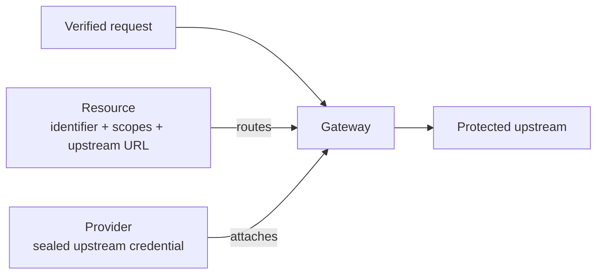

Use this guide after modeling an upstream and before writing policy or application code. The workflow creates the routing and credential boundary that Gateway enforces. The [Admin package](/sdks/admin/) and [Admin API](/api/control-plane/) hold exact automation signatures.

## Prerequisites

- A zone and durable managed application for Gateway routing.
- A stable resource identifier, action-oriented scopes, and an upstream URL reachable from Gateway.
- The upstream's documented authentication method and a production secret source.

## When to create each object

| Object              | Create it when                                                                                                                                                                          |
| ------------------- | --------------------------------------------------------------------------------------------------------------------------------------------------------------------------------------- |
| Resource            | You need a stable protected target, Caracal resource scopes, an upstream URL, a Gateway application, and one upstream credential provider binding.                                      |
| Provider            | A resource needs an explicit upstream auth mode: none, Caracal mandate, OAuth 2.0 authorization code, OAuth 2.0 client credentials, API key, bearer-token, or HTTP Basic upstream auth. |
| Gateway application | You want Gateway-originated upstream calls to use a specific Caracal application identity.                                                                                              |

Resource fields should answer "what is being protected and where does Gateway send traffic?" Provider fields should answer "what credential or identity does Gateway attach upstream?" Keep credential details such as client secrets, token endpoints, API-key placement, bearer tokens, identity forwarding, and runtime injection on the provider. Keep target details such as resource identifier, Caracal resource scopes, upstream URL, Gateway application, and the selected upstream credential provider on the resource.

:::note[FAQ]
[What is the difference between a resource and a provider?](/reference/faq/#faq-009) and [is an application secret the same as a provider credential?](/reference/faq/#faq-013)
:::

## Web Console Workflow

1. Start the runtime for your deployment (locally, `caracal up`).
2. Open the web console and select **Resources**.
3. Create a resource with a stable identifier, such as `resource://pipernet`, and action-oriented scopes, such as `pipernet:read` and `pipernet:refund`.
4. Set the upstream URL and the Gateway application.
5. Attach exactly one upstream credential provider: `None` when the Gateway is the enforcement point and the upstream expects no credential, `Caracal mandate` when the upstream verifies Caracal tokens itself, or a provider-native kind when the upstream needs external credentials.
6. For a path-addressed REST upstream, declare the operations the Gateway may invoke and keep [operation authority](#operation-authority) `enforced`; choose **Any operation** for single-surface transports such as MCP.

## Provider auth modes

| Provider type                | Required main fields                                                                                                   | Runtime behavior                                                                                                                                                 |
| ---------------------------- | ---------------------------------------------------------------------------------------------------------------------- | ---------------------------------------------------------------------------------------------------------------------------------------------------------------- |
| None                         | No credential fields.                                                                                                  | Gateway strips caller auth and forwards no upstream credential; use only when Gateway is the enforcement point and the upstream expects no credential.           |
| Caracal mandate              | No credential fields.                                                                                                  | Gateway forwards the Caracal resource mandate in `Authorization: Bearer ...`; the resource verifies issuer, audience, scopes, target, expiry, and revocation.    |
| OAuth 2.0 authorization code | Authorization endpoint, token endpoint, redirect URI, client ID, client secret, optional upstream OAuth scopes.        | Creates a shared provider connection (optionally bound to a Subject) through a browser consent callback, then refreshes the brokered upstream tokens inside STS. |
| OAuth 2.0 client credentials | Token endpoint, client ID, grant type, client secret or private key depending on the grant and authentication choices. | STS obtains and caches service-to-service provider tokens for Gateway upstream calls, via `client_credentials` or RFC 7523 `jwt_bearer` assertion grants.        |
| API key                      | Header name and API key.                                                                                               | Gateway forwards the sealed provider key in the configured header, with an optional auth scheme prefix.                                                          |
| Bearer token                 | Bearer token.                                                                                                          | Gateway forwards the sealed provider token as `Authorization: Bearer ...` unless Advanced routing configures another header or scheme.                           |
| HTTP Basic                   | Username and password.                                                                                                 | Gateway forwards `Authorization: Basic ...` built from the username and the sealed password; the pair is never exposed to callers or runtimes.                   |

Rules shared by every kind: provider secrets are sealed at creation and never returned by list or detail APIs; every Gateway resource binds exactly one provider; one provider can serve many resources. Concrete per-upstream setups (OpenAI, Google, GitHub, Slack, Jira, internal APIs) live in [Provider Recipes](/guides/provider-recipes/).

### OAuth 2.0 authorization code (delegated consent)

- Register the exact Caracal callback URI as the provider redirect URI, such as `https://api.hooli.example/v1/zones/z1/provider-connections/oauth/callback`, then use the provider's **Connect** action to create an authorization URL for the shared upstream account, or bind it to a specific Subject for per-customer isolation.
- A connection is one authenticated upstream account for the provider. By default it is shared across the Zone: every session policy authorizes through the provider uses it, and authorization stays per-resource through scopes, policies, and grants. A Zone that needs a distinct upstream account per customer can bind a connection to a specific Subject, which takes precedence over the shared account for that Subject. Reconnecting replaces the active connection for the same account.
- The upstream scopes requested during consent come from the provider's configured upstream OAuth scopes. Advanced key/value entries add provider-specific browser parameters (`access_type=offline`, `prompt=consent`) and token endpoint parameters; Caracal always owns `client_id`, `redirect_uri`, `state`, PKCE, credentials, connections, and refresh tokens.
- Connections follow the upstream token's lifecycle: refresh tokens are refreshed inside STS shortly before expiry (rotating refresh tokens are stored under optimistic locking); a lapsed connection without a refresh token becomes `expired` and callers receive a precise `credential_expired_not_renewable` denial. The provider's Connections panel reads this state live; `GET /v1/zones/{zoneId}/provider-connections` is the same listing for automation. Token responses are held to RFC 6749: a `token_type` other than `bearer` is rejected unless the provider's upstream auth scheme explicitly asserts it.
- Revoking a connection always succeeds inside Caracal and immediately stops STS from brokering its tokens; when the provider advertises an RFC 7009 revocation endpoint, Caracal also revokes upstream best-effort and reports the result. To switch the upstream account, **Revoke** then **Connect** again, or just **Connect** again to replace the active connection in place.
- The callback endpoint is intentionally public so providers can redirect browsers back. Security comes from short-lived Redis-backed one-time state, PKCE, provider binding checks, sealed token storage, HTTPS-only exchange, redirect blocking, host allow-listing, and private-address rejection. In cloud deployments, all API replicas must share Redis so any replica can validate callback state.

### OAuth 2.0 client credentials (machine-to-machine)

- The grant type selects how STS obtains tokens: `client_credentials` posts the client's own credentials to the token endpoint; `jwt_bearer` signs an RFC 7523 assertion with the provider private key - the pattern behind Google service accounts and Salesforce's JWT bearer flow.
- For `jwt_bearer`, client authentication defaults to `none` because the assertion is the credential. Upstream OAuth scopes ride inside the assertion's `scope` claim; the assertion subject overrides `sub` (Google domain-wide delegation) and the assertion audience overrides `aud` (Salesforce).
- For `client_credentials`, use upstream OAuth scopes, OAuth token audience, or an OAuth resource indicator as the provider documents; reserve OAuth token parameters for documented provider-specific extras. With `private_key_jwt` client authentication, an optional client certificate adds the `x5t`/`x5t#S256` thumbprint headers Microsoft Entra ID certificate credentials require.
- OAuth token endpoint hosts constrain outbound token acquisition; the web console infers the host from the token endpoint when the Advanced field is blank. Endpoints must resolve publicly unless the exact private hostname is granted through `CARACAL_PRIVATE_EGRESS_HOSTS` on API and STS.
- Both OAuth kinds support endpoint autofill: paste the issuer URL and the control plane resolves its OIDC or RFC 8414 metadata (MCP servers publish the same metadata), fills the endpoints, and rejects metadata whose issuer does not match.

### API key

- One required routing field: the exact header the upstream expects. Use `X-API-Key` or another vendor header for raw key values, `Authorization` plus the Advanced auth scheme `Bearer` for bearer-style keys, or a documented vendor scheme such as `Token`.
- Query-parameter placement is supported for upstreams that require it, but a key in the query string may be logged by systems outside Caracal's control - Caracal's own Gateway and STS audit events never include query strings. Prefer header placement.

### Bearer token

- For static, pre-issued access tokens Caracal does not mint or refresh. The main form needs only the token; Advanced options cover non-default headers or schemes. List and detail APIs expose only `secret_config_keys`, and the Gateway replaces caller-supplied auth before forwarding.

### HTTP Basic

- For username/password or username/API-token pairs (Atlassian, Twilio, Elasticsearch). The username stays readable configuration; the password is sealed, and the Gateway composes `Authorization: Basic ...` at forward time. Because the credential is a two-part pair, HTTP Basic providers are Gateway-forwarded only and never eligible for runtime credential injection.

### None and Caracal mandate

- None providers have no secret and send no credential. Caracal mandate providers have no provider-native secret and no `forward_caracal_identity` setting because the mandate is already the upstream credential - use it for internal services, partner services, and integrations that verify Caracal mandates through a verifier or adapter.

## Provider connectivity checks

OAuth providers own a token endpoint Caracal can genuinely verify before anything is saved, so creating one in the web console ends with **Connect** instead of a plain create. Client-credentials providers perform a real token request against the allow-listed HTTPS token endpoint, including a signed client assertion when OAuth client authentication is `private_key_jwt` or a signed assertion grant when the grant type is `jwt_bearer`. Authorization-code providers submit a placeholder code that a healthy endpoint rejects as an invalid grant after accepting the client credentials; the probe carries a placeholder PKCE verifier so endpoints that mandate PKCE classify the same way. Checks run from the control plane with DNS pinned to approved addresses; private space is accepted only for exact names in `CARACAL_PRIVATE_EGRESS_HOSTS`, while metadata, link-local, loopback, multicast, and unspecified addresses stay forbidden. Upstream responses are reduced to a fixed classification, and any issued token is discarded, never stored or returned.

A failing check blocks creation and reports a precise classification: authentication failed, endpoint unreachable, unexpected endpoint response, or configuration incomplete. **Skip for now** creates the OAuth provider without a passing check; it then carries a red **Failed** badge in the provider list and detail view until a check passes. Open the provider and run **Connect** from its Connectivity section after fixing the configuration - a passing check clears the badge automatically.

The other kinds - none, Caracal mandate, API key, bearer token, and HTTP Basic - make no upstream credential request of their own, so no meaningful preflight exists before a resource uses them. The console creates them directly with **Create Provider** and shows no Connectivity section; their configuration is validated at creation and their credential is exercised once a resource uses it. Caracal never presents a check that cannot fail. Automation can run the OAuth check through `POST /v1/zones/{zoneId}/providers/{id}/test` or create with a check by setting `"check": true` on the create request; both reject non-OAuth kinds with `provider_check_unsupported`, and checks are rate limited per zone.

## Operation authority

A resource declares which upstream operations the Gateway may invoke and how strictly that surface is enforced. This authority is native to the platform: the Gateway and STS enforce it directly, so adopters configure data, not policy control flow.

| Field                   | Meaning                                                                                                                                                                                                                                                                                                                                       |
| ----------------------- | --------------------------------------------------------------------------------------------------------------------------------------------------------------------------------------------------------------------------------------------------------------------------------------------------------------------------------------------- |
| `operations`            | The operations the Gateway may forward, each a `{method, path, scope}` triple. `method` and `path` match the upstream call; `scope` is the Caracal resource scope the mandate must carry for that operation, and must be one of the resource's declared scopes.                                                                               |
| `operation_enforcement` | `enforced` (**Listed operations only**) denies any Gateway operation not listed in `operations` and requires its scope on the mandate. `transport_uniform` (**Any operation**) treats the upstream as a single surface and relies on the mint-time scope check, for protocols such as MCP that address every call through one transport path. |

When `operation_enforcement` is `enforced`, the Gateway authorizes only declared operations and denies everything else with `operation_not_permitted` before any upstream call. A resource that is `enforced` with an empty `operations` list is fully closed: every Gateway operation is denied until operations are declared.

:::caution[Defaults differ by creation surface]
Resources created through the Control API default to `enforced`, so authority stays closed until you describe it. Web console guided setup opens resources as **Any operation** because it does not collect per-operation detail - tighten them from the resource editor once the operation set is known.
:::

Because the floor is enforced in the platform rather than in adopter policy, a policy can further restrict an operation but can never widen authority beyond the declared operations and their scopes.

## Identifier and scope guidance

| Field                        | Good pattern                                                                                                                                                                                                                                                                                                                                                           |
| ---------------------------- | ---------------------------------------------------------------------------------------------------------------------------------------------------------------------------------------------------------------------------------------------------------------------------------------------------------------------------------------------------------------------- |
| Resource identifier          | Stable audience URI, such as `resource://pipernet`; do not use the `provider://` namespace.                                                                                                                                                                                                                                                                            |
| Caracal resource scope       | `domain:action`, such as `pipernet:read`.                                                                                                                                                                                                                                                                                                                              |
| Upstream URL                 | The network URL Gateway can reach; it may change without changing policy audiences.                                                                                                                                                                                                                                                                                    |
| Gateway application          | The managed application this resource's route serves. Gateway exchanges as this identity, and STS only accepts callers whose mandates were minted under it - delegated calls must target a Session it owns. Policy then authorizes each call. DCR applications cannot be bound here - they are short-lived single-session credentials, not durable Gateway identities. |
| Upstream credential provider | The provider record Gateway uses to attach no credential, a Caracal mandate, OAuth tokens, API keys, or bearer tokens.                                                                                                                                                                                                                                                 |
| Authorized operation         | `{method, path, scope}`, such as `{ "method": "POST", "path": "/api/create_payout", "scope": "pipernet:payout" }`; the scope must be one of the resource's Caracal resource scopes.                                                                                                                                                                                    |
| Operation enforcement        | `enforced` for path-addressed REST upstreams; **Any operation** for single-surface transports such as MCP.                                                                                                                                                                                                                                                             |
| Provider identifier          | `provider://lowercase-slug` stable name for the upstream credential system.                                                                                                                                                                                                                                                                                            |

Do not put provider-specific credential details on a resource. Do not use mutable deployment hostnames as policy identifiers unless they are the actual authority boundary. Keep the resource identifier stable even if the upstream URL or upstream credential provider binding changes.

:::note[FAQ]
[Why must the resource identifier stay stable if the upstream URL can change?](/reference/faq/#faq-010)
:::

## Validate the setup

- For OAuth providers, run **Connect** and confirm the connectivity check passes; no provider should show a **Failed** badge.
- Open the resource in the web console and confirm scopes are present.
- Author and activate a policy that allows the application and Subject to request the scopes.
- Send a Gateway request and inspect the audit event. For Caracal mandate upstreams, also confirm the resource uses a Caracal verifier or adapter.

Expected result: OAuth provider checks pass where supported, the resource has one Gateway application and one provider binding, undeclared operations fail before the upstream, and an allowed request reaches only the configured host.

:::caution[Failure point: operation mode]
The API value is `enforced`, not `enforce`. An `enforced` resource with no operations is intentionally closed. Use **Any operation** only when every call shares one transport surface, such as MCP.
:::

## Protect an MCP server over the Gateway

An MCP server is a standard Gateway upstream: it resolves to the same Resource and Provider objects with no MCP-specific primitive. MCP-over-HTTP is proxied like any other HTTP upstream, so only two choices are particular to MCP.

**Resource.** Set operation enforcement to **Any operation**. MCP addresses every tool call through one transport surface, so there is no per-operation `{method, path, scope}` list to declare and the mint-time scope check is the authority boundary. Give the resource a stable identifier such as `resource://pipernet`, one or more tool scopes such as `mcp:tool:call`, the MCP server's upstream URL, and a Gateway application.

**Provider.** Choose the credential kind by how the MCP server authenticates the request the Gateway forwards to it:

| The MCP server authenticates with                                                                | Provider kind                        |
| ------------------------------------------------------------------------------------------------ | ------------------------------------ |
| Caracal mandates it verifies itself through a verifier or adapter                                | Caracal mandate                      |
| Nothing, because the Gateway is the enforcement point and the server is network-restricted to it | None                                 |
| Delegated user consent through the MCP OAuth 2.1 authorization-code flow                         | OAuth 2.0 authorization code         |
| A machine-to-machine OAuth client                                                                | OAuth 2.0 client credentials         |
| A static API key, a pre-issued bearer token, or a username and password                          | API key, Bearer token, or HTTP Basic |

For either OAuth kind, paste the MCP server's issuer URL and use endpoint autofill: MCP servers publish the OIDC and RFC 8414 metadata Caracal resolves, so the authorization and token endpoints fill in automatically.

The Gateway proxies MCP-over-HTTP but does not proxy WebSocket upgrades. For a WebSocket MCP transport, verify mandates inside the server process with [Protect an MCP Server](/guides/protect-mcp/) instead.

## Related Guides

- [Provider Recipes](/guides/provider-recipes/)
- [Author Policy Data](/guides/author-policy/)
- [Debug Authorization Decisions](/guides/authorize-access/)
- [Protect a Gateway-Routed HTTP API](/guides/protect-gateway-http/)
- [Activate a Policy Set](/guides/activate-policy-set/)

## Next Step

Choose a concrete credential setup in [Provider Recipes](/guides/provider-recipes/), then run [Check Provider Readiness](/examples/provider-preflight/) before the first real call.
