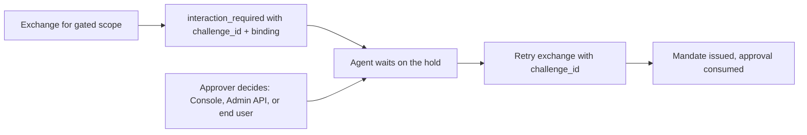

Human approval pauses a token exchange until a person decides it. A policy data document classifies scopes into risk tiers and declares which tiers need a human decision; when an agent requests a gated scope, the STS parks the exchange on a durable hold and returns `interaction_required` instead of a mandate. The gate is optional: a zone that declares no approval tiers never sees a hold.

## Flow



## Declare the gate in policy data

Approval is declared as data, like every other policy input. `risk` names a tier for each sensitive scope; `approval_tiers` declares which tiers hold a mint for a decision:

```text
# caracal:data-document
package caracal.authz

import rego.v1

risk := [
  {"scope": "pipernet:refund", "tier": "high"},
]

approval_tiers := [
  {"tier": "high", "approver": "operator", "ttl_seconds": 1800, "privacy": "identified"},
]
```

| Field | Meaning |
| --- | --- |
| `tier` | Your tier name; the platform fixes no taxonomy. Required - a declaration without a tier fails the mint closed. |
| `approver` | Who may decide: `operator` (approve-capable admin credential), `subject` (the application's own federated end user - see below), or `any`. Defaults to `operator`. |
| `ttl_seconds` | How long the hold stays decidable, clamped between 60 seconds and 7 days. Defaults to 1800. |
| `privacy` | How much approver identity the decision record retains: `identified`, `pseudonymous`, or `anonymous`. Defaults to `identified`. |

When one mint matches several tiers, the hold merges them strictly: the most trusted approver class, the shortest window, and the most protective privacy mode win.

## Handle the hold in the agent

The `interaction_required` error carries the challenge id, the tier, the expiry, and a `binding` - a hash of the exact resource and scope set held. `waitForApproval` long-polls the hold and resolves when someone decides:

```ts
import { OAuthClient, ApprovalRequiredError } from "@caracalai/oauth";

const oauth = new OAuthClient(stsUrl, zoneId, applicationId);
const request = { scopes: ["pipernet:refund"], sessionId };

try {
  return await oauth.exchange(subjectToken, "resource://pipernet", request);
} catch (error) {
  if (error instanceof ApprovalRequiredError) {
    console.log(`approval needed: ${error.challengeId} binding ${error.binding}`);
    await oauth.waitForApproval(error.challengeId);
    return oauth.exchange(subjectToken, "resource://pipernet", {
      ...request,
      challengeId: error.challengeId,
    });
  }
  throw error;
}
```

The Python and Go clients expose the same surface as `wait_for_approval` and `WaitForApproval`. Under `caracal run` none of this is hand-written: the engine prints an `approval_required` notice with the challenge id and binding, waits on the hold, and retries the exchange itself.

## Decide as an operator

Open the zone's **Approvals** page in the Console to review pending holds - each shows the requesting principal, the tier, the binding to cross-check against the agent's notice, and the approval window - and approve or reject with an optional reason. For automation, the Admin API exposes the same decision:

```bash
curl -X POST \
  "$CARACAL_API_URL/v1/zones/$CARACAL_ZONE_ID/step-up-challenges/$CHALLENGE_ID/approve" \
  -H "Authorization: Bearer $CARACAL_ADMIN_TOKEN" \
  -H "Content-Type: application/json" \
  -d '{"reason": "PiperNet refund reviewed against baseline v3"}'
```

Use `/reject` to settle the hold terminally. Deciding requires an admin token minted with the `approve` capability - `write` alone cannot decide a hold, so day-to-day automation credentials never carry approval authority. The approver is recorded from the authenticated actor, never from the request body, and a hold declared `"approver": "subject"` refuses every operator decision with `subject_approval_required`. To hear about new holds without watching the Console, add a [notification sink](/guides/approval-notifications/) that pushes approval events to your team's own systems.

## Decide as the application's end user

A hold declared `"approver": "subject"` reserves the decision for the application's own end user and refuses every operator decision with `subject_approval_required`. Deciding it takes a user session mandate minted through subject federation: register the application's identity system as a zone subject issuer, exchange the end user's identity token (`subject_token_type=urn:ietf:params:oauth:token-type:id_token`) for the user's session mandate, then post the decision to the STS:

```bash
curl -X POST "$CARACAL_STS_URL/step-up/$CHALLENGE_ID/decision" \
  -H "Authorization: Bearer $USER_SESSION_MANDATE" \
  -H "Content-Type: application/json" \
  -d '{"decision": "approved", "binding": "'$BINDING'", "reason": "refund confirmed"}'
```

The SDK OAuth clients wrap both steps: `federateSubject(idToken)` mints the user session, and `decideApproval({...})` posts the decision. The decision must echo the hold's binding exactly, so an approval prompt that does not know the precise held resource and scope set cannot decide it. The session that raised the hold cannot approve itself, and the deciding user must have federated through the application that raised the hold. Without a registered subject issuer, a subject-reserved hold can only expire - declare `operator` or `any` tiers instead.

## Retry the exchange

Retry with `challenge_id` once the hold is approved. The STS verifies the approval matches the same session, principal, and binding, then consumes it: an approval releases exactly one mandate for exactly the held resource and scope set and can never be replayed. Every issuance, decision, and consumption lands in the zone audit stream.

## Troubleshooting

| Symptom | Check |
| --- | --- |
| Deny without a `challenge_id` | The deny was not an approval gate. Confirm the scope appears in `risk` and its tier in `approval_tiers`. |
| `subject_approval_required` on approve | The tier declares `"approver": "subject"`: only the application's own federated end user can decide it. Relay the hold to the user, or redeclare the tier as `operator` or `any`. |
| `challenge_not_decidable` | The hold was already decided, consumed, or expired; the response names its current state. |
| `approve_capability_required` | The admin token carries `write`, not `approve`. Mint a token with the `approve` capability. |
| Retry still denied | The approval may have expired before consumption, or the retry changed the resource or scope set - the binding must match the original request exactly. |

Related pages: [Step-Up Challenges](/concepts/step-up/), [Approval Notifications](/guides/approval-notifications/), and [Author Policy Data](/guides/author-policy/).
