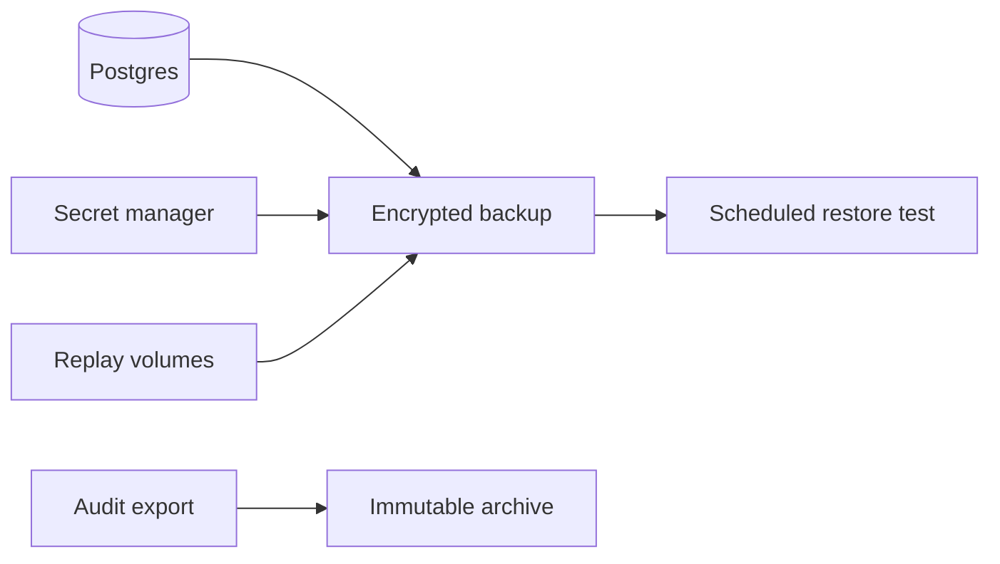

Backups must preserve both access state and evidence state. A restore that loses audit, revocation, keys, or delegation data can produce unsafe or unauditable behavior.

## What to Protect

| Asset                            | Why it matters                                                                                          |
| -------------------------------- | ------------------------------------------------------------------------------------------------------- |
| Postgres database                | Product state, policies, grants, sessions, audit events, agents, delegations, outboxes.                 |
| Runtime secrets                  | Database/Redis credentials, admin token, Coordinator token, zone KEK, HMAC keys, service exchange keys. |
| STS/Gateway replay volumes       | Audit replay files during Redis/Audit outages.                                                          |
| Redis snapshot or managed backup | Optional operational recovery for stream pending entries; Postgres remains authoritative.               |
| Audit exports                    | Long-term evidence and SIEM/compliance integration.                                                     |

## Backup Flow



## Compose Stack Tooling

Self-hosted Compose deployments ship first-party backup and restore scripts. Both resolve containers through Compose labels, so they work against any project name without knowing the compose file path.

`infra/scripts/backup.sh` runs online against the live stack: transaction-consistent `pg_dumpall`/`pg_dump` snapshots of every database, a Redis copy taken after a completed AOF rewrite, and the STS/Gateway replay-protection state, bundled into one timestamped archive.

```bash
CARACAL_BACKUP_DIR=/var/backups/caracal bash infra/scripts/backup.sh
```

| Variable                  | Default     | Purpose                              |
| ------------------------- | ----------- | ------------------------------------ |
| `CARACAL_COMPOSE_PROJECT` | `caracal`   | Compose project to back up.          |
| `CARACAL_BACKUP_DIR`      | `./backups` | Bundle output directory.             |
| `CARACAL_BACKUP_RETAIN`   | `7`         | Bundles kept; older ones are pruned. |

Bundles never contain secrets. Back up the secrets directory through your secret-management workflow and encrypt bundles at rest.

`infra/scripts/restore.sh` performs disaster recovery from a bundle: it stops application services, recreates every database from its dump, replaces the Redis dataset and replay state, then restarts the stack. It refuses to run without explicit confirmation:

```bash
CARACAL_RESTORE_CONFIRM=yes bash infra/scripts/restore.sh /var/backups/caracal/caracalBackup-20260625T120000Z.tar.gz
```

After restore, verify with `infra/scripts/smokeTest.sh` and the [restore validation](#restore-validation) checklist below. Kubernetes deployments in stable mode require externally managed HA Postgres and Redis, so backups there belong to your data-platform tooling, not these scripts.

## Retention Controls

| Area             | Controls                                                                                                                                                                                                                                         |
| ---------------- | ------------------------------------------------------------------------------------------------------------------------------------------------------------------------------------------------------------------------------------------------ |
| Audit database   | `AUDIT_RETENTION_DAYS`, partitions, audit export watermarks.                                                                                                                                                                                     |
| Coordinator data | `DELEGATION_RETENTION_DAYS`, `OUTBOX_RETENTION_DAYS`, `IDEMPOTENCY_RETENTION_SECONDS` (seven days by default), sweeper intervals. Restores also restore live replay receipts; this prevents pre-backup operations from being silently recreated. |
| Redis streams    | Provisioner intended max lengths and managed Redis retention.                                                                                                                                                                                    |
| Backups          | Platform backup policy and legal/compliance requirements.                                                                                                                                                                                        |

## Restore Validation

1. Restore Postgres into an isolated environment.
2. Restore required secrets into the environment secret store.
3. Run migration verification.
4. Start services and verify `/ready`.
5. Confirm audit query, policy-set activation state, resource routing, sessions, agents, and delegation records.
6. Run a canary token exchange and protected Gateway request.

## Troubleshooting

| Symptom                          | Check                                                                                      |
| -------------------------------- | ------------------------------------------------------------------------------------------ |
| Restored STS cannot decrypt keys | `SECRET_STORE_KEK` does not match the envelopes in the database.                           |
| Audit chain verification fails   | Missing audit rows, wrong `AUDIT_HMAC_KEY`, or partial restore.                            |
| Gateway cannot route             | Missing resource rows or resources restored without their upstream URL and provider.       |
| Revocation state is incomplete   | Restore Postgres revocation/session state and replay Redis revocation events where needed. |

## Next Step

Use [Respond to Incidents](/operations/incident-response/) to define containment, evidence preservation, and recovery validation.
