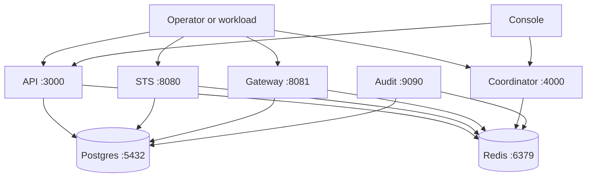

Caracal ships two Compose shapes:

| File | Purpose |
| --- | --- |
| `infra/docker/docker-compose.yml` | Local development stack that builds repository images. |
| `infra/docker/runtime-compose.yml` | Self-hosted runtime stack using versioned GHCR images. |

Both stacks run Postgres, Redis, migrations, STS, API, Gateway, Audit, Coordinator, and optional Control.

## Topology



Local ports are bound to `127.0.0.1` so the OSS stack does not expose services externally by default.

## Prerequisites

- Docker with Compose support.
- Generated runtime secrets under the expected secrets directory.
- For the self-hosted runtime file, `CARACAL_VERSION` and optional `CARACAL_REGISTRY`.

## Local development flow

```bash
pnpm secrets:init
caracal up
caracal status --ready
bash infra/scripts/smokeTest.sh
```

`caracal up` builds local images in development mode. `caracal status --ready` checks dependency readiness, and `smokeTest.sh` probes `/ready` or `/live` for API, Gateway, STS, Audit, and Coordinator.

## Self-hosted runtime flow

```bash
export CARACAL_VERSION=2026.05.27-rc.1
docker compose -f infra/docker/runtime-compose.yml up -d
docker compose -f infra/docker/runtime-compose.yml ps
bash infra/scripts/smokeTest.sh
```

The runtime compose file expects secrets under `./secrets/` relative to the compose file. Keep secret files owner-readable only and never place inline secrets in the compose file.

## Control profile

The Control service is behind the `control` Compose profile and a runtime gate. Enable it only when the Console or platform automation is ready to manage Control exposure and credentials.

```bash
docker compose -f infra/docker/runtime-compose.yml --profile control up -d control
```

## Rollback

1. Stop the stack with `caracal down` or `docker compose ... down`.
2. Restore the previous `CARACAL_VERSION`.
3. Start the stack and wait for readiness.
4. Confirm audit replay and outbox queues drain before reopening high-risk traffic.

## Troubleshooting

| Symptom | Check |
| --- | --- |
| Postgres or Redis never becomes healthy | Check secret files, mounted volumes, and host port conflicts on `5432` or `6379`. |
| API ready fails | Confirm migrations completed and `DATABASE_URL_FILE`, `REDIS_URL_FILE`, and `CARACAL_ADMIN_TOKEN_FILE` resolve. |
| STS or Gateway fails in `rc`/`stable` | Confirm `AUDIT_HMAC_KEY`, `STREAMS_HMAC_KEY`, and `GATEWAY_STS_HMAC_KEY` are hex-encoded and at least 32 bytes. |
| Gateway rejects upstreams | In published modes, configure `UPSTREAM_HOST_ALLOWLIST` when private upstreams are allowed. |
| Audit gaps appear after Redis outage | Keep STS and Gateway replay volumes intact and wait for replay metrics to drain. |
