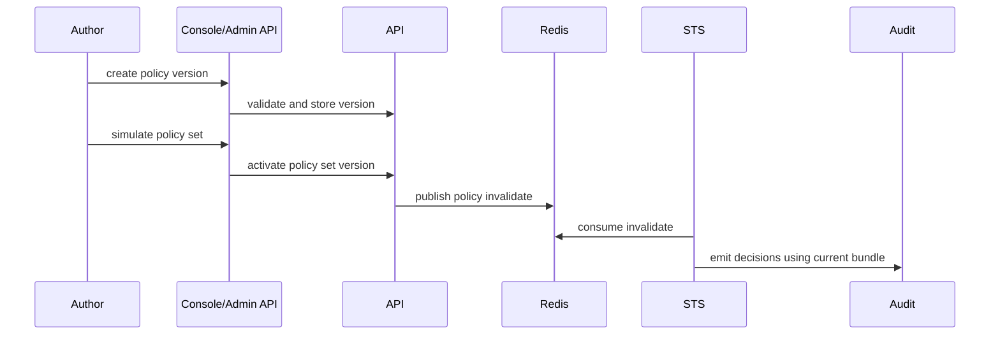

Policy changes affect STS decisions and Gateway access. Treat them as production changes with simulation, activation, audit review, and rollback readiness.

## Deployment Sequence

## Pre-Deployment

1. Confirm the policy uses current resource IDs, scopes, and canonical terminology.
2. Validate syntax and invariants through Console or Admin API. Saving a policy-set version also compiles the merged bundle on the STS runtime engine, so cross-policy conflicts are rejected before the version exists.
3. Simulate expected allow and deny cases.
4. Confirm STS readiness.
5. Note the last known-good policy-set version ID for rollback.

## Activation

Use Console `policy` and `policy set` views or Admin SDK/API automation. Do not use top-level `caracal` runtime commands for policy management.

## Verification

Activation returns `202 Accepted` with a `status_url`. Poll `GET /v1/zones/:zoneId/policy-sets/:id/activation-status` (Admin SDK: `policySets.activationStatus`) until `propagation_status` is `loaded`; it reconciles the database binding, the outbox dispatch state, and the live STS bundle in one response.

| Check                   | Expected                                                                                 |
| ----------------------- | ---------------------------------------------------------------------------------------- |
| API activation response | `202` with `outbox_id` and `status_url`.                                                 |
| Activation status       | `propagation_status: loaded`; `sts.policy_set_version_id` matches the activated version. |
| STS bundle age          | `sts.age_seconds` in the activation status resets after reload.                          |
| Audit decisions         | Expected allow/deny records appear for canary requests.                                  |
| Gateway behavior        | Protected upstream access follows the new decision.                                      |

With several STS replicas, the replica that consumes the invalidation reloads within about a second and the rest converge through the periodic database poll (60 seconds by default). The activation status samples one replica, so allow one poll interval before treating the whole fleet as converged.

## Rollback

Activate the last known-good policy-set version. Then verify STS policy freshness, canary decisions, audit records, and Gateway behavior.

## Troubleshooting

| Symptom                                         | Check                                                                                                                                         |
| ----------------------------------------------- | --------------------------------------------------------------------------------------------------------------------------------------------- |
| Activation succeeds but decisions do not change | Poll the activation status: `outbox.state` shows whether the invalidation dispatched, and `sts` shows the bundle the runtime actually serves. |
| Simulation differs from live decisions          | Input shape, active grants, resource IDs, subject/session claims, and step-up state.                                                          |
| Policy fails closed unexpectedly                | Rego compile errors, missing scope/resource, or invalid grant.                                                                                |

## Next Step

Use [Upgrade Caracal](/operations/upgrade/) for image, chart, migration, and runtime configuration upgrades.
