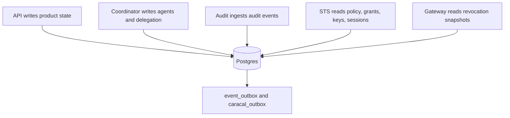

Postgres stores Caracal control-plane state: zones, providers, applications, resources, grants, sessions, policies, audit events, Sessions, Delegations, outboxes, admin tokens, and step-up challenges.

## Storage Model



## Migrations

The migration runner:

- applies `/migrations/*.up.sql` files in sorted order;
- records versions in `public.schema_migrations` (schema-qualified so it survives migrations that reset `search_path`);
- serializes concurrent runners with a Postgres advisory lock;
- rejects unsafe migration filenames;
- is used by Compose `dbMigrate` and Helm pre-install/pre-upgrade Job.

The schema starts from a single consolidated baseline (`0001_baseline.up.sql`). Later releases append expand-only migrations on top of it. Each migration must be backward compatible with the previous application version so it can be applied while that version still serves traffic; contract-phase changes are deferred to a later release and tagged `-- caracal:phase contract`. `validateMigrations.sh` enforces this, which is what lets [`caracal upgrade`](/operations/upgrade/) migrate without a maintenance window.

```bash
PGHOST=localhost PGPORT=5432 PGUSER=caracal PGDATABASE=caracal \
PGPASSWORD_FILE="${CARACAL_SECRETS_DIR:-${CARACAL_HOME:-$HOME/.local/share/caracal}/secrets}/postgresPassword" \
bash infra/postgres/scripts/migrate.sh
```

Production tooling is forward-only and does not reference down migrations.

## Verification

```bash
bash infra/postgres/scripts/validateMigrations.sh
```

The validation script checks migration idempotency, concurrent migrators, expand-only schema discipline, expected tables, append-only audit permissions, immutable policy-version trigger, fail-closed row-level security, and the rolling audit partition window.

## Capacity Controls

| Area             | Settings                                                                                                                                    |
| ---------------- | ------------------------------------------------------------------------------------------------------------------------------------------- |
| Compose Postgres | `POSTGRES_MAX_CONNECTIONS`, `POSTGRES_SHARED_BUFFERS`, `POSTGRES_EFFECTIVE_CACHE_SIZE`, `POSTGRES_WORK_MEM`, `POSTGRES_LOG_MIN_DURATION_MS` |
| Service pools    | `DB_POOL_MAX`, statement timeout, idle-in-transaction timeout, connection timeout, idle timeout                                             |
| Helm             | Use managed Postgres sizing plus service resource requests/limits.                                                                          |

## Backup and Restore

Back up the whole database. Audit events are append-only and partitioned; restore must preserve audit tables, admin audit tables, outboxes, agent/delegation state, and key material references.

## Troubleshooting

| Phase          | Symptom             | First check                                                                                   |
| -------------- | ------------------- | --------------------------------------------------------------------------------------------- |
| Bootstrap      | Migration Job fails | Database secret, host, port, user, database, SSL mode, and advisory-lock connectivity.        |
| Operations     | API outbox grows    | Redis reachability, outbox dispatcher logs, DB pool saturation, and `event_outbox` dead rows. |
| Performance    | Audit queries slow  | Partition health, indexes, retention, and query time windows.                                 |
| Access control | RLS errors          | Confirm service role and zone context handling before widening permissions.                   |

## Next Step

Use [Operate Redis Streams](/operations/redis/) to verify stream groups, pending entries, invalidation, revocation, and audit delivery.
