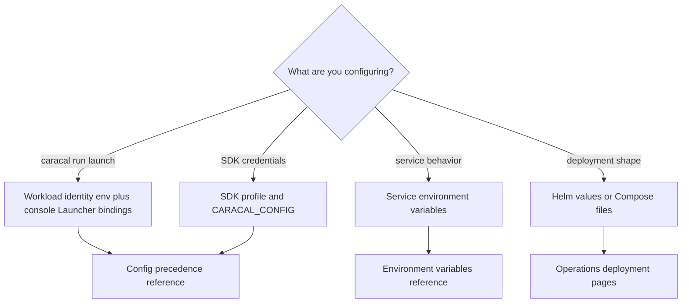

Choose the consumer before choosing a key. Caracal has four configuration domains, and a key accepted by one layer is not automatically accepted by another.

| Domain                     | Used by                                             | Choose it when                                                |
| -------------------------- | --------------------------------------------------- | ------------------------------------------------------------- |
| Workload identity          | `caracal run`.                                      | A Workload launches with server-side credential bindings.     |
| SDK profile                | SDK clients.                                        | An Application needs Session, Delegation, or Resource access. |
| Service environment config | API, STS, Gateway, Audit, Coordinator, and web BFF. | A service needs URLs, secrets, limits, or readiness settings. |
| Deployment values          | Helm, Compose, Postgres, and Redis.                 | Operators size, schedule, expose, or secure infrastructure.   |

## Workload Identity Keys

| Key                            | Meaning                                                                  |
| ------------------------------ | ------------------------------------------------------------------------ |
| `CARACAL_WORKLOAD_ID`          | Workload ID from the console's Launcher page; required by `caracal run`. |
| `CARACAL_WORKLOAD_SECRET`      | Inline local-development workload secret.                                |
| `CARACAL_WORKLOAD_SECRET_FILE` | Cloud/custom mounted workload-secret file path.                          |
| `CARACAL_STS_URL`              | Cloud/custom STS URL override.                                           |
| `CARACAL_CONFIG_HOME`          | Optional OS config-root override for the default workload-secret path.   |

Credential bindings, zone, scopes, and failure behavior come from the workload's launch bindings, authored in the web console. Local dev and stable launches can omit both secret variables and read the owner-only file at `<Caracal config dir>/runtime/<workload_id>/secret`.

## SDK Profile Fields

| Field                    | Meaning                                               |
| ------------------------ | ----------------------------------------------------- |
| `sts_url`                | Cloud/custom STS URL for token exchange.              |
| `coordinator_url`        | Cloud/custom SDK/Console Coordinator URL override.    |
| `gateway_url`            | Cloud/custom Gateway URL override for SDK transports. |
| `zone_id`                | Zone identifier.                                      |
| `application_id`         | Application identifier.                               |
| `app_client_secret_file` | Cloud/custom secret-file path override.               |
| `app_client_secret`      | Inline local-development secret.                      |
| `default_ttl_seconds`    | Default TTL for block-style Session calls.            |
| `credentials[]`          | Resource audiences with optional upstream prefixes.   |
| `optional_credentials[]` | Additional resource audiences and upstream prefixes.  |

SDK credential entries use `resource` and optional `upstream_prefix`. SDKs do not read launcher fields or search the OS config directory. Set `CARACAL_CONFIG` to an explicit profile path. Environment loaders also support `CARACAL_BOOTSTRAP_TOKEN`, `CARACAL_RESOURCES_FILE`, `CARACAL_RESOURCES`, and `CARACAL_DEFAULT_TTL_SECONDS`.

## Core Service Environment Keys

| Key                                                                    | Services                                                    |
| ---------------------------------------------------------------------- | ----------------------------------------------------------- |
| `CARACAL_MODE`                                                         | All services.                                               |
| `DATABASE_URL` / `DATABASE_URL_FILE`                                   | API, STS, Gateway, Audit, Coordinator.                      |
| `REDIS_URL` / `REDIS_URL_FILE`                                         | API, STS, Gateway, Audit, Coordinator.                      |
| `STREAMS_HMAC_KEY` / `STREAMS_HMAC_KEY_FILE`                           | Stream producers and consumers.                             |
| `AUDIT_HMAC_KEY` / `AUDIT_HMAC_KEY_FILE`                               | Audit producers and Audit service.                          |
| `IDEMPOTENCY_HMAC_KEY` / `IDEMPOTENCY_HMAC_KEY_FILE`                   | Coordinator idempotency receipt key digest.                 |
| `IDEMPOTENCY_HMAC_KEY_PREVIOUS` / `IDEMPOTENCY_HMAC_KEY_PREVIOUS_FILE` | Coordinator during one receipt-retention rotation window.   |
| `GATEWAY_STS_HMAC_KEY` / `GATEWAY_STS_HMAC_KEY_FILE`                   | API, STS, Gateway.                                          |
| `SECRET_STORE_KEK` / `SECRET_STORE_KEK_FILE`                           | API and STS.                                                |
| `SECRET_STORE_KEK_PREVIOUS` / `SECRET_STORE_KEK_PREVIOUS_FILE`         | API and STS during a master-key rotation window.            |
| `CARACAL_SECRET_BACKEND`                                               | API and STS; selects the secret backend, default `builtin`. |
| `CARACAL_ADMIN_TOKEN` / `CARACAL_ADMIN_TOKEN_FILE`                     | API and management clients.                                 |
| `CARACAL_COORDINATOR_TOKEN` / `CARACAL_COORDINATOR_TOKEN_FILE`         | Coordinator and Console Session/Delegation views.           |
| `METRICS_BEARER` / `METRICS_BEARER_FILE`                               | Metrics authentication in published modes.                  |

## Per-Service Tuning Keys

Variables that appear in individual runbooks are cataloged here so every documented knob has one home. Defaults are in [Defaults and Limits](/reference/defaults-and-limits/).

| Key | Service | Controls |
| --- | --- | --- |
| `OPA_POLL_SECONDS` | STS | Policy-bundle database poll interval (default 60, max 300). |
| `MAX_GRANT_TTL_SECONDS` | STS | Ceiling for requested mandate TTLs. |
| `CARACAL_PRIVATE_EGRESS_HOSTS` | API, STS | Exact private hostnames granted to OAuth token endpoints, connectivity checks, and notification sink deliveries. |
| `UPSTREAM_HOST_ALLOWLIST` | Gateway | Pins Gateway upstream destinations to an explicit host list. |
| `MAX_REQUEST_BYTES` | Gateway | Proxied request size cap (default 10 MiB). |
| `JTI_FAIL_OPEN` | Gateway | Replay-tracker failure posture; forbidden in published modes. |
| `AUDIT_ADMIN_TOKEN` | Audit | Enables the direct operator search and DLQ routes; they return `404` when unset. |
| `AUDIT_RETENTION_DAYS` | Audit | Evidence retention window (default 365). |
| `AUDIT_EXPORT_S3_*`, `AUDIT_EXPORT_TMP_DIR` | Audit | Optional S3-compatible Parquet export endpoint, credentials, and scratch space. |
| `MAX_AGENTS_PER_ZONE`, `MAX_AGENTS_PER_APP` | Coordinator | Concurrent Session ceilings (defaults 50 and 200). |
| `IDEMPOTENCY_RETENTION_SECONDS`, `GENERATED_IDEMPOTENCY_RETENTION_SECONDS`, `IDEMPOTENCY_MAX_RECEIPTS_PER_SCOPE` | Coordinator | Idempotency receipt retention windows and per-scope cap. |
| `COORDINATOR_BODY_LIMIT_BYTES` | Coordinator | Request body cap (default 256 KiB). |
| `CARACAL_ALLOW_INSECURE_CONFIG_URLS` | SDK clients | Permits plaintext control-plane URLs outside loopback, with a startup warning. |
| `CARACAL_REQUIRE_PROVENANCE` | Install scripts | Makes a missing provenance check fail the install instead of skipping. |

## Deployment Values

Helm values live under `infra/helm/caracal/values.yaml`. Compose environment and secrets are defined by `infra/docker/docker-compose.yml` and `infra/docker/runtime-compose.yml`.

This page is the canonical key inventory. [Configure Service Environment](/operations/env-vars/) is the workflow for setting them, with precedence, secret-class, and published-mode requirements; the shipped Compose files and Helm values for a release map each key to its deployment surface.

## Next Step

Use [Configuration Order](/reference/config-precedence/) to understand which file, environment variable, or deployment value wins.

## Related Pages

- [Configure Workloads](/runtime-console/config-file/)
- [Configure Service Environment](/operations/env-vars/)
- [Choose a Cloud Profile](/operations/cloud-native-profiles/)
