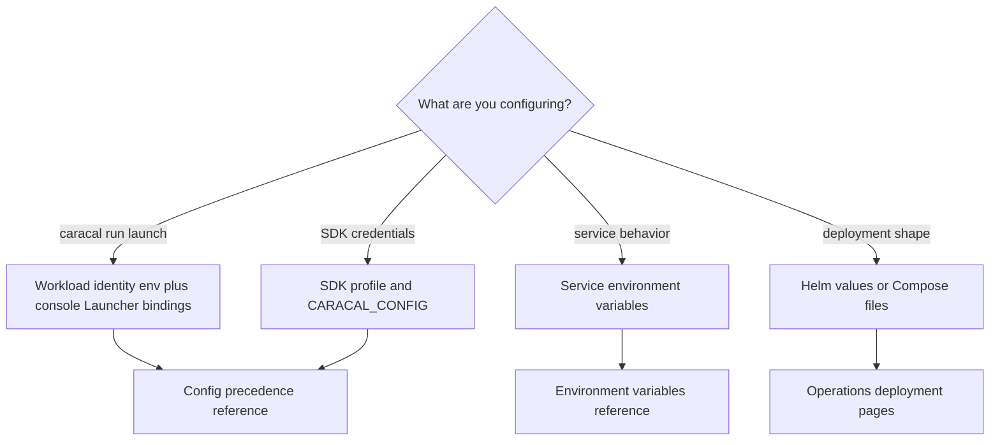

Caracal has three configuration domains:

| Domain                     | Used by                                             | Choose it when                                                |
| -------------------------- | --------------------------------------------------- | ------------------------------------------------------------- |
| Workload identity          | `caracal run`.                                      | A workload launches with console-managed credential bindings. |
| SDK profile                | SDK clients.                                        | An SDK workload needs Caracal-issued resource credentials.    |
| Service environment config | API, STS, Gateway, Audit, Coordinator, and Control. | A service needs URLs, secrets, limits, or readiness settings. |
| Deployment values          | Helm, Compose, Postgres, and Redis.                 | Operators size, schedule, expose, or secure infrastructure.   |

## Workload Identity Keys

| Key                            | Meaning                                                                  |
| ------------------------------ | ------------------------------------------------------------------------ |
| `CARACAL_WORKLOAD_ID`          | Workload ID from the console's Launcher page; required by `caracal run`. |
| `CARACAL_WORKLOAD_SECRET`      | Inline local-development workload secret.                                |
| `CARACAL_WORKLOAD_SECRET_FILE` | Cloud/custom mounted workload-secret file path.                          |
| `CARACAL_STS_URL`              | Cloud/custom STS URL override.                                           |

Credential bindings, zone, scopes, and failure behavior come from the workload's launch bindings, authored in the web console. Local dev and stable launches can omit both secret variables and read the owner-only file at `<Caracal config dir>/runtime/<workload_id>/secret`.

## SDK Profile Fields

| Field                    | Meaning                                               |
| ------------------------ | ----------------------------------------------------- |
| `zone_url`               | Cloud/custom STS URL override for token exchange.     |
| `sts_url`                | Cloud/custom SDK-readable STS alias/fallback.         |
| `coordinator_url`        | Cloud/custom SDK/Console Coordinator URL override.    |
| `gateway_url`            | Cloud/custom Gateway URL override for SDK transports. |
| `zone_id`                | Zone identifier.                                      |
| `application_id`         | Confidential application ID.                          |
| `app_client_secret_file` | Cloud/custom secret-file path override.               |
| `app_client_secret`      | Inline local-development secret.                      |
| `ttl_seconds`            | Credential exchange TTL, capped at 900 seconds.       |
| `continue_on_failure`    | Required credential failure behavior.                 |
| `credentials[]`          | Required resource credentials.                        |
| `optional_credentials[]` | Optional resource credentials with `on_failure`.      |

Credential entries use `env`, `resource`, optional `upstream_prefix`, and optional `credential_type`. Use `provider_token` for direct provider-key access and `caracal_mandate` for mandate-aware workloads.

Local dev and stable SDK loads read the client secret and credential
manifest from files you store under the OS Caracal config directory. Use explicit
secret-file paths and service URLs only for cloud deployments, containers, or
custom infrastructure.

## Core Service Environment Keys

| Key                                                                    | Services                                                    |
| ---------------------------------------------------------------------- | ----------------------------------------------------------- |
| `CARACAL_MODE`                                                         | All services.                                               |
| `DATABASE_URL` / `DATABASE_URL_FILE`                                   | API, STS, Gateway, Audit, Coordinator.                      |
| `REDIS_URL` / `REDIS_URL_FILE`                                         | API, STS, Gateway, Audit, Coordinator.                      |
| `STREAMS_HMAC_KEY` / `STREAMS_HMAC_KEY_FILE`                           | Stream producers and consumers.                             |
| `AUDIT_HMAC_KEY` / `AUDIT_HMAC_KEY_FILE`                               | Audit producers and Audit service.                          |
| `IDEMPOTENCY_HMAC_KEY` / `IDEMPOTENCY_HMAC_KEY_FILE`                   | Coordinator idempotency receipt key digest.                 |
| `IDEMPOTENCY_HMAC_KEY_PREVIOUS` / `IDEMPOTENCY_HMAC_KEY_PREVIOUS_FILE` | Coordinator during one receipt-retention rotation window.   |
| `GATEWAY_STS_HMAC_KEY` / `GATEWAY_STS_HMAC_KEY_FILE`                   | API, STS, Gateway.                                          |
| `SECRET_STORE_KEK` / `SECRET_STORE_KEK_FILE`                           | API and STS.                                                |
| `SECRET_STORE_KEK_PREVIOUS` / `SECRET_STORE_KEK_PREVIOUS_FILE`         | API and STS during a master-key rotation window.            |
| `CARACAL_SECRET_BACKEND`                                               | API and STS; selects the secret backend, default `builtin`. |
| `CARACAL_ADMIN_TOKEN` / `CARACAL_ADMIN_TOKEN_FILE`                     | API and management clients.                                 |
| `CARACAL_COORDINATOR_TOKEN` / `CARACAL_COORDINATOR_TOKEN_FILE`         | Coordinator and Console agent/delegation views.             |

## Deployment Values

Helm values live under `infra/helm/caracal/values.yaml`. Compose environment and secrets are defined by `infra/docker/docker-compose.yml` and `infra/docker/runtime-compose.yml`.

## Next Step

Use [Configuration Order](/reference/config-precedence/) to understand which file, environment variable, or deployment value wins.

## Related Pages

- [Configure Workloads](/runtime-console/config-file/)
- [Configure Service Environment](/operations/env-vars/)
- [Choose a Cloud Profile](/operations/cloud-native-profiles/)
