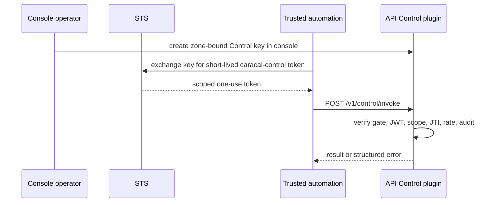

Control is the zone-bound remote automation counterpart to the web console. It is an optional plugin inside the API service, not a separate deployable or port.

## Choose Control or the Admin SDK

Use the Admin SDK when trusted automation can call the Admin API directly with an appropriately scoped operator credential. Use Control when automation needs a self-describing, zone-bound invoke surface with short-lived Control tokens, replay protection, per-command scopes, rate limits, and mandatory audit.

Neither surface manages local stack lifecycle or launches workloads. Control must never appear as a top-level `caracal` runtime command.

## Enablement and Route

| Item                 | Contract                       |
| -------------------- | ------------------------------ |
| Host                 | API service, local port `3000` |
| Invoke               | `POST /v1/control/invoke`      |
| Build-time mount     | `CARACAL_CONTROL_ENABLED=true` |
| Runtime gate         | `CONTROL_GATE_FILE` must exist |
| Default Helm posture | Disabled                       |

Removing the gate file makes invoke return `503` without restarting API. API health and readiness remain the service probes.

## Credential Flow

The token's zone comes from the Control key. A caller must not select another zone. Each token is replay-protected, so mint a fresh token for each invoke.

## Supported Management Model

Control exposes the shared management catalog, including imperative noun/verb operations and declarative `ensure` and `state plan|verify|apply` workflows. Prefer declarative reconciliation for repeatable CI: it is idempotent, reports per-object outcomes, authorizes each touched noun, and can dry-run before writes.

Use `catalog describe` to discover commands, scopes, flags, and desired-state schema instead of hardcoding a copied catalog. Authority records and governed Sessions are separate nouns.

For exact payload examples, scopes, reconciliation documents, and error envelopes, use [Use the Admin API](/api/control-plane/) and [Bootstrap Control State](/examples/control-bootstrap/).

## Failure Behavior

| Condition                                 | Result                                                 |
| ----------------------------------------- | ------------------------------------------------------ |
| Gate absent                               | `control_disabled`, `503`                              |
| Token missing or invalid                  | `unauthorized`, `401`                                  |
| Token reused                              | `token_replay`, `401`                                  |
| Scope or policy insufficient              | `denied`, `403`                                        |
| Bound zone conflicts with requested state | `zone_mismatch`, `409`                                 |
| Subject/source exceeds rate               | `rate_limited`, `429`                                  |
| Required audit cannot be recorded         | `audit_unavailable`, `500`; operation does not execute |
| Body exceeds 64 KiB                       | `413`                                                  |

Control depends on STS JWKS/issuer validation, Redis replay/rate state, the API's downstream credential, and durable audit. Keep it behind TLS and store the long-lived Control key in the automation platform's secret store.

## Manage Keys Only in Console

Control keys are managed in **Services → Control**. They are zone-bound applications restricted to `control:<noun>:<verb>` scopes. Control operations cannot mutate, rotate, or delete Control-key applications, so automation cannot use one key to take over another. Secret reveal is audited.

## Next Step

[Choose the Right Surface](/runtime-console/cli-and-console/) for the complete boundary or [Enforce Boundaries](/architecture/trust-boundaries/) for trust placement.
